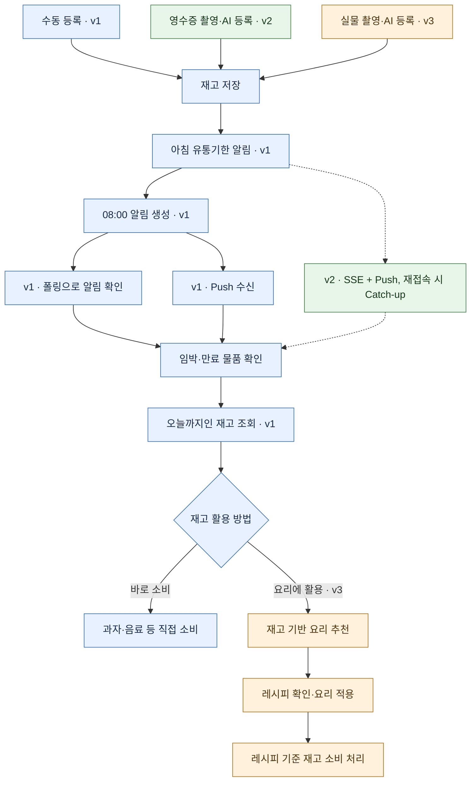
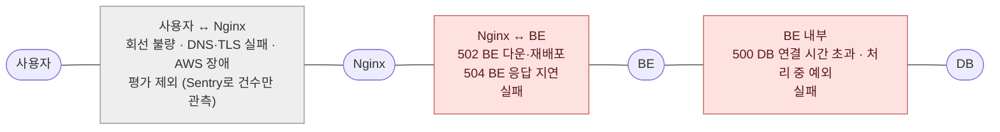
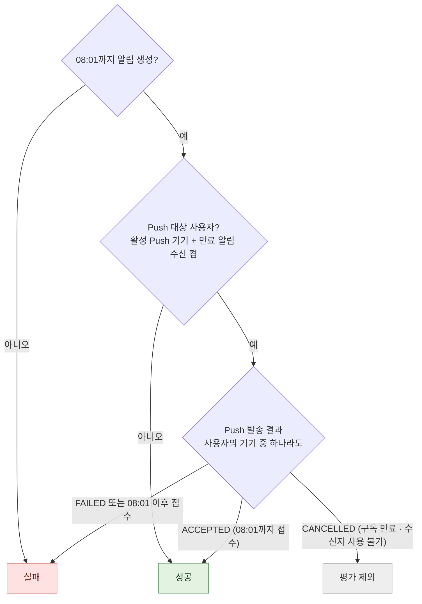
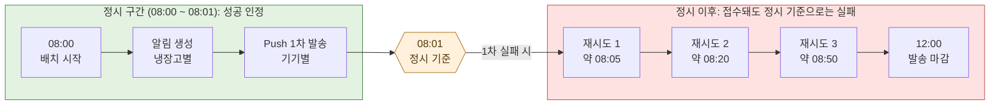
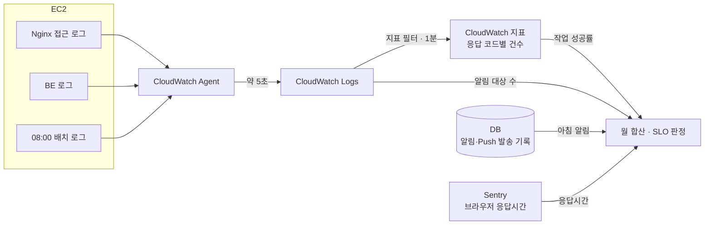
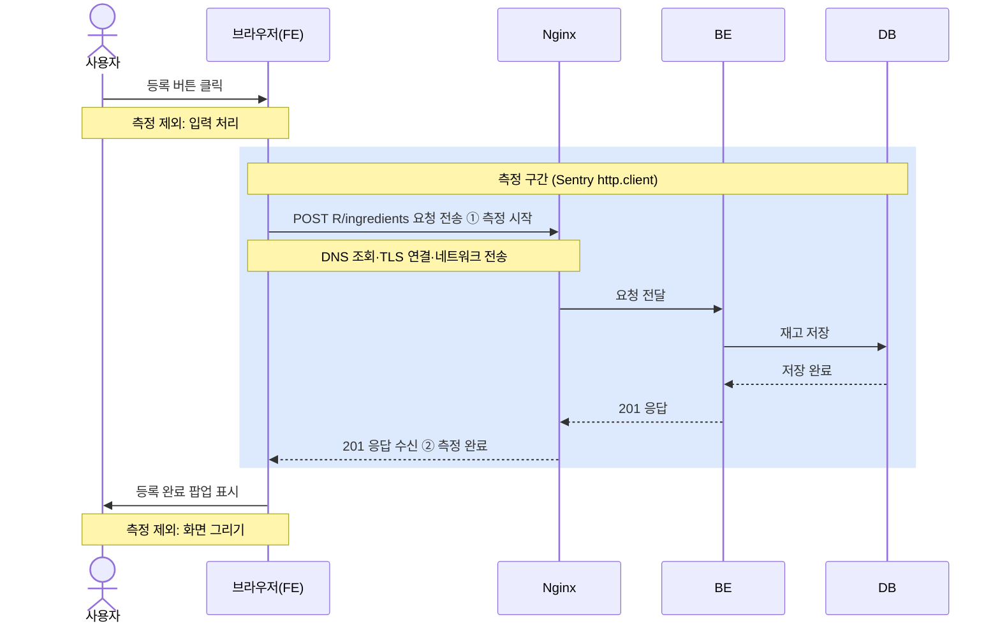

# 다먹자 SLI·SLO 설계

작성일: 2026-09-30 · 수정일: 2026-10-01  
적용 범위: v1 (v2·v3는 [6. 향후 버전 계획](#6-향후-버전-계획) 참고)

## 1. 개요

핵심 사용자 여정의 품질을 측정하고, 목표 수준과 장애 대응 기준을 정하기 위한 문서입니다. 사용자 기대와 운영 여건을 고려해 소수의 지표부터 시작합니다.

| 개념 | 의미 |
|---|---|
| CUJ(핵심 사용자 여정) | 사용자가 서비스를 사용하면서 목적을 달성해 나아가는 과정 |
| SLI(서비스 수준 지표) | 사용자 여정의 품질을 실제로 측정한 값 |
| SLO(서비스 수준 목표) | 정해진 기간 동안 지표가 만족해야 할 수준 |
| 오류 예산 | SLO가 허용하는 실패 범위로, 기능 개발과 안정성 개선의 우선순위를 정하는 기준 |

## 2. 사용자 여정과 운영 기준

다먹자의 핵심 사용자 여정은 **재고 등록 → 아침 유통기한 알림 → 재고 조회 → 직접 소비 또는 추천 요리 활용**입니다.

| 항목 | 운영 기준 |
|---|---|
| 시간 기준 | 서비스 대상은 한국이며, 서버의 업무 날짜·시간은 Asia/Seoul(KST, UTC+9) 기준입니다. 사용자별 시간대 설정은 지원하지 않습니다. |
| 유통기한 단계 | D-3~D-day(당일)는 ‘임박’, 유통기한이 지난 재고는 ‘만료’입니다. 재고 상태·목록 필터·알림 유형이 모두 같은 기준을 사용합니다. |
| 아침 알림 시각 | 매일 08:00에 발송하며, 허용 지연 1분을 두어 08:01까지 서버가 알림 생성·전송을 마치면 정시로 봅니다. 사용자 기기의 수신 시각이 아닌 서버의 발송 시각 기준입니다. |
| 알림 채널 | Polling + Web Push. 클라이언트는 30초마다 최신 알림 ID와 미읽음 수를 조회하고, 값이 바뀌면 알림 목록을 다시 조회합니다(탭이 백그라운드이면 중지, 복귀 시 즉시 조회). 동시에 서버가 Web Push(VAPID 서명, 표준 Web Push 프로토콜)를 발송합니다. |
| 알림 대상 | 임박·만료 재고가 있는 냉장고의 활성 멤버입니다. 탈퇴·비활성 사용자, 냉장고에서 나간 멤버, 삭제된 냉장고는 대상이 아닙니다. |

## 3. SLI

### 3.1 측정 대상

**R = /api/v1/refrigerators/{refrigerator-id}** 로 줄여 씁니다. 대부분의 API가 냉장고 경로 아래에 있어 같은 접두 경로가 반복되므로, 표를 짧게 해 API별 차이(끝 경로)가 잘 보이게 하기 위함입니다. 대신 실제 호출 경로는 R을 펼쳐 읽어야 합니다.

| 사용자 작업 | 측정 API·기록 | 성공 판정 |
|---|---|---|
| 수동 재고 등록 | POST R/ingredients | 201 |
| 오늘까지인 재고 조회 | GET R/ingredients, GET /api/v1/ingredients/{ingredient-id} | 200. 당일 재고는 ‘임박’ 필터에 포함 |
| 알림 확인(폴링) | GET R/notifications/stream, GET R/notifications/unread-count, GET R/notifications | 200 |
| 아침 알림 발송 | 알림·Push 발송 기록(사용자 호출 API 아님) | [3.3 아침 알림 판정](#33-아침-알림-판정) 참고 |

여러 API로 이어지는 사용자 작업은 한 건으로 집계합니다.

**측정하지 않는 API**

- 단건 재고 등록(POST R/ingredient): API는 있지만 FE에서 호출하지 않아 정상 사용자의 여정에 포함되지 않습니다. 5xx는 일반 오류 모니터링으로 확인합니다.
- 보조 관측 대상: 직접 소비(POST /api/v1/ingredients/{ingredient-id}), Push 구독(POST /api/v1/push-subscriptions)은 목표 없이 성공률·응답시간만 관찰합니다.

### 3.2 성공·실패 판정

**공통 계산 기준**

- 성공률은 **성공 건수 ÷ 평가 대상 건수**로 계산합니다.
- 여러 구간을 합칠 때는 구간별 비율을 평균하지 않고, 성공 건수와 평가 대상 건수를 각각 더한 뒤 나눕니다. p95·p99도 구간별 값을 평균하지 않고 전체 측정값에서 다시 계산합니다.
- 판정은 HTTP 응답 코드로만 합니다. 응답 내용이 맞는지는 판정하지 않습니다.

| 판정 | 응답 코드 | 기준 |
|---|---|---|
| 성공 | 2xx (재고 API: INGREDIENT-200-001~006, INGREDIENT-201-001~002) | 요청이 정상 처리된 경우 |
| 실패 | 모든 5xx (BE의 500: GLOBAL-500-001, Nginx의 502·503·504 포함) | 우리 서비스 쪽 장애로 요청을 처리하지 못한 경우 |
| 평가 제외 | 모든 4xx (400·401·403·404·409·412·422·428 포함) | 성공 건수에도, 평가 대상 건수에도 넣지 않음 |

**4xx 제외**

4xx 요청은 없었던 요청처럼 보고 성공률을 계산합니다.

| 예시: 한 달 요청 1,000건 | 건수 |
|---|---|
| 성공(2xx) | 950건 |
| 4xx | 40건 → 계산에서 제외 |
| 실패(5xx) | 10건 |
| 성공률 | 950 ÷ (1,000 − 40) = 950 ÷ 960 ≈ 98.96% |

4xx를 실패로 세면 95%, 성공으로 세면 99%가 됩니다. 제외하면 4xx는 성공률을 올리지도 내리지도 않습니다.

- 이유: 4xx는 잘못된 입력·권한 없음 등 클라이언트 요청에서 비롯되며, 악의적으로 부하를 넣은 요청처럼 의도된 실패도 4xx로 돌아옵니다. 서버는 정상 사용자의 실수와 의도된 실패를 구분할 수 없으므로, 4xx를 실패로 세면 서비스 품질과 무관한 요청이 SLO를 깎게 됩니다.
- 트레이드오프: 외부 요인으로 SLO가 흔들리지 않는 대신, 서버 버그나 인증 장애로 잘못 발생한 4xx(예: 정상 사용자에게 401·404 대량 발생)도 SLO에 드러나지 않습니다. 4xx는 코드별 건수를 별도로 집계하고, 평소보다 급증하면 원인을 확인합니다.

**시간 초과·연결 실패**

- 사용자 ↔ Nginx 구간을 제외하는 이유: v1은 Route 53에서 Nginx로 바로 연결되므로 이 구간에서 우리 쪽 책임인 장애는 AWS 장애 뿐입니다. 반면 이 구간의 실패는 대부분 사용자의 인터넷 미연결·약한 회선 같은 외부 요인이며, 클라이언트 기록만으로는 둘을 구분하기 어렵습니다.
- 트레이드오프: 서버 기록(Nginx·BE)만으로 판정해 기준이 명확하고 사용자 환경 문제가 섞이지 않습니다. 대신 요청이 서버까지 오지 못하는 드문 장애는 성공률에 드러나지 않으므로, Sentry에서 짧은 시간에 여러 사용자의 네트워크 오류가 동시에 늘어나는지로 확인합니다.

**응답 코드 기반 판정의 한계**

서버가 2xx로 응답했지만 결과가 잘못된 경우는 성공으로 집계됩니다.

| 예시 | 응답 | 실제 결과 |
|---|---|---|
| 재고 등록 | 201 | 시간대 변환 오류로 유통기한이 하루 밀려 저장됨 |
| 재고 등록 | 201 | 5개 중 3개만 저장됨 |
| 재고 조회 | 200 | 당일 재고가 목록에서 빠짐 |

- 트레이드오프: 서버 기록으로 바로 집계할 수 있어 기준이 명확하고 구현 부담이 적은 대신, 조용히 틀리는 문제는 SLO에 드러나지 않아 테스트·QA·사용자 제보로 찾아야 합니다.
- 고도화 여지: 결과를 대조하기 쉬운 항목부터 판정에 추가할 수 있습니다(예: 아침 알림 대상 수와 실제 생성 수, 등록 요청 건수와 실제 저장 건수 비교).

### 3.3 아침 알림 판정

**판정 기준**

- 서버 기록으로 판정하며, 사용자 기기가 알림을 받거나 확인한 시각은 고려하지 않습니다. 08:01까지 계획한 발송을 지키지 못하면 실패입니다.
- 사용자별 알림을 한 건으로 세고, 여러 기기 중 하나만 Push 접수에 성공해도 성공입니다.
- Push 대상 사용자(활성 Push 기기가 있고 만료 알림 수신을 켠 사용자)는 알림 생성과 Push 접수가 **모두 성공해야** 성공입니다. 그 외 사용자는 알림 생성만으로 판정합니다.

- 알림 생성 성공: 08:01까지 알림이 생성되어 폴링으로 조회할 수 있는 상태
- Push 접수 성공: 브라우저 푸시 서비스(Chrome은 FCM, Safari는 Apple, Firefox는 Mozilla)가 2xx로 접수한 상태. 기기 도착을 의미하지는 않습니다.

트레이드오프: 서버 발송 기록만으로 판정해 기준이 명확하고 Push 장애가 SLO에 바로 드러납니다. 대신 브라우저 푸시 서비스 자체의 장애처럼 우리 쪽 원인이 아닌 접수 실패도 실패로 집계되고, 서버가 제시간에 보냈더라도 사용자가 늦게 받는 경우는 드러나지 않습니다.

**Push 발송 기록별 판정**

| 발송 기록(`push_notifications`) | 의미 | 판정 |
|---|---|---|
| `ACCEPTED` | 푸시 서비스가 2xx로 접수 | 성공 |
| `FAILED` + `SEND_FAILED`·`SEND_WINDOW_EXPIRED` | 4xx(404·410 제외)·5xx 오류 응답, 시간 초과(최대 10초), 정오까지 발송하지 못함 | 실패 |
| `CANCELLED` + `SUBSCRIPTION_UNAVAILABLE` | 구독 만료(404·410) 또는 작업 생성 후 구독 변경 | 평가 제외 |
| `CANCELLED` + `RECIPIENT_UNAVAILABLE` | 발송 직전 탈퇴·냉장고 나감·수신 끔 | 평가 제외 |

- 4xx를 실패로 보는 이유: 일반 API의 4xx는 사용자 요청에서 비롯되므로 평가에서 제외하지만, Push는 우리 서버가 보내는 요청이고 푸시 서비스는 신뢰할 수 있는 통신 상대입니다. 따라서 푸시 서비스가 돌려준 4xx(예: 400 잘못된 요청, 403 VAPID 인증 오류, 413 내용 초과)는 우리 쪽 요청이 잘못된 것으로 보고 실패로 집계합니다.
- 트레이드오프: 우리 쪽 발송 오류가 SLO에 바로 드러나는 대신, 푸시 서비스 쪽 사정으로 돌아온 4xx(예: 429 요청 한도 초과)도 실패로 집계됩니다.
- 404·410을 제외하는 이유: 구독 만료를 뜻하며, 사용자가 알림 권한을 해제하거나 브라우저 데이터를 지우는 등 사용자 쪽 원인으로 생깁니다. 발송 직전 탈퇴·수신 끔도 사용자의 선택이므로 제외합니다.
- 404·410 제외의 트레이드오프: 사용자 쪽 원인이 오류 예산을 깎지 않는 대신, VAPID 키를 잘못 교체하는 등 우리 실수로 구독이 대량 무효화되는 경우가 드러나지 않습니다. `SUBSCRIPTION_UNAVAILABLE` 건수를 별도로 집계하고 급증하면 원인을 확인합니다.
- 원인 추적: 발송 기록(`push_notifications`)에는 푸시 서비스의 HTTP 상태 코드가 저장되지 않지만, BE가 응답 코드를 로그로 남기도록 수정할 예정이므로(적용 예정) 이후 실패 원인(4xx·5xx 구분 등)은 로그에서 확인합니다.

**발송 흐름과 집계 시 유의점**

- 08:00 배치가 냉장고별로 알림을 생성한 뒤, 생성된 알림을 기준으로 기기별 Push를 발송합니다. 알림 생성에 실패하면 Push도 발송되지 않습니다.
- Push 실패 시 직전 실패 시점부터 5분·15분·30분 뒤에 차례로 재시도하고(1차 실패가 08:00이면 약 08:05·08:20·08:50), 정오가 지나면 중단합니다. 첫 재시도가 5분 뒤이므로 재시도로 접수돼도 정시 기준으로는 실패입니다.
- 알림 생성에 실패한 냉장고는 DB에 남지 않고 배치 로그(`failedRefrigeratorCount`)에만 남습니다. 발송 시도 건수만 평가 대상으로 잡으면 대상 누락을 놓치므로, 전체 대상 수는 배치 로그에서 함께 가져옵니다.

**알림 대상 재고**

- 유통기한이 지난 재고는 사용자가 치울 때까지 매일 만료 알림에 포함됩니다. 치우지 않은 재고를 치우도록 알리는 것이 목적입니다.
- 수량이 0인 재고는 존재하지 않습니다. 남은 양이 0이 되면 재고가 삭제되고, 등록·수정 시에도 수량은 1 이상(무게는 0 초과)만 허용됩니다.
- 알림은 08:00 배치가 조회한 시점의 재고로 만들며, 이후의 재고 변경은 당일 알림에 반영되지 않습니다. 발송 직전 재고를 다시 확인하는 등 고도화 여지가 있습니다.

**알려진 한계 (클라이언트)**

- 화면 표시 지연: 폴링 간격이 30초이므로 알림이 화면에 표시되기까지 최대 약 30초가 걸릴 수 있으며, 이는 서버 기준 SLO에 포함하지 않습니다.
- 폴링 중단: 폴링 요청이 재시도 후에도 실패하면 폴링이 멈추고, 사용자가 탭을 전환해 돌아올 때 재개됩니다. 발송 직전 서버가 잠깐 5xx를 반환하면, 서버가 정시에 알림을 생성했더라도 탭 전환 전까지 화면에 표시되지 않을 수 있습니다.

### 3.4 데이터 수집과 계산

EC2의 로그를 CloudWatch Logs로 수집하고, 지표 필터(Metric Filter)로 실시간 집계합니다.

- 1분 주기를 선택한 이유: 지표 필터는 로그가 도착할 때마다 평가하지만 지표 값은 1분 단위로 기록하므로, 코드 수정 없이 얻을 수 있는 가장 짧은 주기입니다. 장애가 나면 약 1~2분 안에 지표에 반영됩니다.
- 트레이드오프: 1초 단위 집계는 BE 로그 형식을 바꾸거나(EMF) 지표를 직접 보내야(PutMetricData) 하므로 채택하지 않았습니다. 또한 지표 필터는 조건별 건수만 셀 수 있어, 4xx 제외·API별 분리처럼 조건이 늘어나면 필터도 그만큼 늘어납니다.
- 보관: CloudWatch는 지표를 15일 이내 1분, 63일 이내 5분, 455일 이내 1시간 해상도로 보관합니다. 해상도가 줄어도 합계는 유지되므로 월간 합산에는 영향이 없습니다.

## 4. SLO

평가 기간은 **한국 시간 기준 달력 월(매월 1일 00:00 이상, 다음 달 1일 00:00 미만)**입니다. 월간 비율은 일별 비율의 평균이 아니라 건수를 합산해 계산합니다.

| 대상 | 목표 |
|---|---|
| 아침 알림 | 해당 월 평가 대상 알림의 95% 이상이 각 발송일 KST 08:01까지 성공 ([3.3](#33-아침-알림-판정) 기준) |
| 작업 성공률 | 수동 재고 등록·재고 조회·알림 조회(폴링) 각각 월간 95% 이상 |
| 응답시간 | 수동 재고 등록·재고 조회 각각 p95 ≤ 1초, p99 ≤ 10초 |

응답시간은 평가 대상의 **95% 이상이 1초 이내, 99% 이상이 10초 이내**라는 두 조건으로 관리하며, 등록과 조회를 각각 평가합니다. 응답시간 목표와 성공률 목표는 서로 대신하지 않고 각각 평가합니다.

4xx 응답은 성공률과 같이 응답시간 집계에서도 제외합니다.

- 이유: 악의적으로 부하를 넣은 요청은 대부분 4xx로 돌아오며, 서버는 이를 정상 요청과 구분할 수 없습니다. 4xx를 포함하면 이런 요청 때문에 응답시간 지표가 어쩔 수 없이 나빠지므로 이를 막기 위해 제외합니다.
- 트레이드오프: 외부 요청으로 지표가 흔들리지 않는 대신, 정상 사용자가 받은 4xx 응답이 느렸던 경우(예: 인증 처리 지연 후 401)는 응답시간 지표에 드러나지 않습니다.

### 4.1 아침 알림·작업 성공률 목표(95%) 근거

초기 서비스 단계에서는 운영 데이터가 없고 트래픽이 적으므로 현실적으로 지킬 수 있는 95%에서 시작합니다. 운영 데이터가 쌓이면 실제 성공률을 보고 목표를 높입니다.

- 트레이드오프: 목표가 느슨해 초기 장애나 재배포 중단으로 SLO가 쉽게 깨지지 않고, 오류 예산을 실제 개선 우선순위 판단에 쓸 수 있습니다(예: 월 1,000건이면 실패 50건까지 허용). 대신 월 5%의 실패까지 허용하므로 작은 품질 저하는 SLO에 드러나지 않습니다. 이를 보완하기 위해 5xx 건수는 별도로 관찰하고, 목표는 운영 데이터를 바탕으로 단계적으로 높입니다.
- 참고: IBM은 높은 중요도의 시스템에서 99.9% 또는 99.99% 가용성을 고려할 수 있다고 설명합니다. 다먹자는 초기 단계이므로 이 수준을 장기 목표로 두고, 처음에는 낮은 목표로 시작합니다.

### 4.2 응답시간 목표(1초·10초) 근거

Jakob Nielsen이 정리한 응답시간 한계(*Usability Engineering*, 1993)를 근거로 합니다.

| 한계 | 사용자 인지 | 다먹자 목표 |
|---|---|---|
| 1초 | 지연은 느끼지만 생각의 흐름이 끊기지 않는 한계 | p95 ≤ 1초: 대부분의 사용자가 작업 흐름을 유지 |
| 10초 | 작업에 주의를 유지할 수 있는 한계 | p99 ≤ 10초: 거의 모든 사용자가 작업을 이탈하지 않음 |

- 트레이드오프: 사용자 인지에 근거해 "왜 1초인가"를 설명할 수 있지만, 웹·모바일 네트워크 환경을 전제로 한 연구가 아니며 적용 비율(95%, 99%)은 프로젝트의 설계 결정입니다.
- 검증: 측정 시작 후 2~4주간의 실제 응답시간으로 목표가 현실적인지 확인합니다. 측정값이 기준보다 나쁘면 목표를 낮추기보다 개선 과제로 다룹니다.
- 참고: Google Core Web Vitals의 INP는 입력 후 첫 반응이 그려지기까지를 p75 기준 200ms 이하면 "좋음"으로 봅니다. 다먹자 목표(API 요청부터 응답 수신까지)와 측정 범위가 달라 목표 수치로는 쓰지 않습니다.

### 4.3 응답시간 측정 방식

FE에 설정된 Sentry의 성능 측정(Tracing)이 자동으로 기록하는 API 요청 구간(`http.client`)을 사용합니다.

| 항목 | 내용 |
|---|---|
| 시작 | 브라우저가 API 요청을 보낸 시점 |
| 완료 | 브라우저가 API 응답을 받은 시점 |
| 대상 | 수동 재고 등록(POST R/ingredients), 재고 조회(GET R/ingredients 등) |
| 샘플링 | prod 10%, dev 100% (오류 이벤트는 전부 수집) |

아래 다이어그램에서 파란 영역이 측정 구간입니다. 수동 재고 등록을 예로 들었으며, 재고 조회도 같은 방식입니다.

| 구간 | 측정 여부 | 설명 |
|---|---|---|
| 버튼 클릭 → 요청 전송 | 제외 | 입력 처리·요청 준비 시간 |
| ① 요청 전송 → ② 응답 수신 | **측정** | DNS·TLS 연결, 네트워크 왕복, Nginx·BE·DB 처리 시간 |
| 응답 수신 → 팝업 표시 | 제외 | 화면을 그리는 시간 |

- 완료 시점을 응답 수신으로 정한 이유: 등록 요청에 응답이 오면 곧바로 등록 완료 팝업이 뜨므로, 응답 수신이 사용자가 결과를 확인하는 시점과 거의 같습니다. 화면을 그리는 시간은 포함하지 않으며, FE에 기능별 측정 구간을 추가하면 화면 반영 완료까지 측정할 수 있습니다.
- 장점: 사용자 기기에서 재므로 DNS·TLS 연결, 네트워크 왕복, BE 처리 시간이 모두 포함되고, 같은 기기의 시계로 재므로 서버와의 시계 차이 영향이 없습니다. 이미 설정된 Sentry를 쓰므로 수집 서버나 코드 수정이 필요 없습니다.
- 단점: prod는 10%만 샘플링하므로 트래픽이 적은 초기에는 측정값이 부족할 수 있습니다. 데이터가 Sentry 안에 있어 4xx 제외 같은 계산 규칙을 자유롭게 적용하기 어렵고, 측정값을 보내기 전에 탭을 닫거나 오프라인이 되면 값이 빠집니다.
- 운영상 한계: Sentry는 14일 무료 체험 계정 하나를 팀원이 함께 사용합니다. 비용 문제로 멤버 초대가 불가능해 생긴 한계로, 누가 설정을 바꿨는지 추적할 수 없고 체험 기간이 끝나면 무료 플랜의 사용량·보관 기간 제한을 받습니다.

**검토했지만 채택하지 않은 방식**

| 방식 | 채택하지 않은 이유 |
|---|---|
| 브라우저 측정 직접 구현 | 계산 규칙을 자유롭게 정할 수 있지만, 수집 API·저장소·계산 쿼리를 새로 만들고 운영해야 합니다. |
| BE에서 요청 도착 시간 × 2 + 처리 시간으로 추정 | 클라이언트와 서버의 시계가 맞지 않아 요청 도착 시간을 정확히 알 수 없고, 요청과 응답의 크기·회선 속도가 달라 왕복이 대칭이 아닙니다. |
| Nginx 로그 | 코드 수정 없이 BE 처리 시간을 얻을 수 있지만, DNS 조회·연결 수립 등 서버 밖 구간이 빠져 실제보다 짧게 측정됩니다. 원인 분석용 보조 지표로는 활용합니다. |
| 합성 모니터링 | 사용자가 없어도 측정되지만, 고정된 위치·기기에서 실행되어 실제 사용자 환경을 대표하지 못합니다. |

## 5. 오류 예산과 운영 알림

| 대상 | 월간 오류 예산 |
|---|---|
| 아침 알림 | 평가 대상 알림 수 × 5% (예: 1,000건이면 50건) |
| 작업 성공률 | 작업별 평가 대상 건수 × 5% |
| 응답시간 | 1초 초과 5%, 10초 초과 1%를 각각 평가하며 합산하지 않음 |

SLO 미달을 대응 기준으로 삼되, 운영자 알림의 발생 조건·심각도·수신자·대응·복구 조건은 별도 알림 설계에서 정합니다. 월말 최종 판정과 운영 중 조기 경보는 구분하며, 월간 SLO가 깨질 때까지 기다리지 않습니다.

## 6. 향후 버전 계획

아래는 v2·v3 설계 방향이며, 세부 기준은 해당 버전 착수 시 확정합니다.

**v2 아침 알림: SSE + Web Push + Catch-up**

| 채널 | 성공·실패 판정 |
|---|---|
| SSE | 전송 서버가 Redis로 보내는 ACK가 판정 범위 내 정확히 1개이면 성공, 0개 또는 여러 개이면 실패 |
| Web Push | v1과 동일 |
| Catch-up | 재접속 시 GET R/notifications로 누락 알림을 복구하면 성공. 08:01 이후 복구는 정시 성공에 포함하지 않고 별도 측정 |

목표는 v1과 같이 월간 95%, KST 08:01 기준입니다. 배치·Pub/Sub 기반으로 발송하며, ACK 식별 범위·대기 시간과 SSE·Push 결과의 판정 규칙을 정해야 합니다.

**AI 재고 등록(영수증 v2, 실물 v3)**

POST /api/v1/image-analyses → GET /api/v1/image-analyses/{analysisId} → POST R/ingredients 흐름을 하나의 등록 기능으로 측정합니다. 접수(202)·조회(200)만으로 성공 처리하지 않고 인식 결과와 최종 저장까지 확인합니다.

| 구분 | 측정 방법 | 용도 |
|---|---|---|
| 처리 성공률 | 유효한 사진 등록 중 인식부터 재고 저장까지 완료된 비율 | 운영 SLO |
| 시간 내 성공률 | 큐 대기·추론·후처리·저장을 거쳐 T초 안에 재고를 조회할 수 있게 된 비율 | 운영 SLO |
| 필드별 정밀도·재현율 | 정답 자료 대비 이름·수량·유통기한 추출 정확도 | AI 품질 목표 |

품질 평가에는 대표 사진, 사람이 확인한 정답, 값의 정규화 규칙이 필요하며, 평가셋·모델·프롬프트 버전을 기록합니다. confidence나 사용자 무수정 비율을 정답률로 대신하지 않습니다.

**요리 추천·레시피 기반 소비 처리(v3)**

| 작업 | 측정 API | 판정 방향 |
|---|---|---|
| 요리 추천 | POST R/recommendation-jobs → GET R/recommendations → GET R/recipes/{recipeId} | 생성 접수와 결과 제공을 구분하고, 유효한 추천·상세 제공까지 확인 |
| 레시피 기반 소비 처리 | POST R/cooking-records | 선택 레시피의 조리 기록·차감이 한 번만 반영되는지 확인 |

레시피 기반 소비 처리는 추천 레시피를 기준으로 재고를 사용했다고 간주하며, 실제 조리·섭취 여부와 다릅니다. 사용자가 요리하거나 섭취하지 않아 생기는 상황은 서비스 장애에 포함하지 않습니다.

## 7. 출처

- [다먹자 API 명세서](https://docs.google.com/spreadsheets/d/1GCKBe8YhoNOzQ3taUI94wlg1xR-9Ky_g_RRe93bUe6M/edit) — API 경로·동작과 재고 API 응답 코드 정의
- IBM: [What is high availability?](https://www.ibm.com/think/topics/high-availability) — 높은 중요도 시스템의 가용성 수준(장기 목표 참고)
- Jakob Nielsen, NN/G: [Response Times: The 3 Important Limits](https://www.nngroup.com/articles/response-times-3-important-limits/) — 1초·10초 응답시간 목표 근거
- web.dev: [Interaction to Next Paint (INP)](https://web.dev/articles/inp) — INP 측정 범위와 기준
- IETF: [RFC 8030 — Generic Event Delivery Using HTTP Push](https://datatracker.ietf.org/doc/html/rfc8030) — Web Push 접수 응답과 기기 전달의 구분
- AWS: [CloudWatch Agent 설정 파일](https://docs.aws.amazon.com/AmazonCloudWatch/latest/monitoring/CloudWatch-Agent-Configuration-File-Details.html) — 로그 전송 주기 기본값
- AWS: [Metrics concepts](https://docs.aws.amazon.com/AmazonCloudWatch/latest/monitoring/cloudwatch_concepts.html) — 지표 해상도와 보관 기간
- AWS: [High resolution metric extraction from structured logs](https://aws.amazon.com/about-aws/whats-new/2023/02/amazon-cloudwatch-high-resolution-metric-extraction-structured-logs) — 1초 단위 집계 조건(EMF)
- 어다희·천기철, LY Corporation: [신뢰성 향상을 위한 SLI/SLO 도입 1편](https://techblog.lycorp.co.jp/ko/sli-and-slo-for-improving-reliability-1) — 사용자 여정 중심의 지표 설계
- Google SRE: [Implementing SLOs](https://sre.google/workbook/implementing-slos/) — 지표 정의와 목표 설정
- Google SRE: [Example SLO Document](https://sre.google/workbook/slo-document/) — 측정값 기반 목표 설정 사례
- Google SRE: [Alerting on SLOs](https://sre.google/workbook/alerting-on-slos/) — 오류 예산 기반 알림
- Google SRE: [Data Processing Pipelines](https://sre.google/workbook/data-processing/) — 처리 파이프라인의 정확성 목표(v2·v3)
- Google Cloud: [Evaluate performance](https://docs.cloud.google.com/document-ai/docs/evaluate) — 정밀도·재현율 평가(v2·v3)
