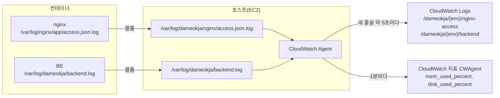

# CloudWatch 로그 수집 적용 기록

작성일: 2026-10-02  
관련 문서: [monitoring-alerting-design.md](monitoring-alerting-design.md), [infra/monitoring/README.md](../../infra/monitoring/README.md)

EC2 앱 서버의 **nginx 접근 로그**, **BE 로그**, **램·디스크 사용률**을 CloudWatch Agent로 CloudWatch에 보내도록 구성한 과정입니다. 다른 서버에 적용할 때 3장 순서를 그대로 따릅니다.

## 1. 진행 상황

| 항목 | dev | prod |
|---|---|---|
| compose 변경(로그 폴더 마운트) | ✅ | ✅ |
| nginx 설정 변경(JSON 접근 로그) | ✅ | ✅ |
| 로그 폴더 준비(`/var/log/dameokja`, uid 10001) | ✅ | ✅ |
| Agent 설치·설정 적용 | ✅ | ✅ |
| BE 로그 → `/dameokja/{env}/backend` | ✅ | ✅ |
| nginx 로그 → `/dameokja/{env}/nginx-access` | ✅ (요청이 있어야 표시) | ✅ |
| 램·디스크 지표 → `CWAgent` | ✅ | ✅ |
| 로그 그룹 보관 기간 설정 | ⬜ | ⬜ |
| 모니터링 스택(지표 필터·알람·대시보드) | ✅ `dameokja-v1-dev-monitoring` | ✅ `dameokja-v1-prod-monitoring` |

## 2. 구조



- **왜 파일을 거치나**: 컨테이너 로그 드라이버가 `local`(Docker 내부 형식)이라 Agent가 `docker logs` 출력을 직접 읽을 수 없습니다. 그래서 같은 로그를 호스트 파일에 한 번 더 쓰고, Agent가 그 파일을 실시간으로 따라 읽게 했습니다.
- **트레이드오프**: Docker 설정과 무관하게 수집되고 `docker logs`도 그대로 쓸 수 있습니다. 대신 로그가 두 번 저장되고, 서버마다 폴더 권한·로그 회전을 따로 챙겨야 합니다.

## 3. 구성 내용

### 3.1 BE: 로그 파일 위치

BE(`application.yml`)는 콘솔과 함께 파일에도 로그를 씁니다.

```yaml
logging:
  file:
    name: /var/log/dameokja/backend.log
```

- 이미지 안에서 BE는 `uid 10001`(app 사용자)로 실행됩니다.
- SQL 로그(`show-sql`)는 콘솔에만 출력되고 파일에는 남지 않습니다.

### 3.2 compose: 로그 폴더 연결

컨테이너 안의 로그 폴더를 호스트 폴더와 연결합니다. 서버 파일: `/home/ubuntu/app/compose.yaml`, 저장소: `dev-compose.yaml`, `prod-compose.yaml`.

```yaml
  nginx:
    volumes:
      - /var/log/dameokja/nginx:/var/log/nginx/app

  backend:
    volumes:
      - /var/log/dameokja:/var/log/dameokja
```

BE는 컨테이너와 호스트의 경로를 같게 맞춰, BE 설정의 경로가 그대로 호스트 경로가 되게 했습니다.

### 3.3 nginx: JSON 접근 로그

서버 파일: `/home/ubuntu/app/nginx/default.conf`, 저장소: `nginx-dev/default.conf`, `nginx-prod/default.conf`.

| 추가한 설정 | 역할 |
|---|---|
| `map "$request_method $uri" $slo_route` | 요청을 SLI 작업(재고 등록·조회·알림 조회)별로 분류, 대상이 아니면 `-` |
| `log_format slo_json` | 요청 한 건을 JSON 한 줄로 기록(`status`, `route`, `request_time` 등) |
| `access_log /var/log/nginx/app/access.json.log slo_json;` (443 서버 블록) | 위 형식으로 마운트된 폴더에 기록. 기존 `docker logs`용 로그도 유지 |

기록 예시:

```json
{"time":"2026-10-02T16:04:00+09:00","method":"GET","uri":"/","status":200,"route":"-","request_time":0.012,"upstream_status":"200","upstream_time":"0.011","bytes":512}
```

- **이유**: 지표 필터가 `status`, `route` 필드를 바로 비교할 수 있어, 작업별 성공·실패 건수를 셀 수 있습니다.
- **트레이드오프**: API 경로가 바뀌면 nginx `map`도 같이 고쳐야 합니다. 80 포트(HTTP→HTTPS 리다이렉트)와 `/nginx-health`는 기록하지 않습니다.

### 3.4 Agent 설정

저장소: `infra/monitoring/cloudwatch-agent/amazon-cloudwatch-agent.{dev,prod}.json` → 서버: `/opt/aws/amazon-cloudwatch-agent/etc/dameokja.json`

| 설정 | 내용 |
|---|---|
| 로그 ① | `/var/log/dameokja/nginx/access.json.log` → `/dameokja/{env}/nginx-access` |
| 로그 ② | `/var/log/dameokja/backend.log` → `/dameokja/{env}/backend` (날짜로 시작하는 줄 기준으로 여러 줄 로그를 묶음) |
| 스트림 이름 | 인스턴스 ID |
| 지표 | `mem_used_percent`, `disk_used_percent`(루트 `/`), 서버당 2개 |

## 4. 적용 순서 (서버 1대 기준)

**사전 준비 (AWS 콘솔)**: EC2 인스턴스 IAM 역할에 `CloudWatchAgentServerPolicy` 추가

**① compose·nginx 설정 교체** (`~/app`)

```bash
cd ~/app
cp compose.yaml compose.yaml.bak
cp nginx/default.conf nginx/default.conf.bak
# 저장소의 {env}-compose.yaml → compose.yaml, nginx-{env}/default.conf → nginx/default.conf 로 교체
```

**② 로그 폴더 준비**

```bash
sudo mkdir -p /var/log/dameokja/nginx
sudo chown 10001:10001 /var/log/dameokja
```

BE가 uid 10001로 실행되고, 호스트 폴더를 마운트하면 호스트 권한이 적용되므로 소유자를 맞춰야 합니다.

**③ 컨테이너 재생성**

```bash
docker compose -p app -f compose.yaml --profile app up -d --force-recreate nginx backend
```

`restart`는 볼륨 변경을 반영하지 못하고, nginx 설정 파일 변경은 compose가 감지하지 못하므로 `--force-recreate`로 다시 만듭니다.

**④ Agent 설치**

```bash
cd ~
curl -O https://amazoncloudwatch-agent.s3.amazonaws.com/ubuntu/arm64/latest/amazon-cloudwatch-agent.deb
sudo dpkg -i amazon-cloudwatch-agent.deb
```

**⑤ Agent 설정 적용** (설정 파일을 서버 홈에 올린 뒤)

```bash
sudo cp ~/amazon-cloudwatch-agent.{env}.json /opt/aws/amazon-cloudwatch-agent/etc/dameokja.json
sudo /opt/aws/amazon-cloudwatch-agent/bin/amazon-cloudwatch-agent-ctl -a fetch-config -m ec2 -s -c file:/opt/aws/amazon-cloudwatch-agent/etc/dameokja.json
```

**⑥ 확인**

```bash
ls -l /var/log/dameokja/ /var/log/dameokja/nginx/
sudo grep piping /opt/aws/amazon-cloudwatch-agent/logs/amazon-cloudwatch-agent.log
```

`piping log from …` 줄이 backend·nginx 각각 보이면 Agent가 전송 중입니다. 콘솔(서울) CloudWatch → 로그 그룹 `/dameokja/{env}/…`, 지표 `CWAgent`에서 확인합니다.

## 5. 트러블슈팅

### dev nginx 로그가 CloudWatch 로그 그룹에 보이지 않음

| 항목 | 내용 |
|---|---|
| 증상 | Agent 로그에 `piping log from /dameokja/dev/nginx-access/…`가 있는데, CloudWatch 로그 관리에서 dev nginx 로그가 보이지 않음 |
| 확인 | nginx 설정(`slo_json`)·마운트(`/var/log/nginx/app`)·Agent 등록 모두 정상. `access.json.log`가 **0바이트** |
| 원인 | 파일 생성 이후 dev에 HTTPS 요청이 한 번도 없어 기록된 줄이 없었음. Agent는 새 줄이 생겨야 전송하므로, 보낼 데이터가 없어 CloudWatch에 로그가 나타나지 않음 |
| 해결 | 요청을 발생시켜 파일에 줄이 생기는지 확인 → 1~2분 뒤 CloudWatch에 표시됨 |

```bash
curl -s -o /dev/null https://dev.dameokja.com/
ls -l /var/log/dameokja/nginx/      # 크기가 0보다 커지면 정상
```

트래픽이 적은 dev에서는 설정이 맞아도 로그 그룹이 비어 보일 수 있으니, 수집 여부는 파일 크기와 Agent의 `piping` 로그로 먼저 확인합니다.

## 6. 주의할 점

- **보관 기간**: Agent가 로그 그룹을 "만료 안 함"으로 만들었습니다. 콘솔에서 dev 7일, prod 30일로 설정합니다. 모니터링 템플릿은 로그 그룹을 만들지 않고 이 그룹을 이름으로만 참조하므로, 보관 기간은 계속 콘솔에서 관리합니다.
- **모니터링 스택보다 Agent가 먼저**: 지표 필터는 대상 로그 그룹이 있어야 만들어집니다. 새 서버는 Agent 적용(로그 그룹 생성) 후 스택을 만듭니다.
- **BE 로그 시간**: UTC(`…Z`)로 찍힙니다. CloudWatch 조회·알람은 수신 시각 기준이라 영향이 없지만, 본문을 읽을 때는 +9시간으로 계산합니다.
- **비용(서울)**: Agent 지표는 서버당 2개(무료 10개 초과 시 개당 월 $0.30). 로그는 수집 GB당 $0.76(월 5GB 무료).

## 7. 남은 작업

1. 로그 그룹 보관 기간 설정(dev 7일, prod 30일)
2. 알람 → Discord 전달 테스트, 대시보드 수치 확인
3. 보류: Push 발송 결과(`event=web_push_send`) 집계 — 아침 알림 SLI 방식 결정 후
