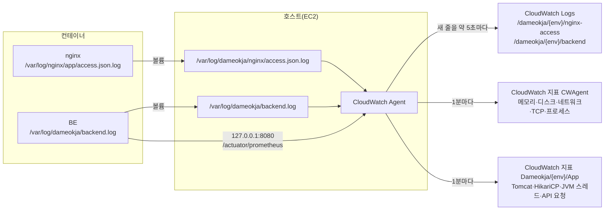

# CloudWatch 로그·지표 수집 적용 기록

작성일: 2026-10-02  
관련 문서: [monitoring-alerting-design.md](monitoring-alerting-design.md), [infra/monitoring/README.md](../../infra/monitoring/README.md)

EC2 앱 서버의 **nginx 접근 로그**, **BE 로그**, **서버 OS 지표**(메모리·디스크·네트워크·TCP·프로세스), **BE 애플리케이션 지표**(Tomcat·HikariCP·JVM 스레드·API 요청)를 CloudWatch Agent로 CloudWatch에 보내도록 구성한 과정입니다. 다른 서버에 적용할 때 4장 순서를 그대로 따릅니다.

## 1. 진행 상황

| 항목 | dev | prod |
|---|---|---|
| compose 변경(로그 폴더 마운트) | ✅ | ✅ |
| nginx 설정 변경(JSON 접근 로그) | ✅ | ✅ |
| 로그 폴더 준비(`/var/log/dameokja`, uid 10001) | ✅ | ✅ |
| Agent 설치·설정 적용 | ✅ | ✅ |
| BE 로그 → `/dameokja/{env}/backend` | ✅ | ✅ |
| nginx 로그 → `/dameokja/{env}/nginx-access` | ✅ (요청이 있어야 표시) | ✅ |
| 램·디스크 지표 → `CWAgent` | ✅ | ✅ |
| OS 지표 확장(네트워크 오류·드롭, TCP, 프로세스, 프로세스별 CPU·메모리) → `CWAgent` | ✅ (콘솔 확인 필요) | ✅ (콘솔 확인 필요) |
| BE 지표 노출(`/actuator/prometheus`, BE 반영) | ✅ | ✅ |
| BE 앱 지표 → `Dameokja/{env}/App` (Agent Prometheus 수집) | ✅ (콘솔 확인 필요) | ✅ (콘솔 확인 필요) |
| 자원 대시보드 `dameokja-{env}-infra` (스택 업데이트) | ⬜ | ⬜ |
| nginx 연결 수(stub_status) | ⬜ 방식 미결정 | ⬜ |
| 로그 그룹 보관 기간 설정 | ⬜ | ⬜ |
| 모니터링 스택(지표 필터·알람·대시보드) | ✅ `dameokja-v1-dev-monitoring` | ✅ `dameokja-v1-prod-monitoring` |

## 2. 구조



- **왜 파일을 거치나**: 컨테이너 로그 드라이버가 `local`(Docker 내부 형식)이라 Agent가 `docker logs` 출력을 직접 읽을 수 없습니다. 그래서 같은 로그를 호스트 파일에 한 번 더 쓰고, Agent가 그 파일을 실시간으로 따라 읽게 했습니다.
- **트레이드오프**: Docker 설정과 무관하게 수집되고 `docker logs`도 그대로 쓸 수 있습니다. 대신 로그가 두 번 저장되고, 서버마다 폴더 권한·로그 회전을 따로 챙겨야 합니다.

## 3. 구성 내용

### 3.1 BE: 로그 파일 위치

BE(`application.yml`)는 콘솔과 함께 파일에도 로그를 씁니다.

```yaml
logging:
  file:
    name: /var/log/dameokja/backend.log
```

- 이미지 안에서 BE는 `uid 10001`(app 사용자)로 실행됩니다.
- SQL 로그(`show-sql`)는 콘솔에만 출력되고 파일에는 남지 않습니다.

### 3.2 compose: 로그 폴더 연결

컨테이너 안의 로그 폴더를 호스트 폴더와 연결합니다. 서버 파일: `/home/ubuntu/app/compose.yaml`, 저장소: `dev-compose.yaml`, `prod-compose.yaml`.

```yaml
  nginx:
    volumes:
      - /var/log/dameokja/nginx:/var/log/nginx/app

  backend:
    volumes:
      - /var/log/dameokja:/var/log/dameokja
```

BE는 컨테이너와 호스트의 경로를 같게 맞춰, BE 설정의 경로가 그대로 호스트 경로가 되게 했습니다.

BE 지표 수집을 위해 BE 포트를 서버 내부에만 엽니다.

```yaml
  backend:
    expose: ["8080"]
    ports: ["127.0.0.1:8080:8080"]
```

- **이유**: Agent는 호스트에서 실행되어 Docker 내부 네트워크의 BE에 바로 접근할 수 없습니다.
- **트레이드오프**: `127.0.0.1`에만 열어 외부에서는 접근할 수 없지만, 서버 안의 다른 프로세스는 BE에 직접 요청할 수 있습니다.

### 3.3 nginx: JSON 접근 로그

서버 파일: `/home/ubuntu/app/nginx/default.conf`, 저장소: `nginx-dev/default.conf`, `nginx-prod/default.conf`.

| 추가한 설정 | 역할 |
|---|---|
| `map "$request_method $uri" $slo_route` | 요청을 SLI 작업(재고 등록·조회·알림 조회)별로 분류, 대상이 아니면 `-` |
| `log_format slo_json` | 요청 한 건을 JSON 한 줄로 기록(`status`, `route`, `request_time` 등) |
| `access_log /var/log/nginx/app/access.json.log slo_json;` (443 서버 블록) | 위 형식으로 마운트된 폴더에 기록. 기존 `docker logs`용 로그도 유지 |

기록 예시:

```json
{"time":"2026-10-02T16:04:00+09:00","method":"GET","uri":"/","status":200,"route":"-","request_time":0.012,"upstream_status":"200","upstream_time":"0.011","bytes":512}
```

- **이유**: 지표 필터가 `status`, `route` 필드를 바로 비교할 수 있어, 작업별 성공·실패 건수를 셀 수 있습니다.
- **트레이드오프**: API 경로가 바뀌면 nginx `map`도 같이 고쳐야 합니다. 80 포트(HTTP→HTTPS 리다이렉트)와 `/nginx-health`는 기록하지 않습니다.

### 3.4 Agent 설정

저장소: `infra/monitoring/cloudwatch-agent/amazon-cloudwatch-agent.{dev,prod}.json` → 서버: `/opt/aws/amazon-cloudwatch-agent/etc/dameokja.json`

| 설정 | 내용 |
|---|---|
| 로그 ① | `/var/log/dameokja/nginx/access.json.log` → `/dameokja/{env}/nginx-access` |
| 로그 ② | `/var/log/dameokja/backend.log` → `/dameokja/{env}/backend` (날짜로 시작하는 줄 기준으로 여러 줄 로그를 묶음) |
| 스트림 이름 | 인스턴스 ID |
| BE 앱 지표(Prometheus) | `127.0.0.1:8080/actuator/prometheus`를 1분마다 읽어 Tomcat·HikariCP·JVM 스레드·SLI API 요청 지표만 `Dameokja/{env}/App`으로 전송. 설정: `prometheus.{env}.yaml` → 서버 `/opt/aws/amazon-cloudwatch-agent/etc/prometheus.yaml` |
| 지표 | 메모리·디스크 사용률, 네트워크 오류·드롭(`ens5`), TCP 연결(ESTABLISHED·TIME_WAIT), 프로세스 상태(running·blocked), 프로세스별 CPU·메모리(`java`·`nginx`·`node`) — 서버당 16개 |

네트워크 인터페이스 이름은 서버의 기본 NIC(`ip -br link`로 확인)와 같아야 합니다. 프로세스별 지표는 `docker stats`가 아니라 호스트에서 본 프로세스 이름 기준입니다.

### 3.5 BE 애플리케이션 지표 (Prometheus)

BE(Spring Boot Actuator)가 Prometheus 형식으로 지표를 내놓고, Agent가 1분마다 읽어 필요한 것만 CloudWatch로 보냅니다.

| 위치 | 변경 |
|---|---|
| BE `build.gradle` | `io.micrometer:micrometer-registry-prometheus` 추가 |
| BE `application.yml` | `management.endpoints.web.exposure.include: health, prometheus` |
| BE `SecurityConfig` | `/actuator/prometheus` 인증 없이 허용 |
| 인프라 compose(backend) | `SERVER_TOMCAT_MBEANREGISTRY_ENABLED: "true"` — Tomcat 스레드 지표에 필요. 비밀이 아니고 dev·prod 값이 같아 Git에 남는 compose에서 관리(BE `application.yml`에 같은 설정을 넣으면 compose 쪽 줄은 삭제) |

| 파일 | 위치 |
|---|---|
| `infra/monitoring/cloudwatch-agent/prometheus.{env}.yaml` | 서버 `/opt/aws/amazon-cloudwatch-agent/etc/prometheus.yaml` (수집 대상 `127.0.0.1:8080/actuator/prometheus`) |
| Agent 설정 JSON의 `logs.metrics_collected.prometheus` | 보낼 지표 선택, 네임스페이스 `Dameokja/{env}/App` |

| 구분 | 지표 |
|---|---|
| Tomcat 스레드 풀 | 사용 중·생성됨·최대 |
| HikariCP | 사용 중·유휴·대기·최대, 커넥션 획득 타임아웃 |
| JVM 스레드 | 전체·데몬·최대 기록, 상태별 |
| HTTP 요청 | SLI API 6개의 요청 수·처리 시간 합계(대시보드에서 평균 처리 시간으로 계산) |

수집 방식은 아래 후보를 비교해 Prometheus + Agent로 정했습니다.

| 방식 | 장점 | 단점 |
|---|---|---|
| **Prometheus + Agent** (채택) | 위 지표를 모두 수집, 보낼 지표를 인프라에서 거름, BE 변경은 의존성·설정·보안 1줄 | Agent 설정 복잡도 증가, BE 포트를 서버 내부에 열어야 함 |
| Micrometer → CloudWatch 직접 전송 | 중간 수집기가 없어 구조 단순 | 지표 선택·변경마다 BE 배포 필요 |
| JMX + Agent | BE 코드 변경 최소 | Agent JMX는 jvm·tomcat 등 정해진 대상만 지원해 **HikariCP 불가**, HTTP 요청별 지표 없음 |

- 외부 노출: nginx가 `/actuator`를 BE로 넘기지 않아 외부에서는 접근할 수 없습니다(외부 요청 시 FE 로그인 페이지로 이동함을 확인).
- 지표 수: HTTP 요청 지표는 경로·메서드·상태코드마다 생겨 많아지므로, SLI 대상 API만 경로·메서드 단위로 보냅니다.
- Agent는 수집한 원본을 로그 그룹 `/dameokja/{env}/prometheus`에 남깁니다(지표 추출용).

### 3.6 대시보드

모니터링 스택이 만드는 대시보드입니다.

| 대시보드 | 내용 |
|---|---|
| `dameokja-prod-slo` | 작업별 월간 성공률·오류 예산, 1시간 오류율, 4xx·5xx, 알람 상태 |
| `dameokja-{env}-infra` | EC2 기본(CPU·크레딧·초과 크레딧·네트워크·EBS·상태 검사), OS(메모리·디스크·프로세스·TCP·네트워크 오류), BE 앱(Tomcat·HikariCP·JVM 스레드·API 요청 수·평균 처리 시간), BE ERROR 건수, 로그 수신량 |
| `dameokja-prod-infra`에만 추가 | Discord 알림 Lambda 호출·오류, 알림 실패 큐, 예상 청구 금액 |

prod 스택에는 Discord 알림 그래프용 파라미터 2개가 있습니다. 값은 Discord 알림 스택(`damuckja-v1-discord-alerts`)의 **출력(Outputs)**에서 복사합니다.

| 파라미터 | 값 |
|---|---|
| `DiscordFunctionName` | `FunctionName` (알람을 Discord로 보내는 Lambda 이름) |
| `DiscordFailureQueueName` | `FailureQueueUrl`의 마지막 `/` 뒤 부분 (전송에 끝내 실패한 알림이 쌓이는 SQS 큐 이름) |

- **이유**: 알림 Lambda가 고장 나면 알람이 울려도 Discord에 아무것도 오지 않아, 알림 경로 자체의 고장을 확인할 수단이 필요합니다. 두 리소스는 다른 스택이 만들고 이름이 자동 생성되어 파라미터로 받습니다.
- **트레이드오프**: 무료 지표라 비용은 없지만, Discord 스택을 새로 만들면 이름이 바뀌어 다시 입력해야 합니다. 알람은 없어 대시보드를 열어야 확인할 수 있습니다.
- 예상 청구 금액 그래프는 결제 콘솔의 "CloudWatch 결제 알림 받기"를 켜야 값이 나옵니다.

**대시보드에서 보이지 않는 것**

| 항목 | 상태 | 확인 방법 |
|---|---|---|
| nginx 4xx·5xx 건수 (dev 전체, prod 자원 대시보드) | 지표(`Dameokja/{env}`의 `Http5xx`·`Http4xx`)는 수집되지만 그래프는 `dameokja-prod-slo`에만 있음 | CloudWatch → 지표 → `Dameokja/{env}` |
| dev 작업별 성공률 | dev는 SLO 대상이 아니라 작업별 지표를 만들지 않음 | Logs Insights 저장 쿼리 `dameokja-dev/SLO 작업별 응답 코드 건수` |
| nginx가 직접 반환한 502·504와 BE 500의 구분 | 5xx 건수에 함께 합쳐짐. BE ERROR 건수는 BE가 남긴 ERROR 로그만 셈 | `/dameokja/{env}/nginx-access`의 `upstream_status` 필드 |
| BE가 ERROR 로그 없이 반환한 500 | BE ERROR 건수에 잡히지 않음(nginx 5xx에는 잡힘) | BE 로그의 WARN·스택트레이스 |
| BE ERROR 건수의 과거 값 | 지표 필터를 만든 이후 로그만 셈 | Logs Insights로 BE 로그 직접 조회 |
| nginx 연결 수(stub_status) | 수집 방식 미결정 | — |
| 컨테이너별 CPU·메모리·재시작 | 프로세스(`java`·`nginx`·`node`) 기준으로만 수집 | `docker stats` |
| DB 서버(MySQL) 지표 | 수집하지 않음 | DB 서버에서 직접 확인 |
| 아침 알림·응답시간 SLI | 측정 방식 미결정(설계 문서 6장), 응답시간은 Sentry | Sentry, DB 발송 기록 |
| Agent 중단 | 알람 없음. 로그 수신량 그래프가 0으로 떨어지는지로만 판단(새벽 무트래픽과 구분 어려움) | `amazon-cloudwatch-agent-ctl -a status` |

## 4. 적용 순서 (서버 1대 기준)

**사전 준비 (AWS 콘솔)**: EC2 인스턴스 IAM 역할에 `CloudWatchAgentServerPolicy` 추가

**① compose·nginx 설정 교체** (`~/app`)

```bash
cd ~/app
cp compose.yaml compose.yaml.bak
cp nginx/default.conf nginx/default.conf.bak
# 저장소의 {env}-compose.yaml → compose.yaml, nginx-{env}/default.conf → nginx/default.conf 로 교체
```

**② 로그 폴더 준비**

```bash
sudo mkdir -p /var/log/dameokja/nginx
sudo chown 10001:10001 /var/log/dameokja
```

BE가 uid 10001로 실행되고, 호스트 폴더를 마운트하면 호스트 권한이 적용되므로 소유자를 맞춰야 합니다.

**③ 컨테이너 재생성**

```bash
docker compose -p app -f compose.yaml --profile app up -d --force-recreate nginx backend
```

`restart`는 볼륨 변경을 반영하지 못하고, nginx 설정 파일 변경은 compose가 감지하지 못하므로 `--force-recreate`로 다시 만듭니다.

**④ Agent 설치**

```bash
cd ~
curl -O https://amazoncloudwatch-agent.s3.amazonaws.com/ubuntu/arm64/latest/amazon-cloudwatch-agent.deb
sudo dpkg -i amazon-cloudwatch-agent.deb
```

**⑤ BE 지표 확인** (3.5의 BE 변경 반영 후)

```bash
curl -s http://127.0.0.1:8080/actuator/prometheus | grep -c -E "tomcat_threads_busy|hikaricp_connections_active|jvm_threads_live|http_server_requests"
```

0보다 크면 정상입니다. backend 재생성 직후에는 기동 중이라 0이 나올 수 있으니 1분쯤 뒤 다시 확인합니다.

**⑥ Agent 설정 적용** (설정 파일 2개를 서버 홈에 올린 뒤)

```bash
sudo cp ~/prometheus.{env}.yaml /opt/aws/amazon-cloudwatch-agent/etc/prometheus.yaml
sudo cp ~/amazon-cloudwatch-agent.{env}.json /opt/aws/amazon-cloudwatch-agent/etc/dameokja.json
sudo /opt/aws/amazon-cloudwatch-agent/bin/amazon-cloudwatch-agent-ctl -a fetch-config -m ec2 -s -c file:/opt/aws/amazon-cloudwatch-agent/etc/dameokja.json
```

**⑦ 확인**

```bash
ls -l /var/log/dameokja/ /var/log/dameokja/nginx/
sudo grep piping /opt/aws/amazon-cloudwatch-agent/logs/amazon-cloudwatch-agent.log
```

`piping log from …` 줄이 backend·nginx 각각 보이면 Agent가 전송 중입니다. 콘솔(서울) CloudWatch → 로그 그룹 `/dameokja/{env}/…`, 지표 `CWAgent`·`Dameokja/{env}/App`에서 확인합니다.

**⑧ 모니터링 스택 업데이트**

CloudFormation → `dameokja-v1-{env}-monitoring` → 업데이트 → 현재 템플릿 교체 → `infra/monitoring/cloudformation/slo-monitoring.{env}.template.json` → 제출. prod는 3.6의 파라미터 2개를 입력합니다.

## 5. 트러블슈팅

### dev nginx 로그가 CloudWatch 로그 그룹에 보이지 않음

| 항목 | 내용 |
|---|---|
| 증상 | Agent 로그에 `piping log from /dameokja/dev/nginx-access/…`가 있는데, CloudWatch 로그 관리에서 dev nginx 로그가 보이지 않음 |
| 확인 | nginx 설정(`slo_json`)·마운트(`/var/log/nginx/app`)·Agent 등록 모두 정상. `access.json.log`가 **0바이트** |
| 원인 | 파일 생성 이후 dev에 HTTPS 요청이 한 번도 없어 기록된 줄이 없었음. Agent는 새 줄이 생겨야 전송하므로, 보낼 데이터가 없어 CloudWatch에 로그가 나타나지 않음 |
| 해결 | 요청을 발생시켜 파일에 줄이 생기는지 확인 → 1~2분 뒤 CloudWatch에 표시됨 |

```bash
curl -s -o /dev/null https://dev.dameokja.com/
ls -l /var/log/dameokja/nginx/      # 크기가 0보다 커지면 정상
```

트래픽이 적은 dev에서는 설정이 맞아도 로그 그룹이 비어 보일 수 있으니, 수집 여부는 파일 크기와 Agent의 `piping` 로그로 먼저 확인합니다.

## 6. 주의할 점

- **보관 기간**: Agent가 로그 그룹을 "만료 안 함"으로 만들었습니다. 콘솔에서 dev 7일, prod 30일, `/dameokja/{env}/prometheus`는 1일로 설정합니다. 모니터링 템플릿은 로그 그룹을 만들지 않고 이 그룹을 이름으로만 참조하므로, 보관 기간은 계속 콘솔에서 관리합니다.
- **모니터링 스택보다 Agent가 먼저**: 지표 필터는 대상 로그 그룹이 있어야 만들어집니다. 새 서버는 Agent 적용(로그 그룹 생성) 후 스택을 만듭니다.
- **BE 로그 시간**: UTC(`…Z`)로 찍힙니다. CloudWatch 조회·알람은 수신 시각 기준이라 영향이 없지만, 본문을 읽을 때는 +9시간으로 계산합니다.
- **비용(서울)**: 사용자 지정 지표는 개당 월 $0.30(계정당 무료 10개), 로그는 수집 GB당 $0.76(월 5GB 무료).

  | 지표 출처 | 개수 |
  |---|---|
  | Agent OS 지표 | 서버당 16 × 2 = 32 |
  | BE 앱 지표 | 환경당 약 29 × 2 = 58 |
  | 로그 지표 필터 | prod 9 + dev 3 = 12 |

  합계 약 102개로 월 약 $28. 알람(약 $5)과 대시보드(지표 50개를 넘는 자원 대시보드 2개 × $3)를 더하면 모니터링 전체는 **월 약 $39 + 로그 수집량**입니다. BE 앱 지표를 prod만 수집하면 약 $9가 줄어듭니다.

## 7. 남은 작업

1. 로그 그룹 보관 기간 설정(dev 7일, prod 30일, prometheus 1일)
2. 모니터링 스택 업데이트 → `dameokja-{env}-infra` 대시보드 확인
3. 알람 → Discord 전달 테스트, 대시보드 수치 확인
4. nginx 연결 수(stub_status) 수집 방식 결정
5. 보류: Push 발송 결과(`event=web_push_send`) 집계 — 아침 알림 SLI 방식 결정 후
