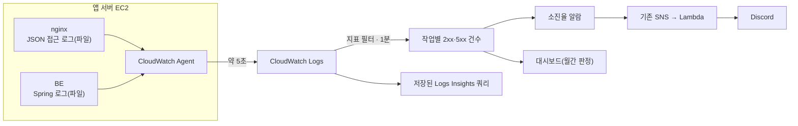

# 다먹자 모니터링·알림 설계 (CloudWatch)

작성일: 2026-10-02  
적용 범위: v1 (dev·prod)  
선행 문서: [SLI-SLO-design.md](SLI-SLO-design.md) — 이 문서는 그 5장에서 "별도 알림 설계"로 미뤄둔 운영자 알림의 발생 조건·심각도·수신자·대응·복구 조건을 정합니다.  
구현: `infra/monitoring` ([README](../../infra/monitoring/README.md))

## 1. 범위

| SLI | 이번 구현 | 비고 |
|---|---|---|
| 작업 성공률(수동 재고 등록·재고 조회·알림 조회) | **구현** — nginx 로그 → 지표 필터 → 소진율 알람·대시보드 | 2~4장 |
| 아침 알림 | 후보 비교만 | 6.1 — 판정에 DB 발송 기록이 필요해 CloudWatch만으로 계산할 수 없음 |
| 응답시간 | 후보 비교만 | 6.2 — 측정값이 Sentry에 있음 |
| 일반 오류·자원(5xx 전체, 4xx 급증, 메모리, 디스크) | **구현** | SLO 문서에서 "별도 관찰"로 남긴 항목 |
| 서버·BE 상세 지표(EC2 기본, OS, Tomcat·HikariCP·JVM 스레드·API 요청, BE ERROR) | **구현**(대시보드만, 알람 없음) | [cloudwatch-agent-setup.md](cloudwatch-agent-setup.md) 3.4~3.6 |

## 2. 수집 구조

### 2.1 로그 전달 방식

- **상황**: compose의 logging driver가 `local`이라 컨테이너 로그가 Docker 내부 형식으로만 저장되어 CloudWatch Agent가 읽을 수 없음. SLO 문서는 이미 "Agent로 수집"을 전제로 함.
- **결론**: nginx·BE가 **호스트 디렉터리(nginx: `/var/log/dameokja/nginx`, BE: `/var/log/dameokja`)에 파일 로그를 따로 쓰고 Agent가 읽음**(팀 선택). `docker logs`용 출력은 그대로 유지.

| 후보 | 장점 | 단점 |
|---|---|---|
| **A. 호스트 파일 + Agent** ✅ | 로그 원본 형식 그대로라 지표 필터가 단순, `docker logs` 유지, BE는 `application.yml`의 `logging.file.name`(`/var/log/dameokja/backend.log`)을 같은 경로로 마운트 | 호스트 logrotate·디렉터리 소유자(uid 10001) 준비 필요, 같은 로그가 두 군데 저장됨 |
| B. json-file 드라이버 + Agent | 앱·nginx 설정 변경 없음 | 로그가 Docker JSON으로 한 번 더 감싸져 필터가 복잡, 컨테이너 재생성마다 파일 경로(ID)가 바뀜 |
| C. awslogs 드라이버 | Agent 불필요, 가장 단순 | 기존 Agent 결정과 다름, `docker logs` 불가, CloudWatch 장애가 컨테이너 기동에 영향 가능 |

- **트레이드오프**: 수집 경로가 Docker와 분리돼 안정적이고 필터가 단순한 대신, 서버마다 1회 준비 작업(`setup-host.sh`)이 생기고 이를 빠뜨리면 BE 파일 로그가 조용히 비게 됨. nginx 로그는 `copytruncate`로 회전하므로 회전 순간 수 ms의 로그가 빠질 수 있음.

### 2.2 nginx 로그 형식과 작업 분류

- **결론**: nginx가 요청을 받을 때 `$slo_route` 값으로 SLI 작업을 분류해 JSON 로그에 남김. 분류 기준은 SLO 문서 3.1과 같음.

| `route` | 요청 |
|---|---|
| `ingredient_create` | POST R/ingredients |
| `ingredient_read` | GET R/ingredients, GET /api/v1/ingredients/{id} |
| `notification_poll` | GET R/notifications, R/notifications/stream, R/notifications/unread-count |
| `aux_consume`, `aux_push_subscribe` | 보조 관측 대상(목표 없음, 쿼리로만 확인) |
| `-` | 그 외(평가 대상 아님) |

- **이유**: 경로에 냉장고 ID가 들어 있어 지표 필터만으로 API를 구분하려면 와일드카드 패턴이 늘어나고 오분류를 검증하기 어려움. nginx에서 한 번 분류하면 필터는 `route` 값만 비교하면 됨.
- **트레이드오프**: API 경로가 바뀌면 nginx·생성기 두 곳을 함께 고쳐야 함. 판정은 nginx가 본 응답 코드라 BE가 응답하지 못한 502·504도 실패로 잡히는(SLO 문서 3.2와 일치) 대신, 사용자↔nginx 구간 장애는 보이지 않음(SLO 문서에서 이미 평가 제외).

## 3. SLO 계산과 알림 방식

### 3.1 계산 방식

- **결론**: 지표 필터 + Metric Math 알람을 **직접 구성**(팀 선택).

| 후보 | 장점 | 단점 |
|---|---|---|
| A. CloudWatch Application Signals SLO | 오류 예산·달성률·소진율을 AWS가 계산, 달력 월 지원 | SLO당 약 $0.13/월(1분 주기, 최초 3개월 무료), 소진율 지표 이름·달력 월 시간대 관련 공식 문서가 불충분해 배포 후 확인 필요 |
| **B. 지표 수식 알람 직접 구성** ✅ | 계산식을 모두 코드로 설명·검증 가능, 추가 서비스 없음 | 알람 창이 최대 1일이라 **월간 잔여 예산을 알람으로 추적할 수 없음** → 월간 판정은 대시보드·쿼리로 분리, 수식 유지보수 부담 |

- 지표: 작업별 `Good`(2xx)·`Bad`(5xx) 건수. 4xx는 지표 자체를 만들지 않아 분모·분자 모두에서 빠짐(SLO 문서 3.2).
- 오류율 = Bad ÷ (Good + Bad). 구간별 비율을 평균하지 않고 건수를 합산(SLO 문서 공통 계산 기준).

### 3.2 오류 예산 소진율 알람

Google SRE Workbook의 **다중 기간·다중 소진율** 방식을 따릅니다. 소진율은 "지금 속도로 실패가 계속되면 예산을 몇 배 빠르게 쓰는가"이며, 목표 95%(예산 5%)에서 소진율 N배 = 오류율 N × 5%입니다.

| 알람 | 긴 창 | 짧은 창 | 소진율(오류율) | 최소 평가 건수(긴/짧은) | 의미 | 심각도 |
|---|---|---|---|---|---|---|
| fast-burn | 1시간 | 5분 | 14.4배(72%) | 10 / 3 | 1시간에 월 예산의 2% 소진 | **page**: 즉시 대응, 멘션 |
| slow-burn | 6시간 | 30분 | 6배(30%) | 20 / 5 | 6시간에 월 예산의 5% 소진 | **ticket**: 당일 확인, 멘션 없음 |

- 긴 창과 짧은 창이 **모두** 기준을 넘을 때만 알림(복합 알람). 짧은 창은 "지금도 계속되는가"를 확인해, 이미 끝난 장애가 긴 창에 남아 계속 울리는 것을 막고 복구 알림을 빠르게 함.
- **이유**: 고정 임계치(예: 5xx 10건)는 트래픽 규모에 따라 의미가 달라지지만, 소진율은 SLO와 직접 연결돼 "이 알림을 무시하면 월 SLO가 깨지는가"로 판단할 수 있음.
- **트레이드오프**:
  - 현재 트래픽(평시 시간당 수 건)에서는 최소 건수 조건 때문에 피크 시간대 외에는 거의 울리지 않음. 최소 건수를 없애면 요청 3건 중 1건 실패(33%)만으로도 경보 수준에 가까워져 오탐이 많아짐. 저트래픽 구간의 장애는 일반 5xx 알람(4장)과 월간 대시보드로 보완.
  - 복합 알람 1개당 $0.50/월이 들어 단일 창 알람보다 비쌈(5장). 긴 창만 쓰면 약 $3/월 절약되지만 복구 알림이 최대 1~6시간 늦어짐.
  - 3일 창(소진율 1배) 같은 장기 알람은 알람 최대 창(1일) 제약으로 만들지 않고 대시보드로 대신함.
- **배포 후 확인 필요**: 1시간·6시간 기간 알람이 매분 이동 창으로 평가되는지, 기간 경계로 평가되는지에 따라 감지가 최대 한 기간 늦어질 수 있음. 장애 주입(테스트용 5xx) 후 실제 알림 시각으로 확인.

### 3.3 월간 판정

- 대시보드 `dameokja-prod-slo`의 숫자 위젯이 **선택한 시간 범위 전체**를 한 기간으로 계산(`setPeriodToTimeRange`). 시간 범위를 **KST 해당 월 1일 00:00 ~ 다음 달 1일 00:00(절대 시간, +09:00)**로 두면 작업별 성공률·남은 오류 예산·평가 대상 건수가 월간 판정값이 됨.
- 정밀 확인은 저장된 쿼리 `dameokja-prod/SLO 작업별 응답 코드 건수`(Logs Insights)로 같은 기간을 집계.
- **트레이드오프**: 판정이 자동 기록되지 않고 사람이 기간을 맞춰 조회해야 함. 지표 보관 해상도는 줄어도 합계는 유지되므로(SLO 문서 3.4) 455일 이내의 월은 다시 계산 가능. 로그 원본은 보관 기간(prod 30일) 이후 사라짐.

## 4. 알림 정책

### 4.1 알림 목록

| 알람 | 환경 | 발생 조건 | 심각도 | 대응 | 복구 조건 |
|---|---|---|---|---|---|
| `…-slo-<작업>-fast-burn-page` | prod | 3.2 표 | page | 즉시: 대시보드에서 작업·시점 확인 → nginx 로그(`upstream_status`)로 502/504(BE 다운·지연)와 500(BE 예외) 구분 → BE 로그 → 최근 배포면 롤백 | 짧은 창 오류율이 기준 미만 |
| `…-slo-<작업>-slow-burn-ticket` | prod | 3.2 표 | ticket | 당일: 원인 API·코드 확인, 이슈 등록 | 동일 |
| `dameokja-{env}-http-5xx-ticket` | dev·prod | 전체 API 5xx 5분 5건 이상 | ticket | SLI 비대상 API(로그인 등) 포함 오류 확인 | 5분간 5건 미만 |
| `dameokja-prod-http-4xx-surge-ticket` | prod | 4xx 1시간 100건 이상 | ticket | 저장 쿼리 `4xx 코드별 건수`로 401·404 급증 여부 확인(서버·인증 버그 가능성) | 1시간 100건 미만 |
| `dameokja-{env}-memory-ticket` | dev·prod | 메모리 90% 이상 10분 | ticket | 컨테이너별 사용량 확인(t4g.small 메모리 예산 부족 우려 항목) | 90% 미만 |
| `dameokja-{env}-disk-ticket` | dev·prod | 루트 디스크 85% 이상 | ticket | 로그·이미지 정리, 로그 회전 확인 | 85% 미만 |

### 4.2 심각도와 수신자

| 심각도 | 의미 | 수신 | 멘션 |
|---|---|---|---|
| page | 사용자 영향이 크고 지금 진행 중 → 바로 대응 | Discord AWS 알림 채널(기존 웹훅) | 기존 `DiscordUserIds`(AWS 담당자) |
| ticket | 오늘 안에 확인 | 같은 채널 | 없음 |

- 심각도는 알람 이름 끝(`-page`/`-ticket`)으로 구분하고, 기존 Discord Lambda가 `-ticket`이면 멘션을 생략하도록 수정함. 기존 알람(이름 규칙 없음)은 이전처럼 멘션.
- **이유**: 별도 채널·웹훅을 만들지 않고 기존 SNS → Lambda → Discord 경로를 재사용해 운영 지점을 늘리지 않음.
- **트레이드오프**: 한 채널에 page·ticket이 섞이므로 ticket이 많아지면 page가 묻힐 수 있음. dev 알림도 같은 채널로 오므로, dev 소음이 커지면 dev 전용 웹훅 분리를 검토.
- **dev는 page가 없음**: dev는 SLO 평가 대상이 아니고 배포·실험으로 오류가 잦아, 작업별 소진율 알람을 만들지 않고 5xx·자원 알람만 ticket으로 둠. 비용도 줄어듦(5장).

### 4.3 알림이 오지 않는 경우(알려진 한계)

| 상황 | 이유 | 보완 |
|---|---|---|
| 요청이 nginx까지 오지 못함(EC2 정지, DNS·TLS 장애) | 로그가 없으면 지표도 없음 → 알람은 정상으로 처리 | 기존 EC2 상태 검사 알람, Sentry 네트워크 오류 증가 |
| CloudWatch Agent 중단 | 위와 같음 | 미구현 — 후보: 로그 그룹 `IncomingLogEvents` 무수신 알람(단, 새벽 무트래픽과 구분이 어려워 오탐) |
| 저트래픽 시간대 장애 | 최소 건수 조건 | 5xx 건수 알람, 월간 대시보드 |
| 2xx로 잘못된 결과 반환 | 응답 코드 판정의 한계(SLO 문서 3.2) | 테스트·QA·제보 |

## 5. 비용 추정

서울 리전 가격 기준(지표·알람 단가는 us-east-1과 같고, 로그 수집만 GB당 $0.76로 더 비쌈). 무료 사용량: 사용자 지정 지표 10개, 알람 지표 10개, 대시보드 3개(각 지표 50개 이하).

아래 표는 SLO 알림 구성만의 비용입니다. 이후 추가한 서버·BE 상세 지표를 포함한 전체 비용은 [cloudwatch-agent-setup.md](cloudwatch-agent-setup.md) 6장(월 약 $39 + 로그)을 기준으로 합니다.

| 항목 | 수량 | 단가 | 월 비용 |
|---|---|---|---|
| 사용자 지정 지표 | prod 8, dev 2, Agent mem·disk 4 = 14 (무료 10 초과 4) | $0.30 | 약 $1.2 |
| 표준 알람(지표 수 기준) | 소진율 하위 알람 12개 × 2지표 + 단순 알람 7개 = 31 (무료 10 초과 21) | $0.10 | 약 $2.1 |
| 복합 알람 | 6 | $0.50 | $3.0 |
| 대시보드·저장 쿼리 | 1 / 5 | 무료 범위 | $0 |
| 로그 수집 | 사용량 | GB당 $0.76 | 아래 참고 |
| **합계(로그 제외)** | | | **약 $6.3** |

- nginx 로그는 요청당 약 250B라 현재 트래픽에선 무시할 수준. BE의 SQL 로그(`show-sql`)는 콘솔에만 출력되고 파일(`backend.log`)에는 남지 않아 CloudWatch 수집량에 포함되지 않음.
- 기존 알람(상태 검사·CPU)도 무료 알람 수를 함께 쓰므로 실제 청구는 약간 늘 수 있음.

## 6. 후보 비교 (미결정)

아래 두 SLI는 CloudWatch 로그만으로 판정할 수 없어 방식 후보만 정리합니다. 최종 선택은 팀에서 정합니다.

### 6.1 아침 알림 SLI

판정(SLO 문서 3.3)에는 사용자별 알림 생성 여부와 Push 발송 기록(`push_notifications`의 상태·접수 시각)이 필요하고, 생성 실패 냉장고 수는 배치 로그(`failedRefrigeratorCount`)에만 있습니다. 배치 로그는 이번 구성으로 이미 `/dameokja/{env}/backend`에 수집되며, 저장 쿼리 `아침 알림 배치 결과`·`Push 발송 실패 로그`로 조회할 수 있습니다.

| 후보 | 방식 | 장점 | 단점 |
|---|---|---|---|
| ① 앱 서버 cron 스크립트 | 매일 08:05 KST에 앱 서버에서 DB 조회 → 성공·실패·제외 건수를 `PutMetricData` | BE 코드 수정 없음, 판정 규칙을 SQL로 정확히 구현, 앱 서버가 이미 DB 접근·Agent 권한(PutMetricData 포함)을 가짐 | 서버 cron·DB 계정 관리가 늘어남, 스크립트 실패를 따로 감시해야 함, ASG 전환(v2) 시 실행 위치 재설계 |
| ② Lambda + EventBridge Scheduler | 같은 조회를 Lambda가 수행 | 서버와 분리, 실패 재시도·로그가 관리형 | prod DB가 private이라 VPC Lambda 필요 → CloudWatch 전송용 VPC 엔드포인트(월 약 $7 이상) 또는 NAT 비용, 보안그룹·DB 계정 추가 |
| ③ BE가 판정 결과를 구조화 로그로 출력 | 배치 종료 후 BE가 대상·성공·실패 건수를 JSON(또는 EMF) 한 줄로 기록 → 지표 필터 | 실시간, 추가 인프라 없음, 판정 로직이 도메인 코드 옆에 있음 | BE 파트의 코드 수정 필요, Push 재시도·08:01 기준을 BE가 다시 계산해야 하고 DB 기록과 이중 관리 |
| ④ 월말 수동 계산 + 배치 이상 알람만 | 월간 판정은 DB 쿼리로 수동, 알람은 배치 로그 기반(생성 실패 냉장고 수 > 0, Push 실패 로그 건수) | 가장 단순·저렴, 이번 구성에 지표 필터만 추가 | 사용자 단위 판정·오류 예산을 실시간으로 볼 수 없음, "배치 미실행"은 로그가 없어 감지하기 어려움(지표 수식의 시간 함수로 08:00 구간만 검사하는 방식은 가능하지만 검증 필요) |

### 6.2 응답시간 SLI

SLO 문서 4.3대로 측정값은 Sentry(`http.client`, prod 10% 샘플링)에 있습니다.

| 후보 | 방식 | 장점 | 단점 |
|---|---|---|---|
| ① Sentry 알림 | Sentry의 성능 지표 알림(p95)을 Discord 웹훅으로 | 측정 원천과 알림이 같아 정의가 일치, 추가 인프라 없음 | 체험 계정 1개를 공유 중이라 설정 변경 추적 불가, 체험 종료 후 무료 플랜 제한, 4xx 제외 같은 규칙 적용이 어려움, 알림 경로가 CloudWatch와 분리 |
| ② nginx 처리시간 비율 알람 | 지표 필터로 `request_time > 1`(초) 건수를 세어 "1초 초과 비율"을 소진율과 같은 방식으로 알람 | 이번 구성에 필터 몇 개만 추가, 4xx 제외 가능, 같은 Discord 경로 | 서버 처리시간만 측정해 DNS·TLS·네트워크 구간이 빠짐 → SLO 측정값보다 항상 짧음(SLO 문서가 보조 지표로만 인정) |
| ③ CloudWatch RUM | 브라우저에서 실제 사용자 요청 시간을 CloudWatch로 수집 | 사용자 기기 기준 측정, CloudWatch에서 알람·대시보드 통합 | FE 코드 수정 필요(FE 파트 영역), 이벤트 10만 건당 약 $1, Sentry와 측정이 이중화 |
| ④ Sentry API 주기 조회 → CloudWatch | Lambda가 Sentry API로 p95를 가져와 `PutMetricData` | 측정 원천은 Sentry 유지, 알림은 CloudWatch로 통일 | Sentry API 토큰 관리, 무료 플랜 API 제한, 구현·운영 부담이 가장 큼 |

현재 구성으로도 저장 쿼리 `API 서버 처리시간 p95·p99`로 ② 수준의 값은 조회할 수 있습니다(알람 없음).

## 7. 결정·확인이 남은 항목

- [ ] 6.1 아침 알림, 6.2 응답시간 측정·알림 방식 선택
- [ ] 배포 후 확인: 1시간·6시간 알람의 평가 방식(3.2), 대시보드 월간 값과 Logs Insights 집계 일치 여부
- [ ] 운영 2~4주 후 `Http4xxHourlyThreshold`·`Http5xxThreshold`·소진율 최소 건수 재조정
- [ ] dev 알림 소음이 커지면 dev 전용 Discord 웹훅 분리

## 8. 출처

- Google SRE Workbook: [Alerting on SLOs](https://sre.google/workbook/alerting-on-slos/) — 다중 기간·다중 소진율 알람, 저트래픽 서비스 고려사항
- AWS: [Service level objectives (SLOs)](https://docs.aws.amazon.com/AmazonCloudWatch/latest/monitoring/CloudWatch-ServiceLevelObjectives.html) — Application Signals 요청 기반 SLO(후보 A)
- AWS: [AWS::ApplicationSignals::ServiceLevelObjective](https://docs.aws.amazon.com/AWSCloudFormation/latest/TemplateReference/aws-resource-applicationsignals-servicelevelobjective.html) — 달력 주기·소진율 설정 구조
- AWS: [Amazon CloudWatch Pricing](https://aws.amazon.com/cloudwatch/pricing/) — 지표·알람·복합 알람·로그·Application Signals 단가
- AWS: [CloudWatch Agent 설정 파일](https://docs.aws.amazon.com/AmazonCloudWatch/latest/monitoring/CloudWatch-Agent-Configuration-File-Details.html) — 로그 파일 수집, `append_dimensions`
- AWS: [Filter pattern syntax](https://docs.aws.amazon.com/AmazonCloudWatch/latest/logs/FilterAndPatternSyntax.html) — JSON 로그 지표 필터
