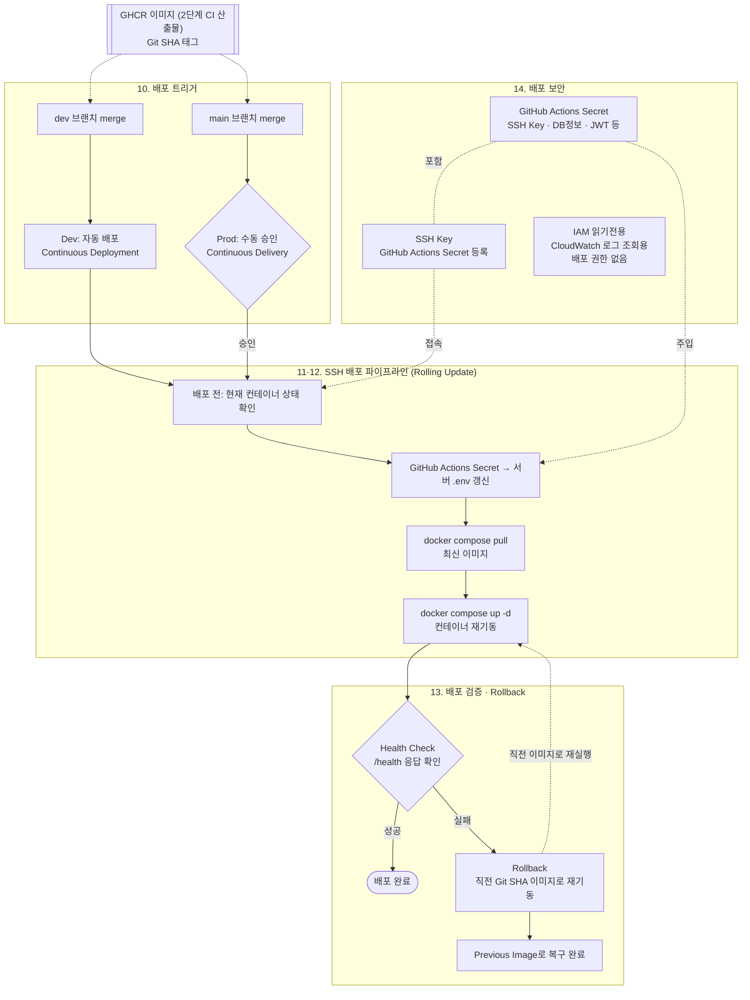

# 다먹자 v1 인프라 위키 — 3단계: CD(지속적 배포) 파이프라인 설계

> KTB 4조 다먹자 팀의 v1 인프라 설계 문서입니다. 이 문서는 **3단계(CD 파이프라인 설계)** 만 다룹니다. 1단계(EC2 + Docker Compose 기반 초기 배포)는 `ktb4-cloud-wiki-v1.md`, 2단계(CI)는 `ktb4-cloud-wiki-ci.md`를 참고하세요.
> 각 결정 항목은 **상황 → 결론 → 이유 → 트레이드오프** 순서로 정리합니다. (결론/이유/트레이드오프는 작성 예정)

## 목차
10. [CD 적용 범위 및 방식 결정](#10-cd-적용-범위-및-방식-결정)
11. [EC2 + Docker Compose CD Pipeline 설계](#11-ec2--docker-compose-cd-pipeline-설계)
12. [배포 전략 결정](#12-배포-전략-결정)
13. [배포 검증 및 Rollback 설계](#13-배포-검증-및-rollback-설계)
14. [배포 보안 설계](#14-배포-보안-설계)

---

## 상황 및 필요성

**상황**: CI를 통해 안정적으로 Docker Image를 만들 수 있게 되었음. 하지만 새 버전을 배포할 때마다 클라우드 담당자가 EC2에 접속해 `docker compose pull` / `docker compose up -d`를 직접 실행해야 한다면, 배포 빈도가 늘어날수록 문제가 커짐 — Application Delivery 과정의 자동화가 필요함.

---

## CD 파이프라인 다이어그램

(10~14번 결정사항을 한눈에 보기 위한 Mermaid 다이어그램)

> 참고: Health Check만으로는 특정 API만 깨진 경우를 못 잡음(13번 트레이드오프) — Smoke Test는 v1 미도입, 추후 서비스가 커지면 검토. IAM은 CD 파이프라인 실행 자체(SSH)에는 쓰이지 않고, 팀원들의 CloudWatch 로그 조회 전용으로만 부여됨(14번).

---

### 10. CD 적용 범위 및 방식 결정
- **상황**: 2단계 CI까지는 자동으로 Docker Image가 만들어지지만, 실제 EC2에 반영하는 과정은 여전히 사람이 SSH로 접속해 `docker compose pull` / `up -d`를 수동 실행해야 함. dev는 AI 1명, 풀스택 3명, 클라우드 1명 전체 팀이 매일 붙어서 확인하는 공유 테스트 환경이라, 변경사항 반영 속도가 곧 개발 속도에 직결됨. 반면 prod는 KTB 훈련생 등 실사용자가 실제로 쓰는 환경인데, CI 통과만으로 바로 실사용자에게 노출하기엔 검증이 충분하지 않다고 느껴짐. 게다가 클라우드 담당이 1명뿐이라, 배포 이후 문제가 생겼을 때 누군가 지켜보고 있는 시점에 배포되는 편이 대응에 유리함.
- **결론**:
  - **Dev**: **자동 배포 (Continuous Deployment)** — `dev` 브랜치에 merge되어 CI에서 이미지가 만들어지면, 사람 승인 없이 즉시 dev 서버에 배포
  - **Prod**: **수동 배포 (Continuous Delivery)** — `main` 브랜치 merge로 이미지는 자동으로 만들어지지만, 실제 운영 서버 배포는 사람이 승인해야 실행됨
  - **배포 전략**: dev/prod 모두 **Rolling Update** (1단계 "배포 빈도/전략"에서 이미 결정한 내용을 그대로 이어감)
- **이유**:
  - **Dev는 자동 배포** — dev는 속도가 생명인 환경. 팀원들이 변경사항을 최대한 빨리 확인하고 다음 작업으로 넘어가야 하므로, 승인 단계 없이 바로 반영되도록 함.
  - **Prod는 수동 배포** — prod는 실사용자에게 직접 영향을 주는 환경인데, 2단계 CI가 아직 BE 위주(FE/AI 테스트·통합 테스트 미비)라 "CI 통과 = 안전"이라고 완전히 믿기 어려운 상태. 게다가 클라우드 담당이 1명뿐이라, 문제가 생겼을 때 그 담당자가 지켜보고 있는 시점에 배포되는 게 대응에 유리함. 배포 전에 사람이 한 번 확인·승인하는 단계를 둬서, 검증이 덜 된 버전이 곧바로 운영에 반영되는 것을 막음.
  - **배포 전략(Rolling Update)** — 1단계에서 이미 정리한 내용과 동일: 사용자 접근이 대부분 식사시간에 몰려 있어 새벽 시간대 빅뱅배포도 고려했으나, 야식을 먹는 사용자가 있으면 불편을 겪을 수 있어 이보다 무중단에 가까운 롤링 배포를 선택함.
- **트레이드오프**:
  - Dev 자동 배포는 검증 없이 바로 반영되므로 잘못된 빌드가 dev에 즉시 노출될 위험이 있음 — 다만 2단계에서 PR 트리거(빌드+테스트)를 이미 게이트로 두고 있어 최소한의 검증은 거친 상태이고, dev는 원래 실험적인 공간이라 이 정도 리스크는 감수하기로 함.
  - Prod 수동 배포는 안전하지만, 승인자가 바로 확인하지 못하면 배포가 지연될 수 있음 — 안정성을 위해 속도를 일부 희생하는 트레이드오프.

### 11. EC2 + Docker Compose CD Pipeline 설계
- **상황**: 10번에서 dev는 자동 배포, prod는 승인 후 배포로 적용 범위는 정했지만, 정작 "승인 이후 실제로 이미지를 서버에 반영하는 과정"은 여전히 사람이 EC2에 SSH로 접속해 `docker compose pull` / `up -d`를 직접 실행하는 수동 작업으로 남아있음. 클라우드 담당자가 1명뿐이라 이 과정이 계속 사람 손을 타면 배포 때마다 그 담당자를 반드시 붙잡아야 하고, 명령어를 잘못 입력하거나 순서를 헷갈릴 실수 위험도 있음. 1단계에서 이미 dev는 nginx+FE+BE+DB 한 EC2, prod는 nginx+FE+BE 한 EC2 + DB 별도 EC2 구성으로 SSH 접근 방식을 채택해뒀으므로, 이 기존 구조 위에서 "사람이 직접 치던 명령"을 파이프라인으로 옮길 구체적인 방법을 정해야 함.
- **고려한 후보**: AWS SSM Run Command, EC2에 Self-hosted GitHub Actions Runner 설치, AWS CodeDeploy
- **결론**: **SSH 스크립트** — GitHub Actions가 대상 EC2에 SSH로 접속해 배포 스크립트를 실행

  1. **배포 전**: 대상 EC2(dev 또는 prod 앱서버)에서 현재 실행 중인 컨테이너 상태 확인
  2. **배포**: GitHub Actions → SSH 접속 → GitHub Actions Secret의 최신 값으로 서버 `.env` 갱신(Application Secret, 14번 참고) → 최신 이미지 `docker compose pull` → `docker compose up -d`로 컨테이너 재기동(Rolling Update, 12번과 연결)
  3. **검증**: 헬스 체크로 컨테이너 정상 기동 여부 확인 (구체적인 기준·실패 판단은 13번에서 별도 설계)
  4. **분기**: dev는 여기서 종료(자동 배포, 10번 결론). prod는 이 파이프라인이 10번에서 정한 **수동 승인** 이후에만 실행되도록 트리거를 둠
  5. 검증 실패 시 롤백 절차는 13번에서 별도로 설계

- **이유**: AWS SSM Run Command, EC2에 Self-hosted GitHub Actions Runner 설치, AWS CodeDeploy를 함께 검토했음. 이 중 SSH 스크립트를 택한 이유는, 1단계에서 이미 SSH 접근 방식을 채택해뒀고 dev/prod 앱서버 모두 SSH 포트가 열려있는 상태라 **추가 리소스 없이 바로 구현 가능**하기 때문. 반면 나머지 방법들은 MVP 단계에 비해 요구하는 리소스가 크다고 판단:
  - **Self-hosted Runner**: Runner 프로세스를 상시 띄워둘 EC2가 필요함 — 기존 앱서버에 얹으면 리소스를 나눠 써야 하고, 별도로 두면 EC2를 하나 더 운영해야 함.
  - **CodeDeploy**: AWS의 별도 관리형 서비스를 새로 도입해야 함 — Agent 설치, 배포그룹 구성 등 추가로 익히고 관리할 대상이 늘어남.
  - **SSM**: EC2 자체는 추가로 필요 없지만, IAM 역할·정책을 새로 설계·관리해야 하는 부담이 있고(지난번 IAM 신뢰 관련 논의와 연결), SSH처럼 이미 구축된 것을 재사용하는 것도 아님.

  결국 셋 다 "EC2를 추가로 두거나, AWS 서비스를 새로 도입해야 한다"는 공통적인 리소스 부담이 있어서, 지금 있는 SSH 인프라를 그대로 쓰는 쪽을 택함.
- **트레이드오프**: SSH 방식은 구현은 간단하지만, SSH 키를 계속 GitHub Secrets로 관리해야 하고 22번 포트가 상시 열려있어야 하는 1단계의 보안 트레이드오프가 CD 단계에도 그대로 이어짐. SSM을 썼다면 포트를 닫고 IAM 기반으로 더 안전하게 관리할 수 있었겠지만, 지금은 이미 구축된 SSH 인프라를 그대로 재사용하는 단순함을 우선함.

### 12. 배포 전략 결정
- **상황**: 1단계에서 비용 때문에 prod 앱서버는 t4g.small **1대**만 두기로 했음. 그런데 사용자 접근 패턴을 보면 아침 알림 직후, 평일 저녁, 주말 식사시간뿐 아니라 야식을 먹는 사용자까지 있어 완전히 트래픽이 없는 시간대를 찾기 어려움 — 배포할 때 서비스가 통째로 끊기면(Recreate) 그 순간 접속한 사용자가 바로 영향을 받음. 반대로 Blue-Green이나 별도 Reverse Proxy 기반 Traffic Switching처럼 완전 무중단을 노리는 방식은 신규 버전을 검증할 인스턴스를 하나 더 띄워야 하는데, 이는 지금의 "앱서버 1대" 구성과 ALB 대신 nginx·RDS 대신 EC2 MySQL을 택해온 비용 절감 기조에 반함. 이 사이에서 배포 전략을 정해야 함.
- **결론**: **Rolling Update** — 1단계 "배포 빈도/전략"에서 이미 결정한 내용을 CD 단계에서도 그대로 유지. 다만 지금 당장의 효과보다는 **나중을 대비해 미리 정해두는 배포 방식**이라는 성격이 큼(아래 이유 참고).
- **이유**: 사실 지금처럼 prod 앱서버가 컨테이너 1대뿐인 상태에서는 **Rolling Update와 빅뱅 배포(Recreate)가 실질적으로 차이가 없음** — 어차피 교체할 인스턴스가 하나뿐이라 "순차적으로 트래픽을 옮겨가며 교체"할 대상 자체가 없기 때문. 그럼에도 지금 Rolling Update로 정해두는 이유는, 이후 서비스가 커져 앱서버를 2대 이상으로 늘리는 시점에 배포 전략을 처음부터 다시 설계하지 않고 지금 세워둔 정책을 그대로 확장할 수 있도록 하기 위함. Blue-Green이나 별도 Reverse Proxy 기반 Traffic Switching도 검토했지만, 이 둘은 지금 당장도 신규 버전을 검증할 인스턴스를 추가로 띄워야 해서 1단계의 "prod 앱서버 1대" 비용 절감 기조와 바로 부딪히는 반면, Rolling Update는 지금은 Recreate와 다를 게 없으면서도 이름·정책만 미리 맞춰두는 것이라 추가 비용 없이 미래를 준비할 수 있음.
- **트레이드오프**: 지금 시점에는 "Rolling Update를 선택했다"는 것 자체가 실질적인 이점(다운타임 감소 등)을 즉시 만들어내지는 않음 — 현재는 Recreate와 똑같이 컨테이너 재기동 순간 짧은 다운타임이 발생함. 즉 지금 당장 얻는 건 없고, 대신 나중에 인스턴스를 늘렸을 때 정책을 다시 논의할 필요가 없다는 미래 이득만 있는 선택. 그 미래가 언제 올지 모르는 상태에서 정책을 미리 확정해두는 것이므로, 실제로 인스턴스가 안 늘어나면 이 결정은 그냥 이름만 다른 Recreate로 남을 수 있음.

### 13. 배포 검증 및 Rollback 설계
- **상황**: 11번에서 SSH 스크립트로 배포 자체는 자동화했지만, `docker compose up -d` 실행 직후 그 배포가 "진짜 성공했는지"를 무엇을 보고 판단할지는 아직 정해지지 않음. 클라우드 담당자가 1명뿐이라 매번 사람이 옆에서 눈으로 지켜보고 있을 거라 기대하기 어렵고, 2단계 CI도 아직 BE 위주라 배포 후 문제가 생겨도 자동으로 잡아줄 별도 테스트 체계가 없음. 배포 실패 시 사람이 다시 SSH로 들어가 되돌리는 수고를 줄이려면, 무엇을 성공/실패 기준으로 삼고 실패했을 때 어떻게 이전 버전으로 되돌릴지 미리 정해둘 필요가 있음.
- **결론**:
  - **배포 검증 기준**: **Health Check**만 사용 — 컨테이너/프로세스 생존 여부, `/health` 엔드포인트 응답 확인
  - **Rollback 흐름**: `Deploy → Health Check` → 실패 시 `Rollback`(11번에서 정한 SSH 스크립트로 접속해 직전 Git SHA 태그 이미지로 `docker compose up -d` 재기동) → `Previous Image`로 복구 완료. 성공 시 배포 종료.
  - HTTP Status, Error Rate, 주요 API 테스트, **Smoke Test**는 v1에서는 도입하지 않음 — **추후 고려할 요소**로 남겨둠 (서비스가 커지거나 실제 장애 사례가 쌓이면 핵심 흐름 1~2개짜리 가벼운 Smoke Test부터 추가하는 것을 검토)
- **이유**: Health Check는 구현이 가장 간단하고, 별도의 모니터링 인프라 구축 없이 바로 적용 가능함. 1단계에서 CloudWatch Logs를 도입하기로 했지만, 이는 사후에 로그를 확인·추적하기 위한 수단이지 배포 성공/실패 여부를 그 자리에서 판단하는 실시간 검증 수단은 아니라서, 배포 검증 기준(13번)과는 별개로 봄. Smoke Test나 주요 API 테스트는 검증 범위는 넓지만 테스트 스크립트를 별도로 작성·유지해야 해서, 지금 우선순위인 "기능 구현"에 비해 과하다고 판단해 제외함(7번 Lint 제외 결정과 같은 맥락).
- **트레이드오프**: Health Check만으로는 컨테이너가 떠 있지만 특정 기능만 깨진 경우(예: 특정 API가 500 에러를 반환)는 감지하지 못함 — 이 경우 배포가 "성공"으로 처리되어, 사용자가 먼저 오류를 겪고 나서야 팀이 알아차리게 되는 위험이 있음. 이 리스크는 v1 단계에서는 감수하고, Smoke Test 같은 더 촘촘한 검증은 이후 필요성이 커지면 추가하기로 함.

### 14. 배포 보안 설계
- **상황**: 지금까지 CD 파이프라인을 설계하는 과정에서 SSH Key(11번), GitHub Actions Secret(1단계), Application Secret(`.env`, 1단계) 등 여러 민감한 값이 이미 파이프라인 곳곳에 등장했음. 그런데 이 값들을 어떻게 보관하고 누가 접근할 수 있게 할지에 대한 기준은 각 항목을 정할 때마다 부분적으로만 언급됐을 뿐, 한데 모아 정리된 적은 없음. 한편 1단계에서 CloudWatch Logs를 도입하기로 했는데, 클라우드 담당자가 1명뿐이다 보니 다른 팀원(AI 1명, 풀스택 3명)이 배포 후 문제를 발견해도 로그를 직접 볼 방법이 없어 매번 그 담당자를 거쳐야 하는 병목이 생김 — 팀원들이 로그를 직접 빠르게 확인하고 바로 코드를 수정할 수 있게 할 방법이 필요함.
- **결론**:
  - **SSH Key**: 1단계·11번에서 정한 SSH 기반 접근을 CD에서도 그대로 사용. Private Key는 GitHub Actions Secret에 등록해두고, 배포 워크플로우 실행 시점에만 불러와 사용 — 코드나 로그에는 노출하지 않음.
  - **GitHub Actions Secret**: SSH Key를 포함해 CD에 필요한 값들을 1단계에서 정한 방식 그대로 GitHub Actions Secret으로 관리 — 이번 설계에서 새로 추가되는 Secret 저장 방식은 없음.
  - **AWS IAM**: CD 배포 파이프라인 자체(SSH 스크립트 실행)에는 여전히 사용하지 않음 — 11번에서 SSM 대신 SSH를 택한 결정은 그대로 유지. 다만 팀원 각자에게 **CloudWatch Logs 조회 전용 IAM 권한**(`logs:GetLogEvents`, `logs:FilterLogEvents`, `logs:DescribeLogGroups` 등 읽기 전용)을 부여해, 배포 실행이나 다른 AWS 리소스 조작 없이 로그만 직접 볼 수 있게 함.
  - **Registry Credential**: 2단계에서 GHCR Repository를 Public으로 정했기 때문에, 배포 시 이미지를 `pull`할 때 별도의 Registry 인증 정보가 필요 없음.
  - **Application Secret**: DB 접속 정보, 외부 API 키 등 애플리케이션 자체의 Secret은 1단계에서 정한 대로 GitHub Actions Secret에 저장해두고, **배포할 때마다** SSH 스크립트가 최신 값을 서버의 `.env`에 갱신한 뒤 `docker compose pull` + `up -d`로 반영.
- **이유**:
  - SSH Key + GitHub Actions Secret 조합은 1단계·11번에서 이미 구축해둔 흐름을 그대로 재사용하는 것이라 추가로 익히거나 구축할 게 없음.
  - CD 배포 파이프라인에는 여전히 IAM을 쓰지 않는 이유는 11번과 동일 — 배포는 SSH만으로 충분해서 굳이 새 인증 체계를 또 만들 필요가 없음. 다만 "배포"와는 별개로 "로그 확인"이라는 필요(팀원들이 문제를 빠르게 파악하고 코드를 고쳐야 함)가 있어, 이 부분만큼은 IAM을 CloudWatch 조회 전용으로 최소 권한만 부여해 활용하기로 함 — 그래야 클라우드 담당자를 거치지 않고도 각자 로그를 바로 확인해 대응 속도를 높일 수 있음.
  - Registry Credential이 필요 없는 것은 2단계 Public Repository 결정의 자연스러운 결과 — 이번 설계에서 별도로 신경 쓸 부분이 없음.
  - Application Secret을 배포마다 GitHub Actions Secret에서 새로 가져와 서버에 반영하는 이유는, 1단계에서 이미 "GitHub Secrets로 관리한다"고 정한 결정과 일치시키기 위함 — Secret을 서버에 최초 1회만 심어두고 그 뒤로 GitHub Secrets를 사실상 쓰지 않는 방식은 1단계 결론의 취지와 어긋남. 매 배포마다 최신 값을 반영해두면, DB 비밀번호 교체처럼 Secret이 바뀌었을 때도 사람이 따로 서버에 접속하지 않아도 다음 배포에서 자동으로 갱신됨.
- **트레이드오프**:
  - SSH Key와 상시 개방된 22번 포트 조합은 11번에서 이미 인지한 트레이드오프가 CD 단계에도 그대로 이어짐 — Key가 유출되면 서버 접근 권한이 통째로 노출됨.
  - Application Secret을 배포마다 GitHub Actions → SSH → 서버로 전달하면, 그 경로 자체가 반복적인 노출 지점이 됨 — SSH 세션이 탈취되거나 스크립트 실수로 로그에 값이 남으면 배포 횟수만큼 위험이 반복됨. 최초 1회만 심어두고 이후엔 건드리지 않는 방식에 비하면 보안 표면은 넓어지지만, Secret 변경이 자동으로 반영되는 실무 편의와 1단계 결정과의 일관성을 우선한 선택.
  - 팀원마다 IAM 사용자(또는 역할)를 만들어 관리해야 해서, 팀원이 늘거나 빠질 때마다 권한을 새로 부여·회수하는 관리 비용이 새로 생김 — 이전의 "IAM을 아예 쓰지 않는다"는 선택보다는 관리할 대상이 하나 늘어나는 셈. 다만 권한 범위를 CloudWatch 조회로만 좁혀뒀기 때문에, 계정 하나가 유출되더라도 로그 열람 이상의 피해(배포 실행, 다른 리소스 변경 등)로는 이어지지 않음.
- **추후 고려할 요소**: SSH Key 주기적 교체(Rotation), 보안 그룹에서 GitHub Actions Runner IP 대역만 22번 포트를 허용하는 IP allowlist, Vault/step-ca 등을 이용한 단기 유효 SSH 인증서 발급, 배포 전용 저권한 계정 분리 등은 지금 단계에서는 다루지 않음 — 13번의 Smoke Test와 같은 맥락으로, 서비스가 커지거나 실제 필요성이 생기면 그때 검토.
