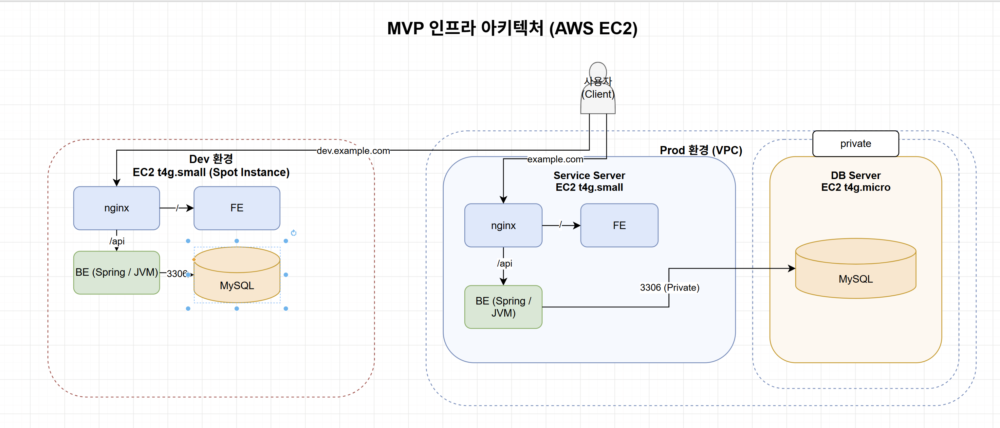
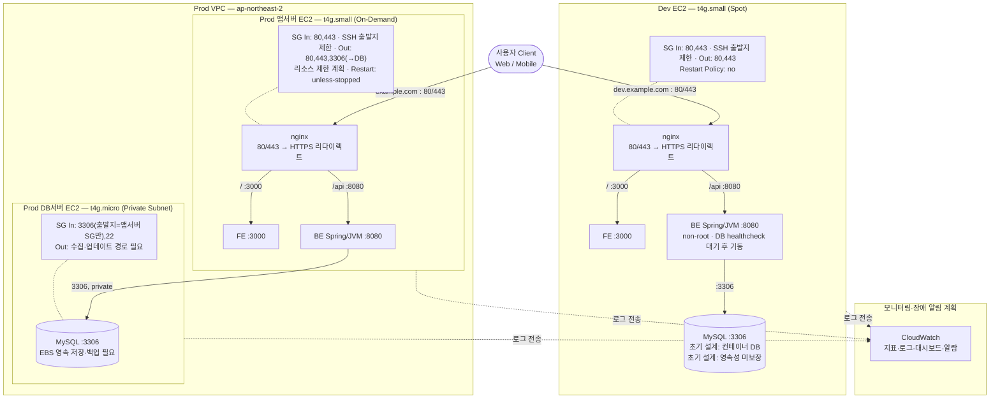

# 다먹자 v1 인프라 위키 — 1단계: EC2 + Docker Compose 기반 초기 배포 설계

> KTB 4조 다먹자 팀의 v1 인프라 설계 문서입니다. 이 문서는 **1단계(EC2 + Docker Compose 기반 초기 배포)** 만 다룹니다. 2단계(CI)는 별도 문서 `ktb4-cloud-wiki-ci.md`를 참고하세요.
> 초기 v1 설계의 가정과 선택 근거를 기록합니다. 실제 운영 설정은 [v1 설정](../../v1/)을, 서비스 품질 목표는 [SLI·SLO 설계](../observability/SLI-SLO-design.md)를 기준으로 확인합니다. AWS에 적용된 상태를 검증한 문서는 아닙니다.
> 검토일: 2026-10-04

## 목차
0. [클라우드 벤더 선택](#0-클라우드-벤더-선택)
1. [초기 서비스 규모 정의](#1-초기-서비스-규모-정의)
2. [Docker 컨테이너 구성 설계](#2-docker-컨테이너-구성-설계)
3. [Docker Compose 기반 배포 구조 설계](#3-docker-compose-기반-배포-구조-설계)
4. [현재 구조의 한계 정의](#4-현재-구조의-한계-정의)

---

## 0. 클라우드 벤더 선택

- **상황**: 빠른 MVP 구축을 위해 기존 학습 경험, 서비스 요구사항, 운영 비용을 함께 검토합니다.
- **결론**: EC2·IAM 등 팀의 사용 경험이 있는 AWS를 선택합니다.
- **이유**: 새로운 플랫폼 학습 시간을 줄일 수 있습니다. 다른 벤더보다 항상 저렴하거나 성능이 우수하다는 의미는 아닙니다.

| 벤더 | 검토한 특징 | v1에서의 판단 |
|---|---|---|
| AWS | 서비스·학습 자료가 다양하며 팀의 기존 학습 경험이 있습니다. | 빠른 구현과 운영 도구 연동을 우선합니다. |
| Microsoft Azure | Microsoft 환경과의 연계, Azure Arc 기반 하이브리드 관리, 규정 준수 요구 대응을 검토할 수 있습니다. | 기존 Microsoft 시스템 연계가 필수 조건은 아닙니다. |
| Google Cloud | AI·데이터 분석, Kubernetes 생태계, 글로벌 네트워크를 활용할 수 있습니다. | v1에는 GPU나 Kubernetes가 필요하지 않습니다. |
| NAVER Cloud | Neurocloud 기반 하이브리드 구성과 CLOVA 계열 AI 연동을 검토할 수 있습니다. | 한국어 AI 연계는 향후 검토 대상이며 v1 인프라 선택의 필수 조건은 아닙니다. |
| NHN Cloud | 공공·금융·게임 분야 솔루션과 게임 운영 경험을 제공합니다. | 해당 산업에 특화된 요구가 현재 핵심 조건은 아닙니다. |

Neurocloud의 공조·서버 모듈은 고객사 설치 형태의 한 예이며, 하이브리드 클라우드를 정의하는 조건은 아닙니다. 친환경 데이터센터도 검토 관점으로 남기되, 근거 없이 비용·성능·환경 우위를 단정하지 않습니다. 공공·금융 규정 준수는 벤더 이름만으로 판단하지 않고 해당 서비스·리전의 인증 범위를 확인해야 합니다.

비용은 같은 리전·메모리·CPU 제공 방식·과금 시간을 맞춰 비교합니다. 기존 비교의 GCP 공유 코어와 AWS 버스터블 CPU, 메모리 용량이 다른 Azure 모델은 동등 성능으로 볼 수 없으므로 가격만으로 순위를 매기지 않습니다.

참고: [Azure Arc](https://azure.microsoft.com/en-us/products/azure-arc/), [Google Cloud 인프라](https://cloud.google.com/about/locations), [Neurocloud](https://www.ncloud.com/neurocloud), [NAVER AI 서비스](https://www.ncloud.com/product/aiService), [NHN Cloud](https://www.nhncloud.com/kr).

## 1. 초기 서비스 규모 정의

### MAU
- **상황**: v1은 KTB 부트캠프 데모/초기 서비스로, 훈련생 그룹과 소수 외부 사용자만 접근할 것으로 예상됨.
- **결론**: MAU 200명
- **이유**: KTB 훈련생 130명 + KTB 관계자 20명 + 외부 사용자 50명

### DAU

- **상황**: 초기 활성 사용자 수를 추정해야 합니다.
- **결론**: 평일 DAU를 약 140명으로 가정합니다.
- **이유**: MAU 200명의 70%가 아침 알림을 확인한다는 가정입니다. 알림 확인자만이 DAU의 정의는 아니며, 실제 DAU는 하루 동안 서비스를 사용한 고유 사용자 수로 측정합니다. 주말 150명 가정은 별도 시나리오이며 시간대별 인원을 단순 합산하지 않습니다.

### 사용자 흐름 및 Peak Traffic (RPS)
- **상황**: 인프라 사이징을 위해 시간대별 접근 패턴과 피크 트래픽(RPS)을 추정해야 함. v1 사용자 흐름은 로그인 → 냉장고 재고 확인 → 유통기한순 재정렬 조회.
- **결론**:

  | 시간대 | 접근자 수 | 윈도우 | RPS |
  |---|---|---|---|
  | 평일 아침 8시 (알림 버스트) | 140명 | 5분 | **1.4 RPS** |
  | 평일 점심 | 0명 | – | 0 RPS |
  | 평일 저녁 | 100명 | 1시간 | 0.083 RPS |
  | 주말 점심 | 150명 | 1시간 | 0.125 RPS |
  | 주말 저녁 | 150명 | 1시간 | 0.125 RPS |

  → 초기 부하 검증 목표: **7 RPS** (1.4 RPS의 5배)

  계산식은 접근자 수 × 세션당 API 요청 3건 ÷ 구간 길이(초)입니다. 1.4 RPS는 5분 구간 평균이므로 순간 최대 부하를 의미하지 않습니다. v1 알림 폴링, 재시도, 정적 파일 요청은 별도로 산정해야 합니다.

- **이유**: 아침 8시 알림 발송 직후 70%가 확인 접근(140명, 5분 윈도우)한다고 가정한 구간이 가장 뾰족한 피크. 평일 점심은 대부분 외부 식사라 접근 없음, 평일 저녁은 사용자 절반이 귀가(100명). 주말은 전체 200명 중 50명이 교육장 식사·외식 등으로 앱을 사용하지 않고 150명이 접근한다고 가정 — 인원은 더 많아도(150명) 윈도우가 1시간으로 넓어 RPS 부담은 적음. 실제 흐름이 예상과 다를 수 있어 3~5배 여유를 둠.

### Latency

- **상황**: 초기 인프라 응답속도 가정과 사용자 경험 목표를 구분해야 합니다.
- **결론**: 초기 200ms는 참고 목표이며 최소 응답시간이 아닙니다. 최종 평가는 [SLI·SLO 설계](../observability/SLI-SLO-design.md)의 사용자 요청부터 화면 반영까지 기준을 따릅니다.
- **이유**: 서버 응답과 화면 반영 시간은 측정 구간이 다릅니다. 수동 재고 등록·조회는 p95 1초, p99 10초 목표를 적용하며 모든 요청이 1초 이내라고 단정하지 않습니다.

### 가용성

- **상황**: 단일 서버 구성의 비용과 장애 영향을 함께 고려해야 합니다.
- **결론**: 초기 설계에서는 99%를 가정했습니다. 운영 평가 대상·분모·평가 기간과 최종 목표는 [SLI·SLO 설계](../observability/SLI-SLO-design.md)를 따릅니다.
- **이유**: 초기 가정만으로 가용성을 보장할 수 없습니다. 인프라 가동 시간과 사용자 요청 성공률은 서로 다른 지표입니다.

### 배포 빈도 / 전략

[Docker Compose 운영 배포 동작](https://docs.docker.com/compose/how-tos/production/)을 기준으로 교체와 롤링 배포를 구분합니다.

- **상황**: dev는 잦은 배포가 필요하고 prod는 배포 중 영향을 줄여야 합니다.
- **결론**: 현재 v1 스크립트는 대상 서비스 컨테이너를 교체하고 헬스체크 후 실패 시 이전 이미지·설정으로 복구합니다. 단일 복제본이므로 짧은 중단이 발생할 수 있습니다.
- **이유**: 서비스별 순차 교체는 무중단 롤링 배포와 다릅니다. 롤링 배포를 보장하려면 복수 인스턴스 또는 복제본, 트래픽 분산과 준비 상태 확인이 필요합니다. 상세 절차는 [CD 문서](ktb4-cloud-wiki-cd.md)와 [배포 스크립트](../../v1/scripts/deploy-v1.sh)를 확인합니다.

### 서버 인스턴스 — 모델 계열
- **상황**: MVP 인프라에 맞는 EC2 인스턴스 계열을 선택해야 함.
- **결론**: 범용 T 시리즈 (G/P 계열 제외)
- **이유**: MVP 구현 단계라 특정 워크로드에 특화된 인스턴스가 필요 없고, AI 파트 팀원에게 확인한 결과 v1 기능에는 GPU가 필요 없다고 판단됨.

### 서버 인스턴스 — ARM vs x86

- **상황**: 비용과 이미지·라이브러리 호환성을 함께 확인해야 합니다.
- **결론**: 초기 후보로 ARM 기반 t4g를 선택합니다.
- **이유**: 팀의 사용 범위에서 ARM 지원을 검증해 비용 효율을 기대합니다. 동일 성능이나 저전력을 일괄 보장하지 않으며, 멀티아키텍처 이미지와 네이티브 의존성을 확인해야 합니다.

### 서버 인스턴스 — 리소스 산정 및 결론

- **상황**: 초기 인스턴스 크기는 부하 검증 전 추정입니다.
- **결론**: dev t4g.small, prod 앱 t4g.small + DB t4g.micro를 초기 후보로 둡니다.
- **이유**: 기존 서비스 운영 경험을 출발점으로 삼되 다음 메모리 예산으로 검증합니다.

| 대상 | 추정 메모리 | 판단 |
|---|---|---|
| Dev 통합 | nginx 100 + FE 100 + BE 1024 + OS 500 + MySQL 500 = 2224 MiB | 약 2.17 GiB로 2 GiB를 초과합니다. DB 분리·증설·사용량 조정이 필요합니다. |
| Prod 앱 | 1724 MiB | 약 1.68 GiB이며 Agent·JVM 급증 여유가 적습니다. |
| Prod DB | MySQL 500 + OS 500 = 1000 MiB | 1 GiB에 여유가 거의 없습니다. Agent와 캐시 사용량을 추가 검증합니다. |

2 vCPU는 초기 가정이며 T 계열 CPU 크레딧·지속 부하도 점검합니다. 리소스 제한은 총 용량 부족을 해결하지 못합니다. 현재 dev Compose에는 MySQL 서비스가 없으므로 통합 DB 구성은 초기 설계와 구분합니다.

### 예상 비용

- **상황**: 월 환산 기준이 섞이지 않도록 동일 시간으로 계산합니다.
- **결론**: 기존 문서의 가정 단가(t4g.small $0.0208/h, t4g.micro $0.0104/h)에 월 730시간을 적용하면 전체 온디맨드는 **$37.96**, dev small만 65% 할인된다고 가정하면 **$28.09**입니다.
- **계산**: 온디맨드 (0.0208 × 2 + 0.0104) × 730 = 37.96. 할인 가정은 (0.0208 × 0.35 + 0.0208 + 0.0104) × 730 = 28.0904입니다.
- **범위**: 계산 검산을 위한 가정이며 최신 서울 리전 견적이 아닙니다. Spot 할인율은 고정되지 않습니다. EBS·공인 IPv4·전송량·CloudWatch·Secrets Manager·SNS·Lambda 등은 별도로 포함해야 합니다.

### 아키텍처 다이어그램

(이미지가 안 보이는 환경을 위한 Mermaid 버전 — AWS 인프라 구성만, CI/CD는 제외)

**다이어그램 적용 범위**

초기 후보 구성을 나타냅니다. dev DB 통합 여부와 실제 인스턴스 사양은 배포 설정에 따라 달라집니다. CloudWatch 전송에는 Agent·로그 수집 설정·IAM 권한·네트워크 경로가 필요합니다. 위 이미지는 초기 배치 참고용이며 세부 정책은 아래 본문을 따릅니다.

## 2. Docker 컨테이너 구성 설계

### 컨테이너 실행 권한

- **상황**: 침해 시 권한 남용 범위를 줄여야 합니다.
- **결론**: 애플리케이션은 가능한 non-root로 실행하고 이미지별 실행 사용자와 파일 권한을 확인합니다.
- **이유**: non-root는 피해 범위를 줄이지만 침해를 차단하는 보장은 아닙니다. Nginx 등 기본 이미지가 모두 non-root라고 가정하지 않습니다.

### nginx / FE / BE 배치

- **상황**: 컴포넌트 분리의 운영 비용과 장애 격리를 비교합니다.
- **결론**: 초기에는 nginx·FE·BE를 한 EC2에 통합합니다.
- **이유**: 예상 부하가 작아 개별 서버의 비용·관리 부담을 줄입니다. 더 작은 인스턴스가 없어서가 아니라 운영 단순화를 위한 선택이며, FE의 SSR 부하는 실측해야 합니다.

### 로드밸런서
- **상황**: 트래픽을 받는 진입점 역할이 필요함.
- **결론**: ALB 대신 nginx 사용
- **이유**: 이 정도 규모의 인프라를 운영하기에는 ALB의 기본요금이 과함.

### DB 서비스 구현 방식
- **상황**: 관리형 DB(RDS)를 쓸지, EC2에 직접 구축할지 결정해야 함.
- **결론**: RDS 대신 EC2에 MySQL 직접 구성
- **이유**: 이 정도 규모의 서비스에서 RDS는 비용이 과함.

### 배치(알림) 작업 위치
- **상황**: 유통기한 임박 알림을 위한 배치 작업을 별도로 분리할지 결정해야 함.
- **결론**: 별도 컴포넌트로 분리하지 않고 BE에 통합
- **이유**: MAU가 크지 않아 배치 작업이 BE 리소스에 주는 부담이 크지 않을 것으로 판단.

### 로깅

- **상황**: 장애를 감지하고 원인을 추적할 중앙 관측 체계가 필요합니다.
- **결론**: CloudWatch Metrics·Logs·Dashboards·Alarms를 사용한 모니터링과 장애 알림을 계획합니다.
- **이유**: 별도 Loki/Promtail 서버 운영 부담을 줄이고 AWS 인프라와 연동합니다. 자동으로 수집되는 항목과 별도 설정이 필요한 항목을 구분합니다.

| 대상 | 수집·알림 계획 |
|---|---|
| CPU·상태 검사·T 계열 크레딧 | EC2 기본 지표를 조회하고 필요한 알람을 설정합니다. |
| 메모리·파일시스템 사용률 | CloudWatch Agent로 수집합니다. EC2 기본 지표만으로는 확인할 수 없습니다. |
| Nginx·BE 로그 | 호스트에 기록한 로그 파일을 Agent로 CloudWatch Logs에 전송합니다. Docker local 드라이버의 로그가 자동 전송되는 것은 아닙니다. |
| 장애·복구 알림 | CloudWatch Alarm → SNS → Lambda → Discord로 전달합니다. 임계값·평가 주기·누락 데이터 처리와 수신 테스트가 필요합니다. |
| Spot 중단 예고 | EventBridge → Lambda → Discord를 사용합니다. StatusCheckFailed는 Spot 중단 사전 예고가 아닙니다. |

세부 구성은 [모니터링 설계](../observability/monitoring-alerting-design.md), [Agent 설정](../observability/cloudwatch-agent-setup.md), [Discord 알림](../../infra/discord-alerts/aws/README.md)을 따릅니다. 이 계획만으로 실제 수집·전달 완료를 보장하지 않습니다. 로그 보존 기간과 민감정보 제외, 수집량 비용을 관리하고 알림 실패도 점검합니다. [CloudWatch 개요](https://docs.aws.amazon.com/AmazonCloudWatch/latest/monitoring/), [Agent 지표](https://docs.aws.amazon.com/AmazonCloudWatch/latest/monitoring/metrics-collected-by-CloudWatch-agent.html)

### Dev 환경 구성

초기 통합 구성의 근거입니다. 현재 dev Compose에는 MySQL과 depends_on이 없으므로 아래 구성을 현재 적용 상태로 해석하지 않습니다.
- **상황**: dev는 다양한 개발/테스트를 지원해야 하고, BE가 DB 준비 상태에 의존적임.
- **결론**: nginx, FE, BE, DB를 한 EC2에 배치, 리소스 제한 없음, BE는 healthcheck·depends_on으로 DB 준비 후 기동
- **이유**: 개발 단계에서 다양한 테스트를 자유롭게 진행할 수 있도록 리소스를 제한하지 않기로 함. BE가 DB에 종속적이라 DB가 뜨기 전에 BE가 먼저 기동되는 것을 막기 위함.

### Dev DB 데이터 유지 (Volume)

- **상황**: 개발 DB를 초기화할지와 데이터를 보존할지는 별도 정책입니다.
- **결론**: 초기 설계는 개발 DB의 영속성을 보장하지 않는 방향이었습니다. 현재 dev Compose에는 DB 서비스가 없으므로 실제 개발 DB의 저장 위치·백업은 별도로 확인합니다.
- **이유**: 컨테이너 재시작은 일반적으로 쓰기 계층을 유지합니다. 컨테이너 삭제·재생성, tmpfs, 이미지의 익명 볼륨, 명시적 볼륨 구성에 따라 결과가 달라집니다. 초기화가 필요하면 명시적 초기화 절차로 수행하며 재배포마다 초기화된다고 단정하지 않습니다. [Docker 저장소](https://docs.docker.com/engine/storage/volumes/)

### Prod 환경 구성

- **상황**: 앱과 DB 장애의 영향을 줄여야 합니다.
- **결론**: nginx·FE·BE는 앱 EC2에 두고 DB는 private subnet의 별도 EC2로 분리하는 초기 설계입니다. 리소스 제한은 실측 후 적용할 계획입니다.
- **이유**: 현재 prod Compose에는 컨테이너별 CPU·메모리 제한이 명시되어 있지 않으므로 적용 완료로 표현하지 않습니다. DB 분리만으로 고가용성이나 데이터 백업이 제공되지는 않습니다.

## 3. Docker Compose 기반 배포 구조 설계

### EC2 구성
- **상황**: 1번에서 정한 인스턴스 구성을 배포 구조에도 반영해야 함.
- **결론**: dev는 t4g.small, prod는 t4g.small + t4g.micro
- **이유**: ARM(t4g)이 성능 대비 비용이 저렴하고 저전력임. x86보다 라이브러리 호환성은 떨어지지만, MVP에서 사용하는 라이브러리 중 ARM에 호환 안 되는 것이 없어 ARM을 선택.

### Docker Network

- **상황**: 컨테이너 통신과 DB 접근 범위를 제한해야 합니다.
- **결론**: 초기 v1은 환경 내 공통 네트워크를 사용하고 별도 계층 분리를 미룹니다.
- **이유**: 구성을 단순화하지만 같은 네트워크의 컨테이너 간 접근이 가능해집니다. prod DB가 별도 EC2에 있어도 앱 EC2의 FE에서 접근할 가능성이 있으므로 DB 분리와 컨테이너 격리는 별개입니다. DB 인증과 보안그룹을 함께 적용해야 합니다.

### Container간 통신 포트

| 구간 | 프로토콜·포트 |
|---|---|
| 사용자 → nginx | HTTP 80 → HTTPS 443 리다이렉트 |
| nginx → FE | HTTP 3000 |
| nginx → BE | HTTP 8080 |
| BE → DB (dev·prod) | MySQL/TCP 3306 |

외부 공개는 nginx를 중심으로 하고 내부 API 포트는 불필요하게 공개하지 않습니다. 내부 HTTP도 침해 시 위험이 있으므로 신뢰 경계와 전송 암호화 요구를 별도로 판단합니다.

### 서버 관리 접근 방식 — SSH vs SSM

- **상황**: 서버 관리와 배포 접근이 필요합니다.
- **결론**: v1은 익숙한 SSH를 사용합니다.
- **이유**: SSM은 인바운드 SSH 포트 없이 IAM으로 접근을 통제할 수 있지만 Agent·역할·서비스 연결 경로가 필요합니다. VPC 엔드포인트는 유일한 연결 방식이 아닙니다. SSH를 선택하면 출발지 제한과 키·호스트 신원 검증을 운영해야 합니다.

### 외부 진입 경로 / SSH

- **결론**: SSH 22는 승인된 관리·배포 경로로 제한하는 정책을 적용해야 합니다. 실제 보안그룹 적용 여부는 별도 확인합니다.
- **이유**: nginx·FE·BE 통합 배치 때문에 SSH 전체 공개가 필수인 것은 아닙니다. Git ignore는 실수로 키를 커밋하는 것을 줄일 뿐, 포트 접근 제한이나 유출된 키의 폐기를 대신하지 않습니다. 서버 교체 시 새 호스트 키의 지문을 검증하고 known_hosts를 갱신합니다.

### 보안그룹 / 포트

| 대상 | Inbound 정책 | 필요한 Outbound |
|---|---|---|
| Dev 앱 EC2 | 80·443, 승인된 출발지의 22 | 이미지·패키지·CloudWatch·외부 API 접근, 외부 DB 사용 시 해당 DB 포트 |
| Prod 앱 EC2 | 80·443, 승인된 출발지의 22 | 위 항목과 Prod DB의 TCP 3306 |
| Prod DB EC2 | 앱 SG에서 TCP 3306, 승인된 관리 경로의 22 | CloudWatch 수집·백업·업데이트에 필요한 목적지 |

DB는 private subnet에 배치하되 CloudWatch 등으로 나가는 NAT 또는 VPC 엔드포인트 등의 경로를 설계해야 합니다. Outbound 전체 차단은 DB 응답 자체보다 신규 로그 전송·업데이트 요청을 막습니다. 보안그룹은 상태를 추적해 허용된 연결의 응답을 허용합니다. [AWS 보안그룹](https://docs.aws.amazon.com/en_en/vpc/latest/userguide/vpc-security-groups.html)

### Volume

- **결론**: 운영 DB는 EC2 분리 여부와 관계없이 영속 저장소와 복구 가능한 백업이 필요합니다.
- **이유**: EBS 저장 위치, DeleteOnTermination, 컨테이너 사용 시 마운트, 백업·복원 절차를 확인해야 합니다. Docker 볼륨만으로 인스턴스 종료나 디스크 손실에서 복구할 수는 없습니다. 초기 설계의 개발 DB 영속성 미보장 정책과 운영 DB 보존 요구를 구분합니다.

### Environment Variable

- **결론**: 이미지 설정은 서버 .env, 서비스별 실행 설정은 env/*.env로 관리합니다.
- **이유**: 배포 스크립트가 필요한 서비스 설정을 갱신합니다. DB 주소·계정도 운영 정보이므로 불필요하게 공개하지 않으며 파일 접근 권한을 제한합니다.

### Secret 관리

- **결론**: 배포용 애플리케이션 시크릿은 GitHub Secrets, AWS 알림의 Discord 웹훅은 Secrets Manager로 관리합니다.
- **이유**: 각각 배포 파이프라인과 Lambda 실행 중 조회라는 사용 목적에 맞춘 선택입니다. Compose secrets는 컨테이너에 파일로 전달하는 기능이며 외부 시크릿 저장소와 역할이 다릅니다. GitHub Secrets도 실행 서버에 전달된 값의 노출·자동 로테이션을 해결하지 못합니다.
- **운영 기준**: 최소 권한, 출력 로그 마스킹, 서버 파일 권한, 키 교체를 별도로 관리합니다. 클라우드 이전 시 Secrets Manager 연동을 변경해야 하지만 시크릿 자체가 무용지물이 되는 것은 아닙니다.

### Container Restart 정책

- **결론**: dev는 no, prod는 unless-stopped를 사용합니다.
- **이유**: dev는 종료 원인을 먼저 조사하고, prod는 명시적으로 중지하지 않은 컨테이너를 재시작합니다. unless-stopped는 정상·비정상 종료 코드만으로 구분하지 않습니다. 수동으로 중지한 컨테이너는 Docker 재시작 후에도 자동 시작하지 않습니다.
- **한계**: unhealthy 상태만으로 컨테이너를 자동 재시작하거나 EC2 장애를 복구하지는 않습니다. [Docker 재시작 정책](https://docs.docker.com/engine/containers/start-containers-automatically/)

### Image Registry
- **상황**: Docker 이미지를 어디에 보관하고 배포할지 결정해야 함.
- **결론**: **GHCR**
- **이유**: 프로젝트가 GitHub를 주로 사용할 것이 확정적이라, GitHub Actions를 잘 활용할 수 있는 GHCR을 선택.

### Image Tag 정책

- **결론**: Git SHA 태그로 빌드 출처를 식별하고 실제 배포는 이미지 digest로 고정합니다.
- **이유**: 태그는 다시 지정될 수 있으므로 동일 이미지 보장을 위해 digest를 사용합니다. 현재 배포 스크립트도 digest 형식을 검증합니다.

## 4. 현재 구조의 한계 정의

1. **가용성**: 앱 서버·nginx·DB에 단일 장애점이 있으며 단일 컨테이너 교체 중 중단이 발생할 수 있습니다.
2. **확장성**: 현재 Compose와 고정 인스턴스 구성에는 자동 수평 확장이 없습니다.
3. **리소스**: 초기 dev 통합 메모리 예산은 2 GiB를 초과하고 prod도 여유가 작습니다. 크레딧·메모리·부하를 측정해 사양을 결정해야 합니다.
4. **데이터**: Spot 종료 시 복구는 EBS 보존과 백업에 달려 있습니다. 별도 DB EC2나 Docker 볼륨만으로 데이터 안전이 보장되지는 않습니다.
5. **보안**: SSH 출발지 제한과 컨테이너 간 접근 통제가 필요하며 Git ignore만으로 보호할 수 없습니다.
6. **시크릿**: 서버에 전달된 설정의 권한 관리와 로테이션은 별도 운영 과제입니다.
7. **관측성**: CloudWatch 모니터링·장애 알림을 계획하지만 임계값, 수집 누락, 알림 전달 실패와 실제 사용자 장애 감지 범위는 검증해야 합니다. 알림 자체가 자동 복구를 의미하지 않습니다.
8. **결합도**: 알림 배치와 API가 BE 자원을 공유하므로 부하 증가 시 분리가 필요합니다.

초기 설계는 빠른 구축을 우선한 가정입니다. 변경된 환경 구성은 v1 설정을, 서비스 품질 목표는 SLI·SLO 문서를 기준으로 관리합니다.
