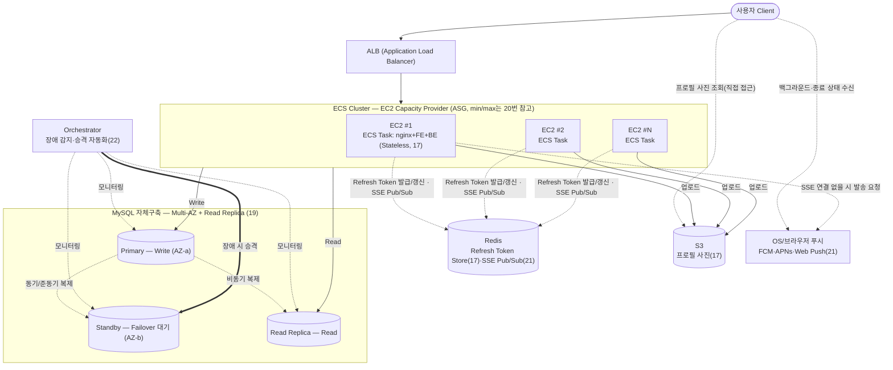

# 다먹자 v2 인프라 위키 — 4단계: 트래픽 급증 대비 인프라 확장 및 Auto Scaling 설계

> KTB 4조 다먹자 팀의 v1 인프라 설계 문서입니다. 이 문서는 **4단계(트래픽 급증 대비 인프라 확장 및 Auto Scaling 설계)** 만 다룹니다. 1단계(EC2 + Docker Compose 기반 초기 배포)는 `ktb4-cloud-wiki-v1.md`, 2단계(CI)는 `ktb4-cloud-wiki-ci.md`, 3단계(CD)는 `ktb4-cloud-wiki-cd.md`를 참고하세요.
> **GitHub Wiki에 그대로 옮겨지는 원본**으로, 결과를 바로 파악할 수 있도록 **상황 → 결론** 위주로 작성합니다. 상세 이유·근거·트레이드오프는 `인프라 설계 의사결정 근거.md`, 트래픽 가정 산출 과정은 `인프라 설계 작업노트.md`를 참고하세요.

## 목차
15. [현재 서비스의 성장 상황 가정 및 기존 인프라 한계 정의](#15-현재-서비스의-성장-상황-가정-및-기존-인프라-한계-정의)
16. [인프라 확장 전략 고려](#16-인프라-확장-전략-고려)
17. [Application 구조 설계](#17-application-구조-설계)
18. [컴퓨트(서버) 확장 방식 비교 및 아키텍처 설정](#18-컴퓨트서버-확장-방식-비교-및-아키텍처-설정)
19. [DB 확장 방식 비교 및 아키텍처 설정](#19-db-확장-방식-비교-및-아키텍처-설정)
20. [Auto Scaling 전략 설계](#20-auto-scaling-전략-설계)
21. [알림(Notification) 아키텍처 설계](#21-알림notification-아키텍처-설계)
22. [장애 상황과 가용성 설계](#22-장애-상황과-가용성-설계)
23. [CI/CD 변경사항 설계](#23-cicd-변경사항-설계)
24. [확장 이후 발생하는 새로운 한계 분석](#24-확장-이후-발생하는-새로운-한계-분석)

---

## 상황 및 필요성

**상황**: 1-3단계는 MAU 200명 규모의 KTB 부트캠프 MVP를 전제로 설계되었음. 서비스를 지속적으로 개발·운영하면서 규모가 급속도로 커질 것으로 예상되는데, v1(EC2 1대 + Docker Compose) 구조는 오토스케일링이 불가능하고 SPOF 등 여러 한계를 안고 있어, 커진 규모의 트래픽을 감당하려면 인프라 구조 자체를 다시 설계해야 함.

---

## 전체 아키텍처 개요

아래는 16-22번 결정을 종합한 v2 목표 아키텍처 다이어그램. 각 구성요소 옆 괄호 숫자는 해당 결정을 다룬 섹션 번호(세부 이유·근거·트레이드오프는 `인프라 설계 의사결정 근거.md`의 같은 번호 참고).

*(다이어그램에는 표시하지 않지만) CloudWatch가 ALB·ASG/ECS·DB(자체구축 EC2)·Redis·S3까지 이 아키텍처의 AWS 리소스 전체를 모니터링 대상으로 함(18번 근거 참고). Orchestrator의 구체적인 클러스터 구성(HA 방식, ProxySQL 연동 여부)은 22번 참고.

---

### 15. 현재 서비스의 성장 상황 가정 및 기존 인프라 한계 정의

  기존 인프라(v1)의 한계 (`ktb4-cloud-wiki` "4. 현재 구조의 한계 정의" 참고):

  1. 가용성(SPOF) — 단일 EC2에 컴포넌트 집중, nginx 단일 진입점, Prod DB 이중화 없음
  2. 확장성 — EC2 대수 고정, Docker Compose는 오케스트레이션 기능이 없어 오토스케일링 불가
  3. 리소스 여유 부족 — 메모리 예산 2.2GiB vs t4g.small 2GiB
  4. Dev 데이터 안정성 — Volume 미사용으로 재배포·재시작마다 초기화
  5. 보안 노출면 — SSH 22 상시 개방, Docker Network 미분리
  6. Secret 관리 한계 — GitHub Secrets는 CI 단계만 커버
  7. 운영/관측성 부재 — 중앙 수집·알림 체계 없음
  8. 구조적 결합도 — 알림 배치가 BE 프로세스에 통합되어 리소스 경합 가능

  이번 4단계 설계에서 v1의 8가지 한계를 다루는 범위는 다음과 같음:

  - **직접 해결 대상(5개)**: 1번(가용성/SPOF), 2번(확장성), 5번(보안 노출면), 7번(운영/관측성 부재), 8번(구조적 결합도). 이 중 **2번(확장성)**이 이번 설계 전체의 출발점 — 위 성장 가정치(Peak RPS 약 95, CCU 약 7,200)는 v1의 EC2 1대 구조로는 감당할 수 없어, 이를 먼저 풀어야 나머지 항목도 의미가 있음.

    | 한계 | 해결에 사용하는 기술/방법 | 관련 항목 |
    |---|---|---|
    | 1번 가용성(SPOF) | Scale-out(다중 인스턴스), 서로 다른 AZ 2곳 이상 배치, ALB(관리형 이중화), DB Multi-AZ + Read Replica(자체구축) | 16, 18, 19, 20 |
    | 2번 확장성 | Scale-up+Scale-out 하이브리드, EC2 Auto Scaling Group, Target Tracking + Scheduled Scaling, Stateless 구조(JWT) | 16, 17, 18, 20 |
    | 5번 보안 노출면 | 미정 — 22-24번에서 직접 설계 예정 | - |
    | 7번 운영/관측성 부재 | CloudWatch로 ALB·ASG/ECS·DB·Redis·S3 등 AWS 리소스 전체 모니터링(모니터링 대상 범위만 결정, 지표·알림·대시보드 등 세부 설계는 22-24번에서 이어서 다룸) | 18 |
    | 8번 구조적 결합도 | DB 폴링 → SSE(Server-Sent Events) 기반 실시간 푸시로 전환 | 21 |
  - **간접 해결(1개)**: 3번(리소스 여유 부족). 별도 항목으로 다루지 않고, 2번(확장성)을 해결하는 과정(인스턴스를 더 크게·더 여러 대로 늘림)에서 자연히 함께 해소됨.
  - **이번 범위 제외(2개)**:
    - **4번(Dev 데이터 안정성)**: 의도한 설계에서 발생한 트레이드오프 — 아직 이로 인해 개발자가 불편함을 느낀다는 피드백이 없어 보류. 관련 피드백이 나오면 재검토.
    - **6번(Secret 관리 한계)**: GitHub(Actions/Secrets)에 종속적으로 CI/CD를 구성하면서 발생하는 트레이드오프로 보고 수용 — 다만 20번에서 ASG가 인스턴스를 동적으로 새로 띄우는 구조가 되므로, 새로 뜬 인스턴스에 런타임 시크릿을 어떻게 주입할지는 23번(CI/CD 변경사항 설계)에서 함께 정리할 필요가 있음.
    4단계 설계와 무관하게 v1 상태를 그대로 유지함.

- **이유**: 성장 가정 수치들은 3단계까지의 설계 전제였던 "MAU 200명 MVP"와 자릿수 자체가 다름(MAU 기준 약 1,150배 차이) — 이후 결정(16-20번)이 모두 이 수치를 기준으로 확장 전략·아키텍처·min/max 용량을 정하므로, 먼저 명확히 수치화해둘 필요가 있음. 이 문서가 산출 근거(계산식, 벤치마크 출처 등)까지 포함하는 단일 진실 공급원(SSOT)이며, 개인 작업용 초안(`인프라 설계 작업노트.md`)은 이 문서에 반영하기 전 가정을 자유롭게 실험해보는 스크래치패드로, 위 표를 포함해 이 문서와 항상 동일하게 맞춰둘 필요는 없음.

- **트레이드오프**: 위 수치는 실사용 데이터 없이 벤치마크·개인 경험을 근거로 잡은 예상임. 예상하기 힘든 항목들을 대비하기 위해서 예상을 하였지만, **예상**이기에 보다 정확한 데이터를 기반으로한 **예측**이 필요함. 따라서 실제 서비스 출시 후 로그 기반 재검증이 필요하며, 가정이 수정되면 이후 항목들의 결론도 함께 재검토해야 함.

### 16. 인프라 확장 전략 고려

- **상황**: 15번에서 정의한 목표(Peak RPS 약 95, CCU 약 7,200)는 v1의 EC2 1대(t4g.small) 구조로는 감당할 수 없음. 인프라 확장은 크게 인스턴스 사양 자체를 높이는 방법(Scale-up)과, 동일한 인스턴스를 여러 대로 늘리는 방법(Scale-out)으로 나뉘어, 어떤 방향으로 확장할지 먼저 정해야 함. 또한 v1은 nginx+FE+BE를 EC2 1대에서 상태(세션 등)를 그대로 들고 있는 구조라, 확장 방향에 따라 애플리케이션 구조에도 영향을 줌.

- **결론**:
  - **Scale-up(수직 확장) + Scale-out(수평 확장) 하이브리드** 채택
  - **Scale-out(수평 확장)** — 앱서버를 여러 대로 늘리고, 그 앞에 로드밸런서를 두는 구조로 전환
  - **Scale-up(수직 확장)** — 개별 인스턴스 사양은 v1의 t4g.small보다 상향한 사양을 기본 단위로 채택(구체적 인스턴스 타입은 좀 더 찾아보고)하고, 이 단위를 여러 대로 늘리는 방식으로 구성
  - DB는 쓰기(Write)는 단일 인스턴스로 유지하되, 읽기(Read)는 Read Replica로 분산 — 15번에서 정의한 읽기:쓰기 비율(7:1-14:1)상 읽기 비중이 압도적이므로 읽기 트래픽부터 분산

- **이유·근거·트레이드오프**: 내부 작업 문서 `인프라 설계 의사결정 근거.md`(16번) 참고.

### 17. Application 구조 설계

- **상황**: 16번에서 Scale-out을 채택하면서 앱서버가 여러 대로 늘어나고, 오토스케일링에 따라 인스턴스가 수시로 추가·제거됨. v1은 nginx+FE+BE가 EC2 1대에 통합돼 있고 별도 상태 저장소가 없어, 세션 같은 상태가 특정 인스턴스에 묶여 있으면 그 인스턴스가 사라지는 순간 사용자가 로그아웃되거나, 로드밸런서가 매번 다른 인스턴스로 요청을 보낼 때 동작이 꼬일 수 있음. 정적 파일(업로드 이미지 등)도 특정 인스턴스에만 있으면 다른 인스턴스에서 접근할 수 없음. 또한 업로드 이미지를 S3에 저장하더라도 서빙 경로에 S3가 BE와 직접 연결돼 있으면 이미지 트래픽이 API 요청 처리와 BE 자원을 두고 경합할 수 있음.

- **결론**:
  - 앱서버(BE)를 **Stateless**로 설계 — 인스턴스 자체에는 세션·업로드 파일 등 상태를 두지 않음
  - 인증 상태 유지 방식은 **Access Token(JWT, Stateless) + Refresh Token(Redis 저장, RTR)** 하이브리드를 사용함 — Access Token은 토큰 자체에 인증 정보를 담아 클라이언트가 보관하고, Refresh Token만 Redis에 저장해 서버가 즉시 폐기·재사용 탐지를 할 수 있도록 함

    | 방식 | 설명 | 장점 | 단점 |
    |---|---|---|---|
    | JWT(Stateless Token) 단독 | 인증 정보를 토큰 자체에 담아 클라이언트가 보관 | 서버에 별도 저장소 불필요, 인스턴스 추가/제거에 영향 없음 | 만료 전 강제 로그아웃(즉시 폐기) 어려움, 토큰 크기만큼 매 요청 오버헤드 |
    | 중앙화된 Session Store(예: Redis) 단독 | 세션 정보를 별도 인메모리 저장소에 저장, 앱서버는 세션 ID만 참조 | 즉시 세션 폐기·강제 로그아웃 가능, 서버 측에서 세션 제어 용이 | Redis라는 별도 컴포넌트를 새로 운영해야 함(비용·장애 지점 추가), 매 요청마다 세션 조회 필요 |
    | **Access Token(JWT) + Refresh Token(Redis, RTR)** ✅ | Access Token은 기존처럼 Stateless로 유지하고, Refresh Token만 Redis에 저장해 RTR(사용할 때마다 재발급, 재사용 탐지 시 토큰 계열 전체 무효화)로 관리 | Access Token 검증에는 Redis 조회가 필요 없어 매 요청 오버헤드가 크게 늘지 않음, Refresh Token은 서버 측에서 즉시 폐기·탈취 탐지 가능 | Redis라는 별도 컴포넌트는 여전히 필요(다만 토큰 갱신 시점에만 사용), Access Token 자체는 만료 전 즉시 폐기 불가능한 한계는 남음 |

  - **프로필 사진**은 인스턴스 로컬 디스크 대신 **S3**에 저장하고 클라이언트가 직접 접근해 서빙받는 구조로 전환 — 이미지 서빙 경로를 BE에서 완전히 분리. **CloudFront**는 캐싱 효과를 검토했으나 채택하지 않음(마이페이지·초대 목록 위주의 낮은 반복 조회 빈도 — 이유는 근거 문서 17번 참고)
  - nginx는 v1처럼 앱서버 내부에 두지 않고, 로드밸런서 뒤로 앱서버를 여러 대 배치하는 구조로 전환(구체적인 방식은 18번에서 비교)

- **이유·트레이드오프**: 내부 작업 문서 `인프라 설계 의사결정 근거.md`(17번) 참고.

### 18. 컴퓨트(서버) 확장 방식 비교 및 아키텍처 설정

- **상황**: 16번에서 Scale-out으로 방향은 정했지만, 실제로 "여러 앱서버를 어떤 방식으로 띄우고 관리할지"는 아직 정하지 않음. AWS 안에서도 EC2를 직접 오토스케일링 그룹으로 관리하는 방법부터 컨테이너 오케스트레이션을 관리형으로 맡기는 방법까지 선택지가 여러 개 있어, 각 방식의 트레이드오프를 비교해야 함.

- **결론**: **ECS — EC2 launch type + Auto Scaling Group + ALB** 채택(아래 표의 두 번째 후보) — Fargate·ECS Managed Instances는 배제. 구체적 인스턴스 사양은 16번대로 팀 논의로 결정, 표는 비교 참고용으로 유지

  | 후보 | 방식 | 장점 | 단점 |
  |---|---|---|---|
  | EC2 + Auto Scaling Group + ALB (오케스트레이션 계층 없음) | v1의 Docker Compose 구조를 유지한 채 EC2만 여러 대로 확장 | 기존 Docker 기반 구조를 크게 바꾸지 않아 전환 비용이 낮음, 1-3단계에서 익힌 EC2·SSH 운영 경험을 그대로 활용 가능 | 스케일 아웃 수단이 인스턴스 단위 하나뿐이라 매번 새 EC2 부팅 지연(1-3분)을 그대로 겪음, 배포 자동화·롤백을 직접 운영해야 하는 부담 지속 |
  | **ECS — EC2 launch type** ✅ | 컨테이너 오케스트레이션(Task 배치·재시작·배포)은 AWS가 관리형으로 제공하되, 인스턴스 자체는 직접 프로비저닝 | 여유 노드 자원이 있으면 Task 단위로 초 단위 빠른 스케일링 가능, 인스턴스 비용은 순수 EC2와 동일(Reserved/Spot 활용 가능), Fargate·ECS Managed Instances의 추가 요금 없음 | 인스턴스 프로비저닝·패치는 직접 운영해야 함, Task Definition/Service 등 신규 개념 학습 필요, 기존 SSH 기반 CD 파이프라인(3단계)을 ECS 배포 방식으로 재설계 필요 |
  | ECS — Fargate / Managed Instances | 인스턴스 관리(Fargate: 전체, Managed Instances: 프로비저닝·패치)를 AWS가 대행 | 운영 부담 최소화 | Fargate는 vCPU/메모리 단위 과금이라 상시 워크로드에서 비용 불리 가능, Managed Instances는 EC2 비용 위에 별도 관리 수수료 추가 |
  | EKS(Kubernetes) | Kubernetes 기반 컨테이너 오케스트레이션 | 가장 유연하고 생태계가 넓어 향후 확장에 제약이 적음 | 러닝커브·운영 복잡도가 넷 중 가장 높음, 지금 서비스 규모·운영 성숙도에는 과잉일 가능성 |

  목표 아키텍처는 문서 상단 "전체 아키텍처 개요" 다이어그램 참고(ECS EC2 launch type 후보 기준 — 다른 후보 선택 시 컴퓨트 계층만 대체, DB 구조는 19번 참고). CloudWatch가 ALB·ASG/ECS·DB(자체구축 EC2)·Redis·S3까지 이 아키텍처의 AWS 리소스 전체를 모니터링 대상으로 하며, 그중 ASG/ECS 지표는 오토스케일링 트리거와도 직결됨(20번 근거 참고). 리소스별 구체적인 지표·알림 임계치·대시보드 설계는 22-24번(운영/관측성)에서 이어서 다룸.

- **이유·근거·트레이드오프**: 내부 작업 문서 `인프라 설계 의사결정 근거.md`(18번) 참고.

### 19. DB 확장 방식 비교 및 아키텍처 설정

- **상황**: 16번에서 DB의 읽기 트래픽을 Read Replica로 분산하기로 방향은 정했지만, 이를 관리형 서비스(RDS)로 전환할지 v1처럼 EC2에 직접 구축(자체구축)할지, 그리고 가용성(Multi-AZ)은 어떻게 확보할지는 아직 정하지 않음.

- **결론**: v1의 EC2 직접 구동 MySQL 구조를 유지하며 **Multi-AZ(자체구축 Standby) + Read Replica**로 확장(16번 결론과 연결, RDS는 비용 검토 후 배제) — 컴퓨트만 비교하면 자체구축이 RDS보다 월 약 21% 저렴한데, 이 격차를 상쇄하려면 월 약 1,000GB 수준의 AZ 간 복제 트래픽이 필요한 반면 실제 예상 복제 트래픽은 월 약 0.8GB에 그쳐 RDS의 무료 복제 혜택이 사실상 작동하지 않음(상세 계산은 의사결정 근거 문서 19번 참고). 단, 클라우드 인프라팀의 DB 운영 부담이 과중해지면 RDS 도입을 다시 고려

  DB 구조는 18번 목표 아키텍처 다이어그램의 DB 서브그래프 참고(Primary — Write / Standby — Failover 대기 / Read Replica — Read, Primary→Standby 동기·준동기 복제, Primary→Replica 비동기 복제)

- **이유·근거·트레이드오프**: 내부 작업 문서 `인프라 설계 의사결정 근거.md`(19번) 참고.

### 20. Auto Scaling 전략 설계

- **상황**: 18번에서 EC2+ASG(또는 ECS/EKS) 기반 확장 구조까지는 정했지만, 실제로 "언제 몇 대로 늘리고 줄일지"를 결정하는 오토스케일링 정책은 아직 없음.
  - **RPS Peak** — 평시(8-14)와 Peak(약 95, 안전 측 범위 약 91-99) 사이 약 7-12배 차이, 저녁 요리 준비 시간대(1시간, 재료검색 비중 최고 구간)에서 발생. 1시간이라는 비교적 넓은 창에 분산돼 변동성이 상대적으로 낮음
  - **CCU Peak** — 약 7,200명, 유통기한 임박 알림 발송 직후 아침 버스트(10분)에서 발생해 RPS Peak과 시간대가 다름. 발생 창이 10분으로 좁고, 그 규모가 검증되지 않은 단일 변수(즉시반응 비율)에 좌우돼 변동성이 큼
  - **향후 불확실성** — 다먹자처럼 성장 중인 서비스는 새로운 알림 트리거가 계속 추가될 수 있어, 지금 아는 8시 버스트 외에도 시각·규모를 미리 알 수 없는 CCU 스파이크가 생길 가능성이 있음
  - 예측 가능한 두 피크와 예측하기 어려운 돌발 트래픽 모두에 대응할 정책이 필요하고, 반응형(Dynamic Scaling) 정책 안에서도 구체적으로 어떤 방식(Target Tracking, Step Scaling, Simple Scaling)을 쓸지도 함께 정해야 함.

- **결론**:
  - **Target Tracking(Dynamic Scaling)을 하루 전체에 상시 적용되는 기본 정책**으로 채택 — CPU 사용률 또는 요청 수 기반 지표를 목표치로 두면 AWS가 자동으로 조정해주는 방식. Dynamic Scaling 중에서도 Step Scaling·Simple Scaling 대신 Target Tracking을 선택 — 별도 임계치·조정폭 설계 없이 목표치 하나로 AWS가 알아서 맞춰줘, 트래픽 가정이 아직 추정치뿐인 지금 단계에 더 맞음(비교는 내부 작업 문서 20번 참고)
  - **RPS Peak(저녁 요리 준비 시간대)에는 Scheduled Scaling을 추가로 적용** — Target Tracking은 이 시간대에도 계속 동작하지만, 발생 시각을 미리 알 수 있는 패턴이라 Scheduled Scaling으로 그 시각 전에 desired/min capacity를 선제적으로 높여둬 Target Tracking의 반응 지연(1-3분)을 겪지 않도록 보완
  - **CCU Peak(알림 발송 직후 아침 버스트)과 평시 시간대는 Target Tracking 단독으로 대응** — CCU Peak은 좁은 시간창과 검증되지 않은 변수(즉시반응 비율)에 좌우돼 변동성이 크고, 성장하는 서비스 특성상 앞으로 생길 수 있는 다른 CCU 스파이크에도 유연하게 대응해야 하므로, 정해둔 규모를 미리 늘려두는 사전 조정 없이 실제 부하에 반응하는 방식만 사용
  - ASG 용량 범위: **min capacity는 평시 RPS(8-14)를, max capacity는 설계 목표 Peak RPS(약 95, 안전 측 범위 약 91-99)를 각각 여유 있게 감당할 수 있는 대수로 설정** — 이때 min capacity는 평시 트래픽 처리뿐 아니라 인스턴스 1대가 장애로 빠져도 남은 인스턴스로 평시 트래픽을 감당할 수 있는 여유(N+1)까지 함께 고려함. 정확한 인스턴스당 처리량은 실제 부하테스트 이후 산정 예정(트레이드오프 참고).
  - **ALB는 1대**로 구성 — AWS가 자체적으로 여러 AZ에 걸쳐 관리형으로 운영하므로 EC2처럼 별도 이중화를 고려할 대상이 아님
  - ASG는 **서로 다른 가용영역(AZ) 2곳 이상**에 걸쳐 인스턴스를 배치 — 단일 AZ 장애에도 서비스가 유지되도록 함
  - 새 인스턴스 기동 시 애플리케이션이 이미 설치된 **AMI**를 Launch Template에 연결해 사용 — user-data 스크립트로 매번 처음부터 배포하는 방식보다 기동-트래픽 수신까지 걸리는 시간을 줄여, Scheduled Scaling으로 미리 대응하는 효과를 실질적으로 살림

- **이유·근거·트레이드오프**: 내부 작업 문서 `인프라 설계 의사결정 근거.md`(20번) 참고.

- **추후 고려할 요소**: Warm Pool(콜드스타트 시간 단축), Predictive Scaling(머신러닝 기반 예측 스케일링) — 현재는 도입하지 않고, 실제 운영 데이터가 쌓이면 검토.

### 21. 알림(Notification) 아키텍처 설계

- **상황**: v1은 알림을 DB 폴링 방식으로 처리했고, 이 알림 배치가 BE 프로세스에 통합돼 있어 15번 한계 목록의 8번(구조적 결합도)으로 지적됨.
  - 규모가 커지면 폴링 주기로 인한 알림 지연, 반복적인 DB 조회 부하, 배치·API 요청 간 자원 경합이 함께 커짐
  - 알림은 앱이 닫혀있을 때도 도달해야 해서 OS/브라우저 푸시(FCM·APNs·Web Push) 전달이 필요하지만, 앱이 이미 열려있는 인앱 상황에서는 푸시가 벤더 인프라를 거치는 만큼 지연을 직접 통제하기 어려워 별도 방식이 필요함

- **결론**: 알림 전달을 **SSE(Server-Sent Events)** + **OS/브라우저 푸시**의 이중 채널로 구성하되, 채널은 알림 유형이 아니라 **발송 시점의 앱 연결 상태**로 분기 — 유저의 SSE 연결이 살아있으면 SSE, 없으면(백그라운드·종료 상태) OS/브라우저 푸시(FCM·APNs·Web Push)로 전달해 어떤 알림이든 최소 한 채널로는 반드시 도달하도록 함. 배치 작업도 BE의 일반 API 요청 처리와 분리해 8번(구조적 결합도)을 해소함
  - **Push 채널**: 디바이스 토큰을 유저별로 등록·저장해두고, SSE 연결이 없는 것으로 확인되면 벤더 발송 API를 호출하는 구조 — 사용할 벤더 조합은 지원 플랫폼 확정 후 결정
  - **SSE 채널**: 로그인 이후 연결을 유지하며 이벤트를 즉시 전달하고, 별도 서버로 분리하지 않고 기존 BE(WAS)에서 처리(인증·권한 로직 재사용, SSE 부하가 커지면 재검토, 구체 구현 방식은 미정). 다중 인스턴스 환경의 유저-연결 라우팅은 **직접 브로드캐스트** 채택(연결 레지스트리·SNS+SQS는 배제), 브로드캐스트와 ACK 전파는 **Redis Pub/Sub**을 사용 — 연결이 몰리는 시점(아침 알림 확인 버스트)과 실제 SSE 이벤트 발생 빈도(냉장고 공유 초대·탈퇴, 드묾)가 달라 브로드캐스트의 트래픽 단점이 부담되지 않음. 재연결(연결이 다른 인스턴스로 옮겨가는) 갭 보완은 **B안(재연결 시 캐치업 조회)**을 최종 채택 — 알림이 이미 DB에 영속화돼 있어 별도 버퍼 없이 재연결 후 마지막 notificationId 이후 조회로 복구

- **이유·근거·트레이드오프**: 내부 작업 문서 `인프라 설계 의사결정 근거.md`(21번) 참고.

### 22. 장애 상황과 가용성 설계

- **상황**: 16-20번에서 컴포넌트별로 각각 이중화 장치(Scale-out, Multi-AZ, ASG, Read Replica 등)를 마련했지만, 컴포넌트가 실제로 장애 났을 때 서비스 전체가 어떻게 동작하는지를 장애 시나리오 관점에서 한데 모아 정리한 적은 없음.

- **결론**: 컴포넌트별 장애 시나리오와 대응을 정리한 결과:
  - **해결**: 앱서버 인스턴스 장애(ALB 헬스체크+ASG 대체 인스턴스 기동), 앱서버 AZ 분산(멀티 AZ 배치로 AZ 전체 장애에도 트래픽 지속 처리), ALB·S3 장애(AWS 관리형)
  - **부분 해결**: AZ 전체 장애 시 DB — Primary/Standby가 서로 다른 AZ(19번)라 쓰기는 Standby로 failover 가능하지만, Read Replica가 Primary와 같은 AZ에 있어 함께 사라짐. DB Primary 장애조치 자동화(아래 항목)는 Primary 한 대만 죽는 상황을 전제로 한 설계라 AZ 전체 장애는 이번 설계 범위 밖 — 상세는 22번 근거 문서 참고
  - **신규 정의**: Refresh Token 탈취 감지 시 해당 유저의 모든 활성 세션을 로그아웃 처리하는 절차를 17번의 RTR 설계에 이어 추가함. 또한 18번의 ECS EC2 launch type에서 한 호스트에 여러 Task가 자원을 공유하는 구조로 인해 생기는 Noisy Neighbor 문제에 대응하기 위해, 컨테이너별 memory·memoryReservation 설정 계획을 추가함(수치는 부하테스트 이후 산정)
  - **DB Primary 장애조치 자동화**: 자동 failover 도구로 **Orchestrator**를 채택 — 쿼럼 기반 장애 판단으로 split-brain 위험을 줄일 수 있다는 근거를 바탕으로 함(후보 비교·근거는 22번 참고). Orchestrator 자체의 HA는 **Semi HA**, 장애 후 클라이언트 리다이렉션은 **VIP/DNS** 방식으로 결정(ProxySQL은 비용·운영 부담으로 v2에서 배제, v3 후보로 유지) — 후보 비교·근거는 22번 참고
  - **보류(적극적 대응 없이 감수)**: Read Replica 장애 시 Primary·Standby 어디로도 읽기를 돌리지 않고 성능 저하를 감수하기로 정함 — 읽기:쓰기 비율이 높은 트래픽 구조상 Primary를 쓰기 전용으로 유지하는 것이 우선이라는 판단. Redis 이중화도 장애 영향 범위(로그인 갱신·로그아웃·SSE Pub/Sub)가 제한적이라 판단해 별도 가용성 처리 없이 단일 인스턴스를 유지하기로 결정
  - 신규 배포로 인한 장애 대응은 23번(CI/CD 변경사항 설계)에서 이어서 다룸

- **이유·트레이드오프**: 내부 작업 문서 `인프라 설계 의사결정 근거.md`(22번) 참고.

### 23. CI/CD 변경사항 설계

- **상황**: v1의 CD는 GitHub Actions가 SSH로 EC2 한 대에 직접 접속해 `docker compose pull` → `docker compose up -d`를 실행하는 방식으로 설계됨 — 배포 대상이 고정된 단일 서버라는 전제 위에서 만들어진 구조. 그러나 18번에서 v2는 컴퓨트 계층을 EC2 launch type 기반 **ECS + ASG**로 전환하기로 이미 결정했고, 이에 따라 인스턴스 수가 가변적이고 한 인스턴스 위에 여러 Task가 떠 있는 구조로 바뀌면서 "SSH로 접속 가능한 서버 1대"라는 v1 배포 방식의 전제 자체가 깨짐. 즉 배포 대상을 특정 서버가 아니라 ECS 서비스·Task Definition 단위로 다시 정의해야 하고, 기존 SSH 기반 배포 스크립트는 그대로 재사용할 수 없음
  - v1 CI(빌드·테스트·이미지 빌드/푸시)는 컴퓨트 방식과 무관해 그대로 유지 가능 — 변경이 필요한 지점은 CD(배포) 단계로 한정됨
  - 22번에서 다음 설계 과제로 넘긴 "신규 배포로 인한 장애 대응"도 배포 대상이 ECS로 바뀌면서 함께 다시 설계해야 하는 범위에 포함됨

- **결론**:
  - **CI**: v1의 GitHub Actions를 그대로 유지 — GitLab CI/CD, Jenkins를 후보로 검토했으나 채택하지 않음
  - **CD(배포 실행)**: GitHub Actions가 직접 **ECS Native Blue/Green**(CodeDeploy 없이)을 호출해 배포 — CodeDeploy Blue/Green, 직접 스크립트, EventBridge 경유를 후보로 검토했으나 채택하지 않음
  - **CI 빌드 환경**: GitHub Actions의 Public 저장소 기본 제공 러너(4 vCPU/16GB, 무료·무제한)를 그대로 사용 — 빌드 시간이 10분을 넘거나 문제가 발생하면 그때 AWS CodeBuild 등 대안 전환을 재검토
  - **저장소 공개 범위**: BE/FE/AI 3개 저장소 모두 v1의 Public 상태를 유지 — Private 전환을 검토·결정했다가 재검토 후 폐기(폐기 경위는 근거 문서의 "폐기된 의사결정" 참고)

- **이유·근거·트레이드오프**: 내부 작업 문서 `인프라 설계 의사결정 근거.md`(23번) 참고.

### 24. 확장 이후 발생하는 새로운 한계 분석

- **상황**: 16-23번에서 v2 아키텍처를 설계하는 과정 곳곳에서 "지금은 비용·복잡도상 배제하지만 서비스 규모·운영 성숙도가 커지면 재검토"라고 이미 명시적으로 남겨둔 트레이드오프들이 있음. 이를 모아보면 공통적으로 두 갈래로 수렴됨: (1) 컴퓨트 오케스트레이션의 유연성·격리 한계, (2) GitHub 관리형 서비스(Actions 등)에 대한 외부 종속

- **결론**: v3는 컴퓨트를 **Kubernetes**로, CI/CD를 **self-hosted** 환경으로 전환하는 방향을 후보로 설정 — v2 범위에서 새로 발견한 한계가 아니라, 18·22·23번에서 각 결정 시점에 이미 "v3 후보"로 남겨뒀던 트레이드오프들을 한데 모아 다음 단계 방향으로 재확인한 것

- **이유**:
  - **18번(컴퓨트)**: EKS는 "러닝커브·운영 복잡도가 가장 높아 지금 규모·운영 성숙도에는 과잉"이라는 이유로 배제했고, EC2 launch type 채택의 대가로 인스턴스 프로비저닝·용량 조정·보안 패치를 팀이 계속 직접 수행해야 하는데 "팀 규모가 커지거나 관리할 인스턴스 대수가 늘어나면 이 판단은 재검토 대상"이라고 이미 명시함 — Kubernetes는 Task/노드 이중 구조 관리, 리소스 격리(Noisy Neighbor, 22번), 정교한 스케줄링을 더 풍부한 생태계로 다룰 수 있어 규모가 커진 시점의 재검토 후보로 부합
  - **22번(장애 대응)**: ProxySQL을 "비용 증가와 상시 관리 컴포넌트 추가 부담 때문에 v2에서는 채택하지 않음 — 읽기 트래픽이 늘어 읽기 분산 필요성이 커지면 v3에서 재검토 대상으로 남겨둠"이라고 이미 명시함 — DB 프록시 같은 상시 컴포넌트 운영은 컨테이너 오케스트레이션 환경(Kubernetes 클러스터 내 운영 등)에서 더 자연스러워짐
  - **23번(CI 도구 선택)**: "self-hosting을 하지 않는 v2 범위에 한정된 판단 — 추후 온프레미스 전환(v3 후보)을 검토할 때는 Jenkins, self-hosted GitLab이 다시 후보로 재검토될 수 있음"이라고 이미 명시함
  - **v1부터 이어진 6번 한계(Secret 관리 한계, 15번 한계 목록)**: "GitHub(Actions/Secrets)에 종속적으로 CI/CD를 구성하면서 발생하는 트레이드오프로 보고 수용"한 채 v2에서도 범위 제외로 남겨둠 — self-hosted 전환은 이 외부 종속성 자체를 줄이는 방향과 맞닿아 있음

- **트레이드오프**: Kubernetes·self-hosted 전환은 18·23번에서 "지금 규모엔 과잉", "상시 운영 부담"이라는 이유로 명시적으로 배제했던 바로 그 복잡도·운영 부담을 다시 감수하겠다는 뜻 — 전환 시점은 그 부담(학습 곡선, 상시 서버·클러스터 운영, 전담 인력 확보)을 팀이 감당할 수 있다고 판단되는 시점이어야 함. 구체적인 전환 설계(Kubernetes 배포 방식, self-hosted CI 도구 선택, 마이그레이션 절차 등)는 v3 범위에서 별도로 다룸 — 이 섹션은 "왜 그 방향인지"에 대한 근거만 정리한 것이고 실제 설계는 후속 작업
