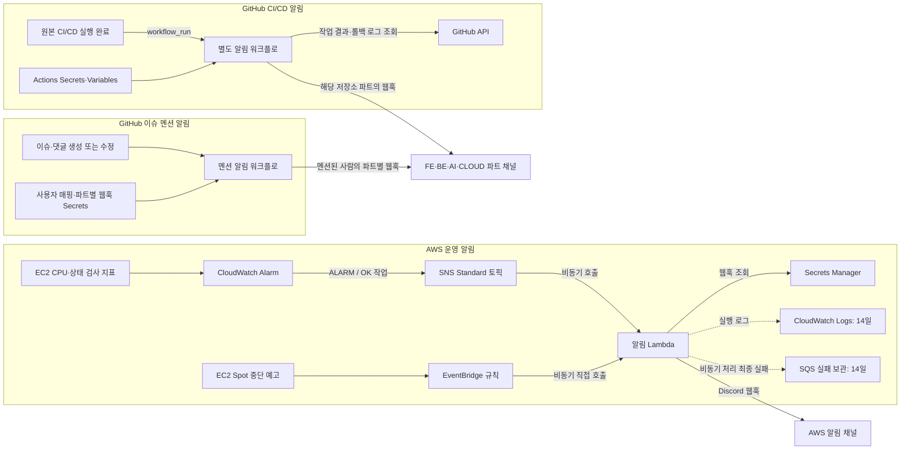
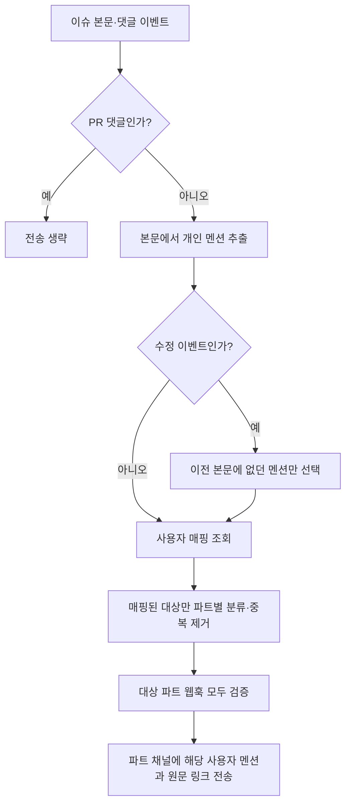
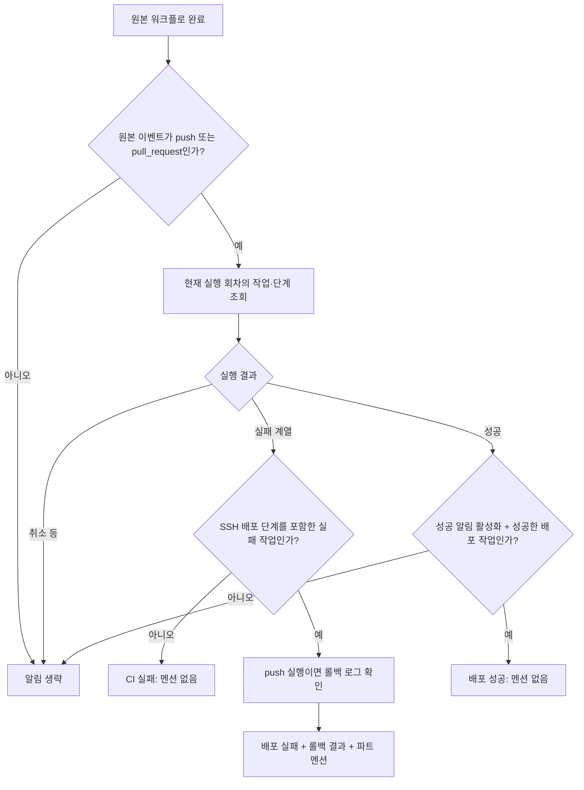

# Discord 알림 통합 관리

EC2 장애·복구와 Spot 중단 예고, GitHub 이슈·댓글의 담당자 멘션, CI/CD 실행 결과를 Discord로 전달한다. AWS 알림은 SNS·EventBridge와 Lambda를 사용하고, GitHub 알림은 각 저장소의 Actions에서 직접 전송한다.

문서 기준일: 2026-09-29. `KTB4-5th-CLOUD/infra/discord-alerts`의 README·Lambda·템플릿 생성기·워크플로를 교차 확인했다.

이 문서는 **이 저장소에 구현된 코드**를 기준으로 작성했다. AWS 스택 파라미터, 기존 알람 임계값, 각 GitHub 저장소의 현재 적용·활성화 상태를 실시간으로 확인한 문서는 아니다. Next.js 서버에서 보내려는 서비스 알림은 이 구현에 포함되어 있지 않다.

- [AWS 설치·업데이트 안내](aws/README.md)
- [GitHub 이슈 멘션 설정 안내](github/mentions/README.md)
- [GitHub CI/CD 설치·설정 안내](github/deployment/README.md)
- [앱 배포 및 환경변수 안내](../../docs/v1-cicd-setup.md)

## 관리 범위와 파일 구조

| 경로 | 역할 | 실제 실행 위치 |
|---|---|---|
| AWS | CPU·상태 검사 장애/복구, Spot 중단 예고 | AWS CloudFormation으로 배포한 리소스 |
| GitHub 이슈 멘션 | 새 개인 멘션을 담당자의 파트 채널로 전달 | 각 저장소의 `.github/workflows/discord-mentions.yml` |
| GitHub CI/CD | CI·배포 실패, 롤백 결과, 선택적 성공 알림 | 각 저장소의 `.github/workflows/discord-cicd.yml` |

이 폴더는 공통 소스의 관리 위치다. 파일 수정만으로 AWS나 다른 GitHub 저장소에 자동 반영되지는 않는다.

```text
infra/discord-alerts/
├── README.md                         # 전체 구성과 알림 동작
├── aws/
│   ├── README.md                     # AWS 설정·파일 역할·배포
│   ├── lambda_function.py            # 실제 알림 코드
│   ├── existing-alarms.json           # 기존 알람 허용 목록
│   ├── instances.example.json        # 신규 알람 생성 입력 예시
│   └── cloudformation/               # 스택에 올리는 CloudFormation 템플릿
└── github/
    ├── README.md                     # 두 GitHub 알림의 진입점
    ├── mentions/
    │   ├── README.md
    │   ├── discord-mentions.yml       # 공통 관리본
    │   └── user-map.example.json
    └── deployment/
        ├── README.md
        ├── notify.py                 # CI/CD 알림 공통 코드
        └── workflows/                # 파트별 생성 YAML
```

실제 웹훅·사용자 매핑은 Secrets에 보관한다. CloudFormation 템플릿은 `aws/cloudformation/`에서 관리한다. 파트별 YAML은 배포 시 복사할 파일이므로 `github/deployment/workflows/`에서 관리한다.

## 전체 구성



채널 이름은 설명용이며 실제 수신 채널은 웹훅이 결정한다. AWS와 GitHub 알림 사이에는 공통 전송 큐나 통합 알림 서버가 없다. SQS는 정상 메시지를 중계하지 않으며, 실패 메시지를 자동 재전송하는 소비자도 없다.

## 어떤 상황을 알려주는가

| 상황 | 감지·판단 방식 | Discord 알림 | 멘션 |
|---|---|---|---|
| 이슈 본문·댓글의 새 개인 멘션 | GitHub 이벤트 본문에서 새 `@로그인`을 찾아 사용자 매핑 | 이슈 번호·제목, 저장소, 작성·수정자, 원문 링크 | 멘션된 사람만, 파트별 전송 |
| EC2 상태 검사 실패 | 연결된 `StatusCheckFailed` 알람이 `ALARM`으로 전환 | `🚨 장애 감지: 알람 이름` | 설정한 AWS 담당자 |
| CPU 사용률 초과 | 연결된 `CPUUtilization` 알람이 `ALARM`으로 전환 | `🚨 장애 감지: 알람 이름` | 설정한 AWS 담당자 |
| SLO 소진율·5xx·4xx·메모리·디스크 | [모니터링 스택](../monitoring/README.md)의 알람·복합 알람이 `ALARM`으로 전환 | `🚨 장애 감지: 알람 이름`, 심각도 필드 | 이름이 `-ticket`으로 끝나면 없음, 그 외 AWS 담당자 |
| AWS 알람 복구 | 이전 상태가 `ALARM`, 새 상태가 `OK` | `✅ 복구: 알람 이름` | 없음 |
| Spot 회수 예고 | 대상 ID의 `EC2 Spot Instance Interruption Warning` | `🚨 Spot 인스턴스 중단 예고` | 설정한 AWS 담당자 |
| 테스트·빌드·이미지 업로드 실패 | 원본 Actions 실행과 실패 작업·단계 조회 | `FE/BE 🔴 CI 실패` | 없음 |
| 서버 배포·배포 중 헬스체크 실패 | `SSH 배포` 단계가 포함된 작업의 실패 | `FE/BE 🔴 배포 실패`와 롤백 결과 | 해당 파트 담당자 |
| 배포 실패 후 롤백 실패 | 배포 로그의 명시적인 복구 실패 문구 | `FE/BE 🚨 긴급: 배포·롤백 실패` | 해당 파트 담당자 |
| 배포 성공 | 성공한 배포 작업 존재 + 성공 알림 옵션 활성화 | `FE/BE ✅ 배포 성공` | 없음 |
| 인프라 검사 실패 | CLOUD용 알림 워크플로를 설치한 경우 | `CLOUD 🔴 CI 실패` | 없음 |

GitHub 실패는 `failure`, `timed_out`, `action_required`, `startup_failure`를 대상으로 한다. `SSH 배포`라는 **단계 이름이 포함된 작업 단위**로 배포 여부를 분류하므로, 같은 작업 내 준비 단계가 실패해도 배포 실패로 표시될 수 있다. 실제 실패 위치는 실패 단계 필드에서 확인한다.

다음 항목은 현재 감지·알림 범위에 포함되지 않는다.

- 사용자가 EC2를 수동 정지한 상황. Spot 예고와 다른 이벤트다.
- 상시 웹사이트 접속 가능 여부, API 응답시간, DB 가용성. API 오류율과 RAM·디스크는 [모니터링 스택](../monitoring/README.md)이 담당한다.
- Next.js의 문의·신고·서버 오류 등 서비스 이벤트.
- AWS의 `INSUFFICIENT_DATA`, 최초 정상화 등 `ALARM → OK` 이외의 `OK` 전환.
- GitHub 실행 취소, 수동·예약 실행 등 원본 이벤트가 `push` 또는 `pull_request`가 아닌 실행.

## AWS 알림 동작

### CPU·상태 검사: CloudWatch → SNS → Lambda

1. CloudWatch가 지표와 평가 조건에 따라 알람 상태를 바꾼다.
2. 알람의 `ALARM`·`OK` 작업에 연결된 SNS 토픽으로 이벤트를 보낸다.
3. Lambda는 SNS 토픽 ARN을 검증한다. 기존 알람 모드에서는 허용한 알람 이름도 확인한다.
4. 전달 대상 상태이면 Secrets Manager에서 웹훅을 읽고 Discord 메시지를 전송한다.
5. 장애에는 설정한 사용자 멘션을 넣고, 복구에는 멘션을 넣지 않는다.

| 템플릿 모드 | 관리 대상 | 평가 조건 |
|---|---|---|
| 기존 알람 연결 | `existing-alarms.json`의 허용 이름과 기존 알람의 SNS 작업 | 기존 CloudWatch 설정 유지. 생성기가 임계값을 변경하지 않음 |
| 신규 알람 생성 | 실제 인스턴스 목록으로 CloudFormation 알람 생성 | 상태 검사: Maximum ≥ 1, 60초 구간 2회 연속. CPU: Average ≥ 80% 기본값, 300초 구간 2회 연속 |

신규 알람의 CPU 기준은 `CpuThreshold`로 변경한다. 누락 데이터는 `missing`으로 처리하며, 데이터가 안 들어온다는 사실만으로 EC2 정지를 확정하지 않는다.

현재 [기존 알람 목록](aws/existing-alarms.json)에는 다음 이름이 기록되어 있다.

- `dev-v1 서버 중단 알람`
- `awsec2-i-0eced2b65959c4faf-GreaterThanOrEqualToThreshold-CPUUtilization`

첫 알람은 이름에 “서버 중단”이 있어도 대화에서 확인한 지표는 `StatusCheckFailed`다. 이름만으로 수동 정지나 Spot 회수를 감지하는 알람으로 해석하면 안 된다. 이 파일에는 임계값과 SNS 연결 상태가 저장되어 있지 않다.

### Spot: EventBridge → Lambda

Spot 중단 예고는 SNS를 거치지 않고 같은 Lambda를 직접 호출한다. EventBridge 규칙과 Lambda가 지정된 인스턴스 ID·계정·리전·이벤트 종류를 확인한다.

| 예정 동작 | 메시지 의미 |
|---|---|
| `stop` | AWS에 의한 Spot 정지 예고 |
| `terminate` | AWS에 의한 Spot 종료·삭제 예고 |
| `hibernate` | 최대 절전 시작. 2분의 사전 예고 없음 |

일반적인 정지·종료 예고는 중단 약 2분 전에 발생하지만, 예고 수신과 Discord 도착을 보장하지 않는다. 전달 지연으로 중단 이후에 도착할 수도 있어 이벤트 발생 시각을 표시한다. 이 경로는 복구 알림을 만들지 않는다.

`SpotInstanceIds`가 비어 있으면 Spot 규칙을 생성하지 않는다. 인스턴스를 교체하면 새 ID로 스택 파라미터를 갱신해야 한다. `EnableNotifications`는 신규 CloudWatch 알람의 작업에만 적용되며 Spot 규칙을 끄지 않는다.

## GitHub 이슈·댓글 멘션 알림

`issues: opened/edited`, `issue_comment: created/edited` 이벤트를 처리한다. 대상 관리본은 [discord-mentions.yml](github/mentions/discord-mentions.yml)이며, wiki·FE·BE·AI·CLOUD 저장소에 같은 파일을 적용하는 구조다. 현재 원격 활성화 상태는 별도 확인이 필요하다.



이슈가 발생한 저장소보다 **멘션된 사람의 소속 파트**가 수신 채널을 결정한다. 예를 들어 wiki 이슈에서 FE와 BE 담당자를 함께 멘션하면 두 채널로 각각 전달한다. CI/CD 알림은 해당 저장소의 파트 채널로 전송한다는 점에서 다르다.

- 이슈 제목이 아닌 본문·댓글에서 개인 `@GitHub로그인`을 찾는다. 대소문자는 구분하지 않는다.
- 편집할 때는 이전 본문과 비교해 새로 추가된 멘션만 전달한다. 제목만 수정하거나 기존 멘션을 그대로 두면 전송하지 않는다.
- 코드 블록·인라인 코드·인용문·이메일·이스케이프된 멘션·조직 팀 멘션은 제외하도록 처리한다. PR 댓글도 제외한다.
- 매핑에 없는 사용자는 건너뛴다. 파트별 Discord ID 중복을 제거하며, 많은 대상은 최대 80명 단위로 나눈다.
- 허용한 개인만 멘션한다. `@everyone`, `@here`, 역할 멘션은 허용하지 않는다.
- 대상 파트 웹훅을 모두 검증한 후 전송한다. 실제 전송 중 한 파트가 실패해도 다른 파트는 계속 처리하고 최종 작업을 실패로 표시한다.
- 코드 내 재시도는 없다. 수정 전후 비교는 영구적인 이벤트 중복 제거가 아니므로 워크플로 재실행은 메시지를 중복 전송할 수 있다.

이 워크플로는 저장소를 checkout하지 않고 GitHub API도 호출하지 않는다. `permissions: {}`로 이벤트 JSON과 Actions Secrets만 사용한다.

## GitHub CI/CD 알림 동작



각 저장소의 `.github/workflows/discord-cicd.yml`이 완료 이벤트를 관찰한다. 저장소 코드를 checkout하지 않고 GitHub API로 결과·작업·필요한 로그만 읽는다. AWS Lambda와 Secrets Manager는 사용하지 않는다.

- 원본 실행이 끝난 뒤 알리므로, 실패 알림은 롤백 대기 시간까지 포함한다.
- 재실행은 현재 회차만 조회하여 이전 회차의 실패 로그와 섞지 않는다.
- 빌드와 이미지 업로드가 한 단계라면 내부 실패 원인까지 분리하지 않는다. Actions 링크로 확인한다.
- 환경 표시는 원본 이벤트·브랜치 기준으로 `PR 검증`, `main → prod`, `dev → dev`를 사용한다. 실제 배포 환경 API를 조회하는 방식은 아니다.
- `DISCORD_USER_MAP`에서 해당 `part`의 담당자만 최대 50명 멘션한다. 매핑이 없거나 파싱에 실패하면 멘션 없이 전달한다.
- 알림 파일은 저장소의 **현재 기본 브랜치**에 있어야 `workflow_run`이 작동한다. 기본 브랜치가 항상 `main`인 것은 아니다.
- FE·BE·AI·CLOUD용 YAML이 있지만, 파일이 존재한다고 각 저장소에 설치되었다는 뜻은 아니다. AI·CLOUD 적용은 선택 사항이다.

롤백 결과는 추정하지 않고 로그 문구로 판단한다.

| 확인한 로그 문구 | 표시 |
|---|---|
| `이전 버전 복구 완료` | 성공 — 이전 버전 상태 검사 통과 |
| `이전 버전 복구 확인 실패: 서버 점검이 필요합니다.` | 실패 — 서버 점검 필요, 긴급 제목 |
| `첫 배포이므로 복구할 이전 이미지가 없습니다.` | 불가 — 이전 이미지 없음 |
| 문구 없음·로그 조회 실패 | 확인 불가 — 실행 로그 확인 필요 |

배포 단계 이름이나 로그 문구를 바꾸면 [notify.py](github/deployment/notify.py)의 판별 로직도 수정해야 한다.

## Discord 메시지 예시

아래는 코드의 메시지 필드를 바탕으로 만든 설명용 예시이며 실제 장애 기록이 아니다. AWS 시각은 이벤트의 문자열을 그대로 표시하고 KST로 변환하지 않는다.

**이슈 멘션** — 파란색 Embed, 제목에서 해당 이슈 또는 댓글로 이동한다.

```text
@멘션된 담당자
#42 API 응답 형식 확인 요청
설명: 이슈 댓글에서 GitHub 계정이 멘션되었습니다.
저장소: 조직/KTB4-5th-wiki
작성·수정자: example-user
```

원문 본문 전체는 전송하지 않는다. 이슈 번호·제목, 작성·수정자와 원문 링크를 전달한다.

**AWS 장애** — 빨간색 Embed, 제목에서 CloudWatch 알람으로 이동한다.

```text
@설정된 담당자
🚨 장애 감지: dev-v1 서버 중단 알람
설명: CloudWatch가 제공한 상태 변경 이유
상태: OK → ALARM
인스턴스: i-...
발생 시각: 이벤트의 StateChangeTime
```

복구는 초록색 `✅ 복구: ...` 제목과 `ALARM → OK`를 표시하고 멘션하지 않는다. 장애 지속 시간은 현재 계산하지 않는다.

**Spot 예고** — 빨간색 Embed, 제목에서 해당 EC2 상세 화면으로 이동한다.

```text
@설정된 담당자
🚨 Spot 인스턴스 중단 예고
설명: 중단 예고 및 전달 지연 가능성
인스턴스: i-...
예정 동작: 종료·삭제
이벤트 발생 시각: 이벤트의 time
```

**배포·롤백 실패** — 빨간색 Embed, 제목에서 원본 Actions 실행으로 이동한다.

```text
@해당 파트 담당자
FE 🚨 긴급: 배포·롤백 실패
환경 / 브랜치: dev / dev
워크플로: FE v1 CI-CD
커밋 / 실행 회차: abcdef123456 / 1
실패 단계: 작업 이름 / SSH 배포
롤백: 실패 — 서버 점검 필요
```

CI 실패와 배포 성공도 같은 GitHub 필드를 사용한다. 성공 메시지는 초록색이며 실패 단계 대신 `결과: 배포 완료`가 표시된다. 로그 원문은 Discord로 보내지 않는다.

## 비밀값·환경변수 관리 위치

### AWS

설정한 이름으로 안내한 스택은 `damuckja-v1-discord-alerts`, 비밀 이름은 `damuckja/v1/discord-webhook`이다. 실제 적용값은 서울 리전 CloudFormation의 Parameters와 Lambda Configuration에서 확인한다.

| 설정 | 원본 관리 위치 | Lambda에서 사용하는 값 |
|---|---|---|
| Discord 웹훅 URL | Secrets Manager 비밀의 `discord_webhook_url` 키 | `WEBHOOK_SECRET_ARN`으로 조회한 값 |
| 비밀 ARN | CloudFormation `WebhookSecretArn` | `WEBHOOK_SECRET_ARN` |
| 멘션 대상 | CloudFormation `DiscordUserIds` | `DISCORD_USER_IDS` |
| Spot 대상 ID | CloudFormation `SpotInstanceIds` | `SPOT_INSTANCE_IDS` |
| 기존 알람 허용 목록 | `existing-alarms.json` → 템플릿 생성 | `ALLOWED_ALARM_NAMES` |
| SNS 출처·계정·리전 | CloudFormation이 설정 | `TOPIC_ARN`, `EXPECTED_ACCOUNT`, `EXPECTED_REGION` |

CloudFormation은 Lambda 코드와 연결 리소스를 배포한다. 웹훅 URL 자체는 템플릿에 포함하지 않고 Lambda가 비밀을 조회한다. 같은 비밀의 웹훅 값을 바꾸면 코드 재배포 없이 다음 조회부터 사용한다.

### GitHub Actions

각 파트 저장소의 **Settings → Secrets and variables → Actions**에서 관리한다.

| 종류 | 이름 | 용도 |
|---|---|---|
| Secret | `DISCORD_FE_WEBHOOK_URL`, `DISCORD_BE_WEBHOOK_URL` | FE·BE 채널 웹훅. 이슈 멘션과 CI/CD가 재사용 |
| Secret | `DISCORD_AI_WEBHOOK_URL`, `DISCORD_CLOUD_WEBHOOK_URL` | AI·CLOUD 채널 웹훅. 이슈 멘션 및 적용한 CI/CD에서 사용 |
| Secret | `DISCORD_USER_MAP` | 사용자별 `part`, `discord_id` 매핑 |
| Variable | `DISCORD_NOTIFY_SUCCESS` | 문자열 `true`일 때 성공 알림 활성화. 기본 비활성 |
| 자동 발급 | `GITHUB_TOKEN` | CI/CD 알림의 작업·로그 조회, `actions: read`. 이슈 멘션은 사용하지 않음 |


이슈 멘션을 받는 파트의 웹훅은 **이벤트가 발생하는 각 저장소**에 등록해야 한다. wiki 저장소에서 FE 담당자를 멘션한다면 wiki 저장소에도 FE 웹훅과 사용자 매핑이 필요하다. 조직 Secret을 쓴다면 해당 저장소에 접근을 허용한다.

`DISCORD_USER_MAP` 형식 예시(가짜 값):

```json
{
  "example-fe-user": {"discord_id": "111111111111111111", "part": "fe"},
  "example-be-user": {"discord_id": "222222222222222222", "part": "be"}
}
```

GitHub 로그인에는 `@`를 붙이지 않는다. 두 GitHub 알림에서 함께 쓰는 매핑이므로 이슈 멘션 검증 기준인 17~20자리 숫자 문자열 ID와 `fe`·`be`·`ai`·`cloud` 중 하나의 part를 사용한다. [전체 예시](github/mentions/user-map.example.json)는 형식 참고용이며 실제 개인정보를 채워 커밋하지 않는다.

AWS Secrets Manager와 GitHub Actions Secrets는 독립적이다. 한쪽의 웹훅을 바꿔도 다른 쪽 값은 바뀌지 않는다.

이 값들은 알림 워크플로의 실행 환경변수로 전달한다. Next.js 서버 기능용 `APP_ENV`·서비스 웹훅과는 별도 설정이다.

## 실패 처리와 운영 한계

| 구간 | 구현된 처리 | 확인할 점 |
|---|---|---|
| Lambda 비동기 함수 오류 | 최대 2회 재시도, 최대 이벤트 나이 3,600초 설정, 최종 실패 목적지 SQS | SQS는 14일 보관, 자동 재전송 없음 |
| EventBridge → Lambda 호출 | 최대 이벤트 나이 300초, 최대 재시도 2회 | 규칙 전달 실패용 DLQ 없음. `FailedInvocations` 확인 |
| SNS → Lambda 전달 | SNS 서비스의 전달 처리 사용 | SNS 구독 DLQ 없음. Lambda 수락 전 실패는 함수 실패 큐 범위 밖 |
| GitHub 이슈 멘션 → Discord | 대상 웹훅 사전 검증, 전송 실패 시 다른 파트 처리 계속 | 별도 재시도 없음, 최종 Actions 작업 실패 |
| GitHub CI/CD → Discord | HTTP 429에서 최대 총 3회 시도, 각 대기 1~15초 제한 | 네트워크 오류·다른 HTTP 오류는 알림 작업 실패로 종료 |
| 실행 결과 | AWS는 CloudWatch Logs, GitHub는 알림 워크플로 기록 | 알림 실패가 원본 CI/CD 결과를 바꾸지는 않음 |

현재 중복 이벤트 제거, 오류 묶음 전송, 장애 지속 시간 계산, 미확인 장애 재알림, 점검 시간 억제는 구현하지 않았다. 재시도 등으로 중복 메시지가 올 수 있다. 실패 큐 적재나 알림 워크플로 실패를 다른 채널에 자동 통지하는 기능도 없다.

알림이 오지 않으면 다음 순서로 확인한다.

1. **CloudWatch:** 알람의 SNS 작업 연결 → Lambda 로그 → 실패 큐.
2. **Spot:** `SpotInstanceIds` → EventBridge 규칙·전달 지표 → Lambda 로그.
3. **GitHub 멘션:** 기본 브랜치의 실행 YAML → 새 개인 멘션인지 → 사용자 매핑·대상 파트 웹훅 → 알림 작업 결과.
4. **GitHub CI/CD:** 기본 브랜치의 실행 YAML → 원본 이벤트 종류 → Secrets·성공 알림 옵션 → 알림 작업 결과.

Lambda의 `sent: 0`은 상태나 허용 목록 필터로 생략된 결과일 수 있다. 전송 확인은 `sent: 1`과 실제 Discord 수신을 함께 본다.

## 파일과 변경 반영

| 파일 | 역할 |
|---|---|
| [lambda_function.py](aws/lambda_function.py) | AWS 이벤트 검증, 장애·복구·Spot 메시지와 전송 |
| [discord-alerts.template.json](aws/cloudformation/discord-alerts.template.json) | Lambda 소스·허용 목록을 포함한 CloudFormation 템플릿 |
| [existing-alarms.json](aws/existing-alarms.json) | 기존 알람 이름 허용 목록 |
| [instances.example.json](aws/instances.example.json) | 신규 알람용 입력 예시. 실제 ID로 교체 필요 |
| [discord-mentions.yml](github/mentions/discord-mentions.yml) | 이슈·댓글 새 개인 멘션 추출·파트별 전달 |
| [user-map.example.json](github/mentions/user-map.example.json) | 실제 값이 아닌 사용자 매핑 형식 예시 |
| [notify.py](github/deployment/notify.py) | GitHub 실행 분석·롤백 판별·전송 공통 코드 |
| [FE YAML](github/deployment/workflows/discord-cicd-fe.yml), [BE YAML](github/deployment/workflows/discord-cicd-be.yml) | 각 저장소에 반영할 알림 워크플로 |

AWS 코드를 바꾸면 템플릿의 같은 코드도 고쳐 스택을 업데이트한다. GitHub 공통 코드(`notify.py`)는 파트별 YAML 안에 같은 내용이 들어 있으므로 YAML도 함께 고쳐 각 대상 저장소에 반영한다. Python 파일만 수정하면 실행 환경에는 반영되지 않는다.

### 변경 사항별 반영 방법

| 변경 | 수정 위치 | 실행 환경 반영 |
|---|---|---|
| AWS 웹훅 교체 | Secrets Manager의 `discord_webhook_url` | 같은 비밀이면 다음 Lambda 조회부터 사용 |
| Spot 대상 추가·교체 | 스택 `SpotInstanceIds` | CloudFormation 파라미터 업데이트 |
| CloudWatch 알람 추가 | `aws/existing-alarms.json`과 템플릿 | 템플릿 수정·스택 업데이트 후 알람의 In alarm/OK에 SNS 연결 |
| AWS 메시지·처리 변경 | `aws/lambda_function.py`와 템플릿 `ZipFile` | 스택 업데이트 |
| GitHub 담당자·채널 변경 | 각 저장소 Actions Secrets | 다음 이벤트부터 사용 |
| 이슈 멘션 로직 변경 | `github/mentions/discord-mentions.yml` | 각 저장소 `.github/workflows/discord-mentions.yml`에 반영 |
| CI/CD 알림 로직 변경 | `github/deployment/notify.py`와 `workflows/*.yml` | 대상 저장소 `.github/workflows/discord-cicd.yml`에 반영 |

CloudFormation 템플릿의 `Resources.Function.Properties.Code.ZipFile`에 Lambda 소스가 포함되므로 Python 파일을 별도 업로드하지 않는다. 신규 알람 생성 모드의 `instances.example.json`은 입력 예시이며 기존 알람 모드의 운영 대상 목록이 아니다.

GitHub 두 워크플로는 기본 브랜치에서 활성화 여부를 확인한다. 기존 문서에 기록된 FE=dev, 나머지=main은 과거 확인값이므로 실제 저장소 설정을 우선한다. 공통 관리본과 실행 파일에 서로 다른 수정이 있으면 덮어쓰기 전에 비교한다.

Lambda 콘솔 테스트는 실제 메시지를 전송할 수 있다. 이슈 멘션도 실제 이슈에서 테스트하면 담당자에게 메시지를 보낸다. 세부 절차는 [AWS 안내](aws/README.md), [이슈 멘션 안내](github/mentions/README.md), [CI/CD 안내](github/deployment/README.md)를 따른다.
