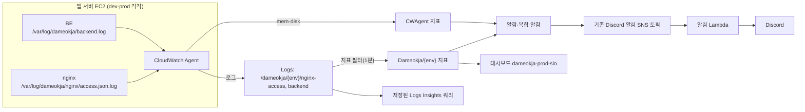

# SLO 모니터링·알림 (CloudWatch)

[SLI-SLO-design.md](../../docs/observability/SLI-SLO-design.md)의 작업 성공률 SLI를 CloudWatch로 수집·계산하고, 오류 예산 소진 속도와 일반 오류를 Discord로 알린다.
설계 근거와 후보 비교는 [monitoring-alerting-design.md](../../docs/observability/monitoring-alerting-design.md)를 참고한다.

## 구성



| 파일 | 역할 |
|---|---|
| `../../nginx-*/default.conf` | `$slo_route` 분류 map, `slo_json` 로그 형식, 호스트 파일 로그 |
| `../../*-compose.yaml` | nginx·BE 로그 디렉터리 마운트(BE는 컨테이너와 같은 경로 `/var/log/dameokja`) |
| `cloudwatch-agent/amazon-cloudwatch-agent.{env}.json` | 수집할 로그 파일과 로그 그룹, mem·disk 지표 |
| `host/setup-host.sh` | 로그 디렉터리·소유자, logrotate, Agent 설치·설정 적용 |
| `host/logrotate-dameokja-nginx` | nginx JSON 로그 회전(BE는 Spring Boot가 회전) |
| `build_template.py` | 환경별 CloudFormation 템플릿 생성기 |
| `generated/` | 생성 결과(Git 제외) |

## 알람 목록

| 알람 이름 | 환경 | 조건 | 심각도 |
|---|---|---|---|
| `dameokja-prod-slo-<작업>-fast-burn-page` | prod | 오류율 ≥ 72%(소진율 14.4배)가 60분·5분 창에서 동시 발생, 각 창 최소 10·3건 | 즉시 대응, 멘션 |
| `dameokja-prod-slo-<작업>-slow-burn-ticket` | prod | 오류율 ≥ 30%(소진율 6배)가 6시간·30분 창에서 동시 발생, 각 창 최소 20·5건 | 확인 필요, 멘션 없음 |
| `dameokja-{env}-http-5xx-ticket` | dev·prod | 전체 API 5xx가 5분간 `Http5xxThreshold`(기본 5)건 이상 | 확인 필요 |
| `dameokja-prod-http-4xx-surge-ticket` | prod | 4xx가 1시간 `Http4xxHourlyThreshold`(기본 100)건 이상 | 확인 필요 |
| `dameokja-{env}-memory-ticket` | dev·prod | 메모리 사용률 ≥ 90%, 5분 × 2회 | 확인 필요 |
| `dameokja-{env}-disk-ticket` | dev·prod | 루트 디스크 사용률 ≥ 85% | 확인 필요 |

`<작업>`은 `ingredient-create`, `ingredient-read`, `notification-poll`이다. 소진율 판정용 하위 알람(`...-60m`, `...-5m` 등)은 알림을 보내지 않는다.
Discord Lambda는 이름이 `-ticket`으로 끝나는 알람에 멘션을 넣지 않는다.

## 최초 적용 순서

순서를 지켜야 알람이 SNS로 거부되지 않는다.

1. **EC2 IAM 역할**: dev·prod 앱 서버 인스턴스 역할에 `CloudWatchAgentServerPolicy`를 추가한다(로그 전송·지표 전송 권한).
2. **Discord 알림 스택 업데이트**: `existing-alarms.json`에 새 알람 이름이 추가되었고 Lambda가 바뀌었으므로 템플릿을 다시 만들어 `damuckja-v1-discord-alerts`를 업데이트한다([AWS 안내](../discord-alerts/aws/README.md) 6장).
3. **모니터링 스택 생성**: CLOUD 저장소 루트에서 템플릿을 만든 뒤, 서울 리전 CloudFormation에서 환경별 스택을 만든다.
   ```powershell
   python infra/monitoring/build_template.py
   ```
   | 스택 이름 | 템플릿 | 필수 파라미터 |
   |---|---|---|
   | `dameokja-v1-dev-monitoring` | `generated/slo-monitoring.dev.template.json` | `AlarmTopicArn`(Discord 스택 Outputs의 `TopicArn`), `InstanceId`(dev 앱 서버) |
   | `dameokja-v1-prod-monitoring` | `generated/slo-monitoring.prod.template.json` | 위와 같음(prod 앱 서버) |
4. **서버 준비**: 각 앱 서버에 이 폴더를 복사하고 실행한다.
   ```bash
   sudo bash infra/monitoring/host/setup-host.sh prod   # dev 서버에서는 dev
   ```
5. **nginx·compose 반영**: 서버의 nginx 설정과 compose 파일을 갱신하고 nginx·backend 컨테이너를 다시 만든다(`docker compose up -d`). 로그 디렉터리를 4번보다 먼저 Docker가 만들면 root 소유가 되어 BE가 파일 로그를 쓰지 못한다.
6. **확인**
   - `/var/log/dameokja/nginx/access.json.log`에 JSON 한 줄이 쌓이는지, `route` 값이 맞는지 확인한다.
   - CloudWatch Logs의 두 로그 그룹에 `{instance_id}` 스트림이 생기는지 확인한다.
   - 1~2분 뒤 지표 `Dameokja/{env}`에 `Http4xx` 등이 보이는지 확인한다(요청이 있어야 생긴다).
   - 대시보드 `dameokja-prod-slo`의 시간 범위를 이번 달(KST)로 바꿔 성공률이 표시되는지 확인한다.

## 변경 사항별 반영

| 변경 | 수정 위치 | 반영 |
|---|---|---|
| SLI 대상 API 추가·변경 | nginx `map $slo_route`, `build_template.py`의 `ROUTES` | nginx 재기동 → 템플릿 재생성·스택 업데이트 → `existing-alarms.json` 갱신·Discord 스택 업데이트 |
| SLO 목표·소진율 기준 | `SLO_TARGET`, `BURN_RULES` | 템플릿 재생성·스택 업데이트 |
| 5xx·4xx 기준 건수 | 스택 파라미터 | 파라미터만 업데이트 |
| 앱 서버 교체(인스턴스 ID 변경) | 스택 `InstanceId` | 파라미터 업데이트 후 새 서버에서 `setup-host.sh` 실행 |
| 로그 보관 기간 | CloudWatch 콘솔(로그 그룹 → 보존 설정 편집) | 템플릿은 로그 그룹을 만들지 않음. Agent가 만든 그룹을 이름으로 참조 |

새 알람 이름을 추가하면 반드시 `python infra/monitoring/build_template.py --print-alarm-names`의 결과를 `existing-alarms.json`에 넣는다. 빠뜨리면 그 알람은 Discord로 전달되지 않는다.

## 운영 한계

- 요청이 서버까지 오지 못한 장애, 로그 수집(Agent) 중단은 지표가 비어 보일 뿐 알람이 울리지 않는다.
- 저트래픽 시간대에는 최소 건수 조건 때문에 소진율 알람이 울리지 않는다. 월간 판정은 대시보드·저장 쿼리로 본다.
- 아침 알림 SLI와 응답시간 SLI는 이 구성에 포함되지 않았다(설계 문서의 후보 비교 참고).
