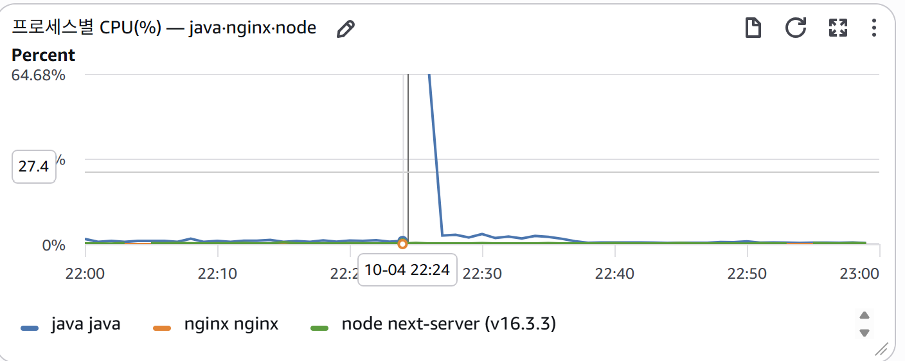
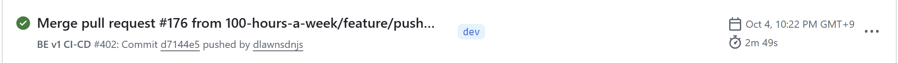
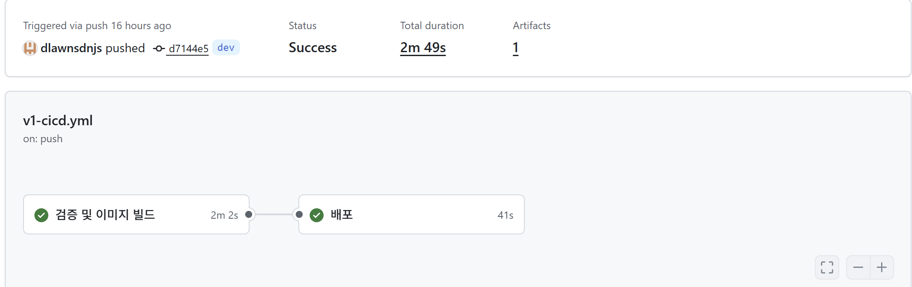
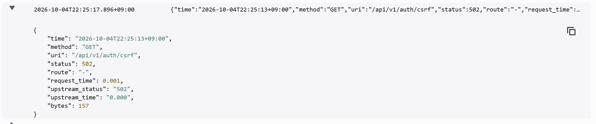
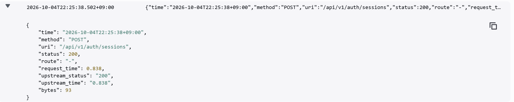

# 2026-10-04 v1 부하 테스트 재실행 결과

개발 서버 https://dev.dameokja.com 에서 한국시간 **19:26:46~22:36:49**에 다섯 시나리오를 모두 실행했습니다. 1,240개 흐름을 시도해 1,239개가 성공했습니다. 목표 업무 API 7RPS 구간은 오류 없이 통과했습니다. 주말 저녁에는 CSRF 502 한 건으로 흐름 하나가 실패했습니다.

상태 파일의 completed는 모든 예정 흐름의 시도를 마쳤다는 의미이며, 모든 검증 기준의 통과를 뜻하지 않습니다. 주말 저녁은 성공 흐름 수와 업무 요청 수 기준 미달로 k6 종료 코드 99, 나머지 네 구간은 0입니다.

> **수치 표시 기준: 응답시간·RPS·실패율은 소수점 셋째 자리에서 반올림하여 둘째 자리까지 표시합니다.** 요청 수와 사용자 수는 정수로 표시합니다. 기준 충족 여부는 반올림 전 원본 값으로 판단합니다.

## 요청과 흐름

업무 API는 로그인 → 최신 등록순 재고 조회 → 유통기한순 조회입니다. CSRF 발급은 별도로 집계합니다. 계정마다 별도 VU와 쿠키 저장소를 사용하며, 구간 사이에는 계정을 재사용합니다.

| 구간 | 기간 | 계정 수 | journeys_attempted / journeys_completed | business_requests | 업무 RPS | 전체 HTTP 요청 |
| --- | --- | ---: | ---: | ---: | ---: | ---: |
| 아침 | 5분 | 140 | 140 / 140 | 420 | 1.40 | 560 |
| 목표 부하 | 5분 | 200 | 700 / 700 | 2,100 | 7.00 | 2,800 |
| 평일 저녁 | 1시간 | 100 | 100 / 100 | 300 | 0.08 | 400 |
| 주말 점심 | 1시간 | 150 | 150 / 150 | 450 | 0.12 | 600 |
| 주말 저녁 | 1시간 | 150 | 150 / 149 | 447 | 0.12 | 597 |
| 합계 | 약 3시간 10분 | 고유 200 | 1,240 / 1,239 | 3,717 | — | 4,957 |

목표 부하 구간은 업무 API 7.00RPS, CSRF 포함 전체 HTTP 9.33RPS였습니다. 200명이 동시에 활동하는 시험이 아니라 200개 계정으로 700개 흐름을 5분 동안 분산 실행했습니다.

## 업무 API 응답시간

| 구간 | 평균(ms) | p95(ms) | 최대(ms) | p95<200ms | 최대<1,000ms |
| --- | ---: | ---: | ---: | --- | --- |
| 아침 | 74.76 | 148.02 | 233.22 | 통과 | 통과 |
| 목표 부하 | 64.11 | 141.79 | 267.33 | 통과 | 통과 |
| 평일 저녁 | 62.78 | 134.62 | 212.27 | 통과 | 통과 |
| 주말 점심 | 70.08 | 178.00 | 377.30 | 통과 | 통과 |
| 주말 저녁 | 71.49 | 145.67 | 847.38 | 통과 | 통과 |

설계의 200ms 목표를 스크립트에서 p95<200ms로 해석했습니다. 설계 자체에는 백분위가 명시되어 있지 않습니다. 위 business_duration 수치는 CSRF 응답시간과 사용자 흐름 전체 소요시간을 포함하지 않습니다.

## 실패율과 빈 재고 응답

| 구간 | business_failed | all_requests_failed(CSRF 포함) | journey_failed | empty_inventory_responses |
| --- | ---: | ---: | ---: | ---: |
| 아침 | 0.00% | 0.00% | 0.00% | 280 |
| 목표 부하 | 0.00% | 0.00% | 0.00% | 1,400 |
| 평일 저녁 | 0.00% | 0.00% | 0.00% | 200 |
| 주말 점심 | 0.00% | 0.00% | 0.00% | 300 |
| 주말 저녁 | 0.00% | 0.17% (1/597) | 0.67% (1/150) | 298 |

전체 HTTP 실패는 1/4,957건(약 0.02%), 흐름 실패는 1/1,240건(약 0.08%)입니다. 업무 API 3,717건은 모두 검증에 성공했지만 CSRF에서 실패한 흐름은 후속 업무 API를 호출하지 않았으므로 업무 API 실패율에는 CSRF 단계에서 종료된 흐름이 반영되지 않습니다.

## 배포와 겹친 오류 및 최대 응답시간

한국시간 **22:25:13**, 흐름 번호 121에서 GET /api/v1/auth/csrf가 HTTP 502를 반환했습니다. 해당 흐름은 재시도 없이 종료하고 다음 사용자 흐름은 진행했습니다. 연속 5회 실패 또는 최근 최대 100요청에서 최소 20건 관측 후 실패 5건 이상·실패율 5% 이상이라는 중단 조건에는 도달하지 않았습니다.

GitHub Actions 배포 로그와 k6 측정 시각의 대조 결과는 다음과 같습니다(분석일: 2026-10-05). **주말 저녁 테스트 도중 백엔드 컨테이너 교체가 발생했으며, 502와 최대 응답시간은 배포 중·직후에 관측됐습니다.** 타임라인 기준은 2026-10-04 한국시간(KST)입니다.

| 시각 | 관측 내용 | 출처 |
| --- | --- | --- |
| 22:24:55 | SSH 배포 단계 시작 | GitHub Actions |
| 22:25:03 | 백엔드 컨테이너 Recreate | GitHub Actions |
| 22:25:07 | 새 백엔드 컨테이너 Started | GitHub Actions |
| 22:25:13 | CSRF 요청 HTTP 502 | k6 실행 로그 |
| 22:25:33 | 배포 완료 메시지 | GitHub Actions |
| 22:25:37.93 | 로그인 응답시간 847.38ms 기록 | k6 시계열 원본 |
| 22:25:38 | 로그인 HTTP 200, nginx 전체 처리 및 upstream 응답시간 각각 838.00ms | CloudWatch에 수집된 nginx 접근 로그 |

배포 근거: [GitHub Actions 실행 37205408987의 SSH 배포 로그](https://github.com/100-hours-a-week/KTB4-5th-BE/actions/runs/37205408987/job/111445821666#step:2:52). 해당 배포는 dev 브랜치 커밋 `d7144e5`를 대상으로 했습니다.

**배포에 따른 백엔드 교체와 기동 직후 처리가 오류 및 지연에 영향을 미쳤을 가능성이 높습니다.** 컨테이너 Started는 Spring Boot의 요청 처리 준비 완료를 보장하지 않습니다. 502는 컨테이너 시작과 배포 완료 사이에, 최대 응답시간을 기록한 로그인은 배포 완료 약 5초 뒤에 관측됐습니다.

다만 시간상 일치가 내부 원인까지 입증하지는 않습니다. JIT 컴파일·DB 연결 초기화·GC 등 개별 처리 과정의 지연 기여도는 확인되지 않았습니다. k6와 nginx 기록 간 공통 요청 ID가 없어 동일 요청 여부는 시각과 소요시간의 유사성에 근거한 추정입니다. CloudWatch 대시보드에서는 22:25~22:27 부근 Java CPU 증가가 관측됐으나, 분 단위 지표로 1초 미만 지연의 원인을 확정할 수는 없습니다.

오류와 지연 측정값은 통계에서 제외하지 않았습니다. 배포 영향을 포함한 실제 관측 결과로 유지합니다.

## 증빙 자료

CloudWatch 대시보드·nginx 접근 로그 및 GitHub Actions 실행 기록을 증빙 자료로 제시합니다. 캡처에는 원본 표시값을 유지하며, 본문의 응답시간·비율은 소수점 둘째 자리까지 반올림해 표시합니다.

### Java 프로세스 CPU 변화

22:25~22:27 부근 Java CPU의 급상승과 이후 하락이 관측됩니다. 최고점이 그래프 상단에서 잘려 있어 캡처만으로 정확한 최대 CPU 사용률을 산출할 수 없습니다. 화면의 27.4 표시는 최대 CPU 사용률로 식별되지 않으므로 최대값의 근거에서 제외합니다.

### 배포 실행 시각과 단계

dev 브랜치 커밋 `d7144e5`의 워크플로가 한국시간 22:22에 시작했고 전체 소요시간은 2분 49초였음을 보여줍니다.

검증 및 이미지 빌드는 2분 2초, 배포 작업은 41초였습니다. 실행 개요 캡처는 단계별 소요시간을 나타냅니다. 타임라인의 초 단위 컨테이너 교체 시각은 GitHub Actions SSH 배포 상세 로그를 기준으로 합니다.

### 배포 중 CSRF 오류

JSON 본문의 `time` 기준 22:25:13에 CSRF 요청이 502를 반환했습니다. nginx 요청 처리시간은 1.00ms, upstream 응답시간은 표시 정밀도상 0.00ms입니다. 목록의 이벤트 시각과 본문 발생 시각이 다르므로 타임라인은 본문 시각을 사용했습니다. 이 접근 로그만으로 연결 거부 등 세부 오류 원인은 확정할 수 없습니다.

### 배포 직후 로그인 지연

22:25:38 로그인 요청은 HTTP 200이지만 nginx 전체 처리시간과 upstream 응답시간이 각각 838.00ms였습니다. k6 최대 응답시간 847.38ms와 시각·소요시간이 유사한 요청입니다. 요청 ID가 없어 동일 요청이라고 확정하지는 않습니다.

## 해석의 한계

- 재고 조회 2,478건 모두 빈 목록이었습니다. 데이터가 누적된 DB의 정렬·페이지 조회 성능은 검증하지 못했습니다.
- CloudWatch 지표와 배포 이력의 사후 대조 범위는 일부 항목으로 제한되며, 전체 서버 자원의 요청 단위 분석은 수행되지 않았습니다. 자원 여유나 정확한 병목 위치는 판단할 수 없습니다.
- 주말 저녁 도중 배포로 애플리케이션 버전과 기동 상태가 바뀌었습니다. 따라서 구간별 차이를 부하량만의 영향으로 해석할 수 없습니다. 순수한 부하별 성능 비교에는 동일 버전·배포 없는 조건의 재검증이 필요합니다.
- 개발 서버의 클라이언트 측정이며 운영 성능을 보장하지 않습니다. 브라우저 렌더링·정적 자원·SSE·데이터 생성 흐름도 포함하지 않았습니다.
- 7RPS 목표의 5분 검증이며 최대 처리량이나 200명 동시 활동을 검증한 시험은 아닙니다.
- 약 3시간의 실행으로 월간 가용성 99% 달성을 입증할 수 없습니다.

## 근거

private/v1-suite-status.json 및 각 구간의 private/v1-<mode>.json, .log, -samples.json을 사용했습니다. 인증정보는 보고서에 포함하지 않았습니다. 앞선 18시 중단 결과는 private 아래 archive 디렉터리에 보관되어 있고 본 재실행 통계에는 합산하지 않았습니다.

실행 구성: k6 스크립트 `v1-flow.js`와 순차 실행 프로그램 `run_v1_suite.py`를 사용했습니다. 실행 스크립트와 계정 정보 및 private 원본 데이터는 결과 공유 범위에서 제외합니다.
